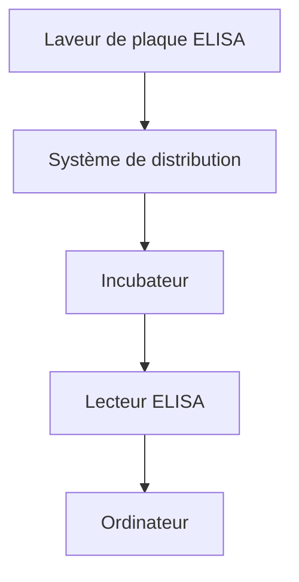
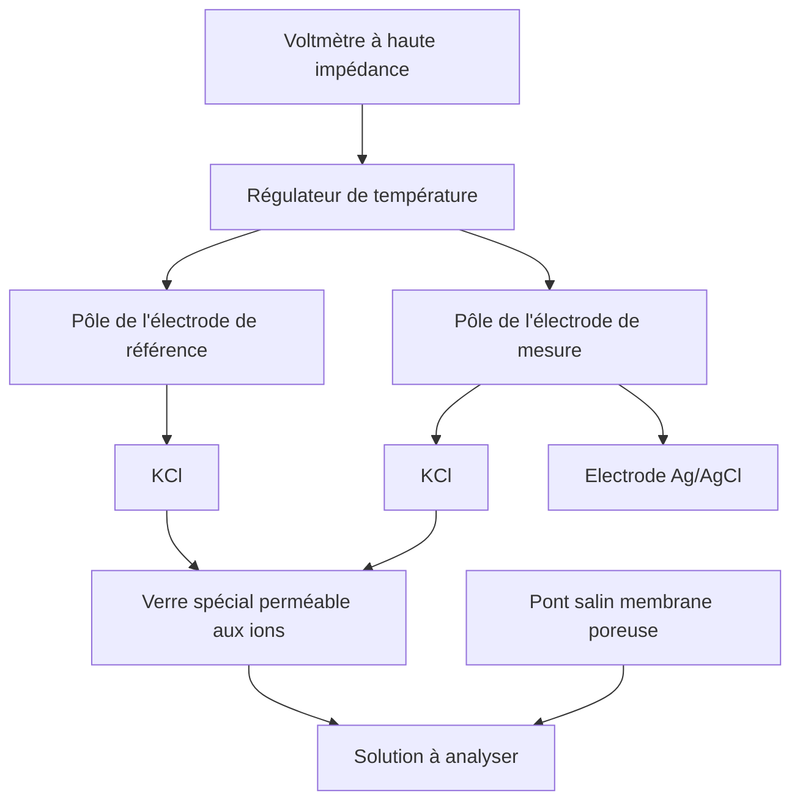

MANUEL D'ENTRETIEN ET DE MAINTENANCE DES APPAREILS DE LABORATOIRE

# Chapitre 1

## Lecteur de microplaques

| **GMDN Code**    | 37036                                   |
| ---------------- | --------------------------------------- |
| **ECRI Code**    | 16-979                                  |
| **Dénomination** | Lecteur photométrique pour microplaques |


Le lecteur de microplaques, aussi appelé « lecteur photométrique pour microplaques » ou « lecteur ELISA » est un spectrophotomètre spécialisé dans la lecture des résultats des tests ELISA, une technique utilisée pour détecter la présence d'anticorps ou d'antigènes spécifiques dans des échantillons. La technique repose sur la détection d'un antigène ou d'un anticorps capturés sur une surface solide au moyen d'anticorps directs ou secondaires marqués, ce qui donne une réaction dont le produit peut être lu avec un spectrophotomètre. Le mot ELISA est l'acronyme de « Enzyme-Linked Immunosorbent Assay », et désigne un test basé sur une réaction immunoenzymatique. Le présent chapitre porte sur l'utilisation des lecteurs de microplaques pour les tests ELISA. Pour des renseignements complémentaires sur les principes de fonctionnement et d'entretien de ces appareils, voir le chapitre 11 sur le spectrophotomètre.

### PHOTOGRAPHIE D'UN LECTEUR DE MICROPLAQUES

Photo avec l'aimable autorisation de BioRad Laboratories

### A QUOI SERT UN LECTEUR DE MICROPLAQUES

Le lecteur de microplaques est utilisé pour lire les résultats des tests ELISA. Cette technique a des applications directes en immunologie et en sérologie. Parmi ses autres applications figurent la confirmation de la présence d'anticorps ou d'antigènes spécifiques d'un agent infectieux, d'anticorps présents à la suite d'une vaccination ou d'auto-anticorps, par exemple dans la polyarthrite rhumatoïde.

### PRINCIPES DE FONCTIONNEMENT

Le lecteur de microplaques est un spectrophotomètre spécialisé. Contrairement au spectrophotomètre classique qui permet la lecture sur un large éventail de longueurs d'onde, le lecteur de microplaques possède des filtres ou des grilles de diffraction qui limitent la gamme de longueurs d'onde à celles utilisées dans les tests ELISA, en général entre 400 et 750 nm (nanomètres). Certains lecteurs travaillent dans l'ultraviolet et effectuent des analyses entre 340 et 700 nm. Le système optique adopté par de nombreux fabricants utilise des fibres optiques qui conduisent la lumière dans les puits des microplaques contenant les échantillons. Le faisceau lumineux qui traverse l'échantillon a un diamètre de 1 à 3 mm. Un système de détection capte la lumière venant de l'échantillon, amplifie le signal et détermine l'absorbance (ou densité optique) de l'échantillon. Un système de lecture convertit cette valeur en données permettant d'interpréter les résultats du test. Certains lecteurs de microplaques utilisent un système lumineux à double faisceau.

Les échantillons à tester sont déposés dans des plaques spécialement conçues qui possèdent un certain nombre de puits où la réaction a lieu. Les plaques couramment utilisées ont 8 colonnes et 12 rangées, soit un total de 96 puits. Il existe aussi des plaques ayant un plus grand nombre de puits. Pour certaines applications, la tendance consiste actuellement à augmenter le nombre de puits (plaques à 384 puits) pour réduire les quantités de réactifs et d'échantillons utilisées et augmenter la cadence de travail. L'emplacement des capteurs optiques du lecteur varie selon les fabricants : ils peuvent se trouver au-dessus de la plaque contenant les échantillons ou directement au-dessous des puits.

Actuellement, les lecteurs de microplaques possèdent des commandes régulées par microprocesseurs, des interfaces de connexion avec les systèmes d'information et des programmes de contrôle des processus et de contrôle de la qualité qui, avec l'aide d'un ordinateur, permettent une automatisation complète des tests.

1


---


CHAPITRE 1 LECTEUR DE MICROPLAQUES

## Matériel nécessaire pour les tests ELISA

Pour l'exécution de la technique ELISA, il faut :

1. Un lecteur de microplaques.
2. Un laveur de microplaques (chapitre 2).
3. Un système de distribution de liquides (on peut utiliser des pipettes multicanaux).
4. Un incubateur pour incuber les plaques.

La figure 1 montre comment ces éléments sont reliés entre eux.

## Etapes mécaniques de la technique ELISA

### Utilisation du matériel

Lorsqu'on réalise un test ELISA, on procède en général comme suit :

1. Un premier lavage de la plaque peut être réalisé au moyen du laveur de microplaques.
2. A l'aide d'un distributeur ou de pipettes multicanaux, on remplit les puits avec la solution préparée pour le test.
3. On dépose la plaque dans l'incubateur où, à température contrôlée, une série de réactions se produit.

Les étapes 1, 2 et 3 peuvent être répétées plusieurs fois selon le test, jusqu'à ce que les réactifs ajoutés aient fini d'agir.

Enfin, quand toutes les étapes d'incubation sont achevées, on transfère la plaque dans le lecteur de microplaques. La plaque est lue et on peut en déduire un diagnostic.

## Etapes biochimiques de la technique ELISA¹

Les étapes de la technique ELISA du point de vue biochimique sont les suivantes :

1. Les puits de la microplaque sont recouverts d'une couche d'anticorps ou d'antigènes.
2. Les échantillons, les témoins (ou contrôles) et les étalons sont ajoutés dans les puits et incubés à des températures allant de la température ambiante à 37 °C pendant une durée déterminée, selon les caractéristiques du test. Pendant l'incubation, l'antigène présent dans l'échantillon se lie à l'anticorps déposé sur la plaque, ou l'anticorps présent dans l'échantillon se lie à l'antigène déposé sur la plaque, selon ce qui se trouve dans l'échantillon et en quelle quantité.
3. Après l'incubation, les antigènes ou les anticorps non liés sont lavés et éliminés de la plaque au moyen du laveur de microplaques et d'un tampon de lavage approprié.
4. On ajoute ensuite un anticorps secondaire, appelé le conjugué. Cet anticorps porte une enzyme qui réagira avec un substrat pour donner un changement de coloration lors d'une étape ultérieure.
5. Alors commence une deuxième étape d'incubation pendant laquelle le conjugué se lie au complexe antigène-anticorps dans les puits.
6. Après l'incubation, on effectue un nouveau cycle de lavage pour éliminer le conjugué non lié.
7. On ajoute alors un substrat. L'enzyme réagit avec le substrat et provoque un changement de coloration de la solution. Ce changement indiquera quelle quantité de complexe antigène-anticorps est présente à la fin du test.
8. A la fin de la période d'incubation, on ajoute un réactif pour stopper la réaction enzyme-substrat et le changement de coloration. Ce réactif est en général un acide dilué.
9. Enfin, on lit la plaque à l'aide du lecteur de microplaques. Les valeurs obtenues sont utilisées pour déterminer la quantité exacte ou la présence d'antigènes ou d'anticorps dans l'échantillon.

Note : Certains des puits sont utilisés pour les étalons et les témoins. Les étalons permettent de définir les valeurs seuils. Les étalons et les témoins contiennent des quantités connues et sont utilisés pour mesurer la bonne exécution du test en évaluant les données obtenues par rapport aux concentrations connues présentes dans chaque témoin. La procédure décrite ci-dessus est valable en général, mais il existe de nombreux tests ELISA présentant des variantes spécifiques.

**Figure 1. Matériel utilisé pour les tests ELISA**



¹ Pour des explications plus détaillées, se reporter à la littérature spécialisée.

2


---


MANUEL D'ENTRETIEN ET DE MAINTENANCE DES APPAREILS DE LABORATOIRE

## CONDITIONS REQUISES POUR L'INSTALLATION

Pour que le lecteur de microplaques fonctionne correctement, il faut respecter les points suivants :

1. Un environnement propre, sans poussière.
2. Une table de travail stable, à l'écart des appareils qui produisent des vibrations (centrifugeuses, agitateurs). Elle doit être de taille suffisante pour qu'il reste de la place à côté du lecteur de microplaques. Le matériel complémentaire nécessaire pour exécuter le test comme décrit ci-dessous comprend : laveur de microplaques, incubateur, distributeur, et ordinateur avec ses périphériques.
3. Une alimentation électrique répondant aux normes nationales. Par exemple, dans les pays d'Amérique, le réseau est en général alimenté en 110 V/60 Hz alors qu'ailleurs dans le monde il est alimenté en 220-240 V/50-60 Hz.

### Etalonnage du lecteur de microplaques

L'étalonnage d'un lecteur de microplaques est une opération spécialisée qui doit être réalisée par un technicien ou un ingénieur qualifiés en suivant les instructions données par le fabricant. Pour procéder à l'étalonnage, il est nécessaire de disposer d'une série de filtres gris montés sur une plaque de mêmes dimensions que les plaques utilisées pour les analyses. Les fabricants fournissent ces plaques d'étalonnage pour toutes les longueurs d'onde utilisées par le lecteur.

Les plaques d'étalonnage sont livrées avec au moins trois valeurs préétablies de la densité optique correspondant à l'intervalle de mesure courant : une valeur faible, une valeur moyenne et une valeur élevée. Pour réaliser l'étalonnage, procéder comme suit :

1. Mettre la plaque d'étalonnage dans l'appareil.
2. Effectuer une lecture complète avec la plaque d'étalonnage. Vérifier s'il y a des différences de lecture d'un puits à l'autre. Si c'est le cas, faire pivoter la plaque de 180° et refaire la lecture pour voir si les différences sont dues à la plaque elle-même. En général, on admet que l'appareil n'a pas besoin d'un étalonnage plus poussé si les résultats correspondent aux valeurs attendues pour deux longueurs d'onde.
3. Vérifier si le lecteur nécessite un étalonnage. Si oui, l'effectuer en suivant la procédure indiquée par le fabricant, en vérifiant que la linéarité des lectures se maintient aussi rigoureusement que possible.
4. Si l'appareil n'est pas livré avec une plaque d'étalonnage, le contrôler en déposant une solution colorée dans les puits d'une plaque et en effectuant immédiatement une lecture complète. Puis faire pivoter la plaque de 180° et refaire la lecture. Si les deux séries de lectures donnent des résultats moyens identiques pour chaque rangée, le lecteur est étalonné.

5. Vérifier que le lecteur est étalonné en procédant colonne par colonne. Prendre une plaque propre et vide et faire une lecture. S'il n'y a pas de différence entre les lectures moyennes de la première à la dernière colonne, on peut considérer l'appareil comme étalonné.

## ENTRETIEN DE ROUTINE

Les procédures d'entretien décrites ci-après concernent uniquement le lecteur de microplaques. L'entretien du laveur de microplaques est décrit au chapitre 2.

### Entretien courant

**Fréquence : une fois par jour**

1. Vérifier que les capteurs optiques de tous les canaux sont propres. S'ils sont sales, nettoyer la fenêtre des émetteurs de lumière et des capteurs avec une petite brosse.
2. S'assurer encore une fois que le système émetteur de lumière est propre.
3. Vérifier que l'étalonnage du lecteur est correct. Au début de la journée de travail, laisser le lecteur chauffer pendant 30 minutes. Ensuite, faire une lecture à blanc puis lire une plaque entière de substrat. Les valeurs obtenues doivent être identiques. Si non, faire pivoter la plaque et répéter la lecture pour déterminer si la différence vient de la plaque ou du lecteur.
4. Examiner le système de déplacement automatique du tiroir porte-plaque. Le déplacement doit être constant et sans à-coups.

### Entretien préventif

**Fréquence : une fois par trimestre**

1. Vérifier la stabilité de la lampe. Utiliser la plaque d'étalonnage, et faire des lectures avec la même plaque à intervalles de 30 minutes. Comparer les résultats. Ils ne doivent pas présenter de différences.
2. Nettoyer le système optique du détecteur et le système émetteur de lumière.
3. Nettoyer le tiroir porte-plaque.
4. Vérifier l'alignement de chaque puits avec les systèmes émetteurs et détecteurs de lumière.

3


---


CHAPITRE 1 LECTEUR DE MICROPLAQUES

## GUIDE DE DÉPANNAGE

| PROBLÈME                                                                                                          | CAUSE PROBABLE                                                                                                           | SOLUTION                                                                                                                                                                                                                      |
| ----------------------------------------------------------------------------------------------------------------- | ------------------------------------------------------------------------------------------------------------------------ | ----------------------------------------------------------------------------------------------------------------------------------------------------------------------------------------------------------------------------- |
| Le lecteur donne une valeur qui n'a pas de sens.                                                                  | La lampe du système émetteur de lumière est hors service.                                                                | Remplacer la lampe par une autre ayant les mêmes caractéristiques que la lampe d'origine.                                                                                                                                     |
| Le lecteur donne des valeurs différentes d'une rangée à l'autre.                                                  | Les capteurs optiques sont sales.                                                                                        | Nettoyer les capteurs.                                                                                                                                                                                                        |
|                                                                                                                   | Les lentilles ou d'autres parties du système émetteur de lumière sont sales.                                             | Nettoyer les lentilles du système émetteur de lumière.                                                                                                                                                                        |
| Le lecteur donne des valeurs de l'absorbance trop élevées.                                                        | Un ou plusieurs canaux ne sont pas étalonnés.                                                                            | Vérifier l'étalonnage de chaque canal.                                                                                                                                                                                        |
|                                                                                                                   | Réactifs périmés et/ou préparés de façon incorrecte.                                                                     | Vérifier si la TMB est incolore et si la préparation est correcte.                                                                                                                                                            |
|                                                                                                                   | Contamination par d'autres échantillons.                                                                                 | Répéter le test en vérifiant les étiquettes, le laveur de plaque et la façon dont la pipette a été utilisée.                                                                                                                  |
|                                                                                                                   | Filtre de longueur d'onde inadapté.                                                                                      | Vérifier la longueur d'onde recommandée pour le test. Corriger si elle est incorrecte.                                                                                                                                        |
|                                                                                                                   | Lavage insuffisant ou inefficace.                                                                                        | Vérifier la méthode de lavage. Utiliser un test approprié de contrôle de la qualité.                                                                                                                                          |
|                                                                                                                   | Incubation très longue ou à température trop élevée.                                                                     | Vérifier la durée et la température d'incubation.                                                                                                                                                                             |
|                                                                                                                   | Dilution incorrecte de l'échantillon.                                                                                    | Vérifier la procédure de dilution de l'échantillon.                                                                                                                                                                           |
|                                                                                                                   | Un réactif a été omis.                                                                                                   | Vérifier que le test a été réalisé suivant la procédure établie.                                                                                                                                                              |
|                                                                                                                   | Incubation très courte ou à température trop basse.                                                                      | Vérifier la durée et la température d'incubation.                                                                                                                                                                             |
| Le lecteur donne des valeurs de l'absorbance trop faibles.                                                        | Les réactifs n'étaient pas à température ambiante.                                                                       | Laisser la température des réactifs s'équilibrer avec la température ambiante.                                                                                                                                                |
|                                                                                                                   | Lavage excessif de la plaque.                                                                                            | Ajuster la procédure de lavage en se conformant aux instructions du fabricant.                                                                                                                                                |
|                                                                                                                   | Filtre de longueur d'onde inadapté.                                                                                      | Vérifier la longueur d'onde sélectionnée. Utiliser la longueur d'onde recommandée pour le test.                                                                                                                               |
|                                                                                                                   | Réactifs périmés ou préparés de façon incorrecte.                                                                        | Vérifier les réactifs utilisés. Tester les dilutions.                                                                                                                                                                         |
|                                                                                                                   | Un réactif a été omis.                                                                                                   | Vérifier que le test a été réalisé suivant la procédure établie.                                                                                                                                                              |
|                                                                                                                   | La plaque présente des rayures au fond des puits.                                                                        | Préparer une nouvelle plaque et refaire le test.                                                                                                                                                                              |
|                                                                                                                   | Plaque mal choisie ou sale.                                                                                              | Vérifier le type de plaque utilisé. Préparer une nouvelle plaque et refaire le test.                                                                                                                                          |
|                                                                                                                   | Les puits de la plaque ont séché.                                                                                        | Changer la façon de laver la plaque.                                                                                                                                                                                          |
|                                                                                                                   | La plaque est mal installée dans le lecteur.                                                                             | Vérifier le positionnement de la plaque. Refaire la lecture.                                                                                                                                                                  |
|                                                                                                                   | Humidité ou traces de doigts sur le dessous de la plaque.                                                                | Vérifier que le dessous de la plaque est propre sous les puits.                                                                                                                                                               |
|                                                                                                                   | Il reste du tampon de lavage dans les puits avant d'ajouter le substrat.                                                 | Vérifier que le tampon de lavage est complètement éliminé.                                                                                                                                                                    |
|                                                                                                                   | Les comprimés de substrat ne se dissolvent pas complètement.                                                             | Vérifier que les comprimés se dissolvent correctement.                                                                                                                                                                        |
|                                                                                                                   | Le comprimé de substrat a été contaminé par de l'humidité, des pinces métalliques ou n'est pas entier.                   | Contrôler l'intégrité et la manipulation des comprimés de substrat.                                                                                                                                                           |
|                                                                                                                   | La position du puits de mesure à blanc a pu changer et une quantité incorrecte a alors été soustraite de chaque lecture. | Vérifier que la répartition des puits est correcte.                                                                                                                                                                           |
| Le lecteur présente une variation imprévue des lectures de densité optique.                                       | La lampe du lecteur est instable.                                                                                        | Remplacer la lampe par une autre ayant les mêmes caractéristiques que la lampe d'origine.                                                                                                                                     |
| Le lecteur donne des valeurs augmentant ou diminuant progressivement d'une colonne à l'autre.                     | Etalonnage incorrect du moteur d'entraînement de la plaque.                                                              | Etalonner l'entraînement de la plaque de façon qu'à chaque arrêt les puits restent exactement alignés avec le système émetteur de lumière.                                                                                    |
| Les lectures de la densité optique sont très basses par rapport aux critères d'évaluation optique de l'opérateur. | La lecture a été faite à une longueur d'onde différente de celle qui est prévue pour le test.                            | Vérifier la longueur d'onde utilisée pour effectuer la lecture. Si c'est là le problème, régler la longueur d'onde et refaire la lecture. Vérifier que le filtre de longueur d'onde choisi est bien celui qui est recommandé. |


4


---


MANUEL D'ENTRETIEN ET DE MAINTENANCE DES APPAREILS DE LABORATOIRE

| Faible reproductibilité.                                          | Homogénéité de l'échantillon.                                                                                                      | Mélanger les réactifs avant emploi. Laisser leur température s'équilibrer avec la température ambiante.                 |
| ----------------------------------------------------------------- | ---------------------------------------------------------------------------------------------------------------------------------- | ----------------------------------------------------------------------------------------------------------------------- |
|                                                                   | Pipetage incorrect.                                                                                                                | Vérifier que les embouts des pipettes sont changés entre les échantillons et que tout liquide restant est éliminé.      |
|                                                                   | Lecteur non étalonné.                                                                                                              | Contrôler l'étalonnage. Utiliser une série appropriée pour le contrôle de qualité.                                      |
|                                                                   | Lecture effectuée sans attendre un préchauffage suffisant de l'appareil.                                                           | Attendre que le lecteur ait atteint sa température de fonctionnement.                                                   |
| Valeur élevé de l'absorbance obtenue avec le blanc.               | Substrat contaminé.                                                                                                                | Vérifier que la TMB est incolore et que sa préparation est correcte.                                                    |
|                                                                   | Lavage insuffisant ou inefficace.                                                                                                  | Bien vider le tampon de lavage. Vérifier que le remplissage des puits et l'aspiration sont uniformes pendant le lavage. |
| Les données ne sont pas transmises du lecteur au microprocesseur. | Le lecteur et le microprocesseur ont des codes différents.                                                                         | Vérifier les codes sélectionnés.                                                                                        |
|                                                                   | Taux de transfert de l'information (en bauds) différents.                                                                          | Confirmer les taux de transfert sélectionnés.                                                                           |
|                                                                   | Configuration incorrecte de l'interface de communication (réception/transmission).                                                 | Vérifier la configuration de l'interface. La configuration doit respecter les paramètres définis par le fabricant.      |
| Faisceau lumineux mal aligné.                                     | Le lecteur a été déplacé sans que les précautions nécessaires aient été prises.                                                    | Appeler le service technique.                                                                                           |
|                                                                   | La source lumineuse (lampe) a été changée et l'installation ou l'alignement de la nouvelle lampe n'ont pas été faits correctement. | Vérifier l'installation et l'alignement de la lampe.                                                                    |
| Identification incorrecte de l'échantillon.                       | La plaque n'a pas été chargée correctement.                                                                                        | Vérifier la procédure d'identification des échantillons. Refaire la lecture en tenant compte des corrections.           |
|                                                                   | Identification incorrecte de l'échantillon enregistré dans le lecteur.                                                             | Vérifier la procédure d'identification des échantillons. Refaire la lecture en tenant compte des corrections.           |
| L'ordinateur n'indique pas les codes d'erreur.                    | Le programme qui contrôle l'activation des alarmes et des avertissements a un défaut ou n'est pas validé par le fabricant.         | Appeler le service technique.                                                                                           |
| Le lecteur ne détecte pas les erreurs.                            | Divers composants du système ne fonctionnent pas, par exemple le système de détection du niveau de liquide.                        | Appeler le service technique.                                                                                           |


## DÉFINITIONS

**Chemiluminescence.** Emission de lumière ou d'une luminescence résultant directement d'une réaction chimique à température ambiante.

**ELISA** (Enzyme-Linked Immunosorbent Assay). Technique biochimique principalement utilisée en immunologie pour détecter la présence d'un anticorps ou d'un antigène dans un échantillon.

**Enzyme.** Protéine qui accélère (catalyse) les réactions chimiques.

**Fluorophore.** Molécule qui absorbe la lumière à une longueur d'onde déterminée et qui la réémet à une longueur d'onde plus élevée.

**Laveur de microplaques.** Appareil utilisé pour laver les plaques à divers stades des tests ELISA afin d'éliminer les résidus de composants non liés après une réaction. Les laveurs de microplaques utilisent des tampons de lavage spéciaux.

**Lecteur de microplaques.** Nom donné aux spectrophotomètres capables de lire des microplaques.

**Microplaque ELISA.** Consommable standardisé pour l'exécution des tests ELISA. Les plaques comportent en général 96 puits classiquement disposés en 8 rangées et 12 colonnes. Il existe aussi des microplaques ELISA à 384 puits et jusqu'à 1536 puits pour les tests spécialisés à réaliser à cadence élevée dans les centres ayant une forte demande.

**TMB.** Tétraméthylbenzidine, substrat pour la peroxydase de raifort (enzyme).

5


---


NO_CONTENT_HERE


---


MANUEL D'ENTRETIEN ET DE MAINTENANCE DES APPAREILS DE LABORATOIRE

# Chapitre 2

## Laveur de microplaques

| **GMDN Code**    | 17489                  |
| ---------------- | ---------------------- |
| **ECRI Code**    | 17-489                 |
| **Dénomination** | Laveur de microplaques |


Le laveur de microplaques, aussi appelé « laveur de microplaques ELISA » ou « laveur ELISA », est conçu pour effectuer les opérations de lavage requises par la technique ELISA. Il effectue le lavage des puits des microplaques ELISA à divers stades du test.

### PHOTOGRAPHIE D'UN LAVEUR DE MICROPLAQUES

Photo avec l'aimable autorisation de BioRad Laboratories

### À QUOI SERT UN LAVEUR DE MICROPLAQUES

Le laveur de microplaques est conçu pour distribuer de façon contrôlée les tampons de lavage nécessaires à l'exécution des tests ELISA. De même, l'appareil enlève dans chaque puits les substances restant en excès après la réaction. Selon le test réalisé, le laveur peut intervenir de une à quatre fois, avec distribution du tampon de lavage, agitation et aspiration des réactifs non liés¹ après la durée programmée, jusqu'à l'achèvement des cycles de lavage. L'appareil possède deux réservoirs, l'un pour le tampon de lavage et l'autre pour les déchets générés pendant le processus de lavage.

### PRINCIPES DE FONCTIONNEMENT

Le laveur de microplaques est conçu pour effectuer les opérations de lavage lors des tests ELISA. Il possède au minimum les sous-systèmes suivants, qui peuvent différer selon les fabricants.

° **Sous-système de contrôle.** En général, le laveur ELISA est contrôlé par des microprocesseurs qui permettent de programmer et de contrôler les opérations, par exemple le nombre de cycles de lavage² (1–5), les durées prévues, la pression de distribution et d'aspiration, le format des plaques (96–384 puits), le réglage de la fonction d'aspiration selon le type de puits³ (à fond plat, à fond en V ou à fond en U), ou encore des bandelettes, les volumes distribués et aspirés, les cycles de trempage et d'agitation, etc.

° **Sous-système de distribution.** En général, il comporte un réservoir pour la solution de lavage, une ou plusieurs pompes, habituellement une seringue à déplacement positif et une tête de distribution qui répartit la solution de lavage dans les différents puits au moyen d'aiguilles. La tête de distribution est en général livrée avec huit paires d'aiguilles pour réaliser les opérations de lavage et d'extraction dans tous les puits d'une même rangée simultanément (les sous-systèmes de distribution et d'extraction se rejoignent au niveau de la tête du laveur). Il existe des modèles à douze paires d'aiguilles et d'autres qui effectuent le lavage dans tous les puits simultanément. Certains laveurs offrent la possibilité de travailler avec différents types de solutions de lavage, en changeant de solution selon le programme enregistré par l'opérateur.

¹ Voir une explication succincte de la technique ELISA dans le chapitre 1, *Lecteur de microplaques*.

² Le nombre exact de lavages nécessaires dépend du test utilisé. Ce nombre est spécifié sur le mode d'emploi fourni par le fabricant du test.

³ Si le puits est à fond plat, l'aiguille d'aspiration est placée très près d'un des bords du puits ; s'il s'agit d'un puits à fond en U ou en V, l'aiguille est centrée.

7


---


CHAPITRE 2 LAVEUR DE MICROPLAQUES

○ **Sous-système d'extraction ou d'aspiration.** Ce sous-système nécessite un dispositif pour faire le vide et un système de stockage des liquides et des déchets extraits des puits. Le vide peut être réalisé au moyen de pompes externes et internes. L'extraction se fait à l'aide d'une série d'aiguilles montées sur la tête du laveur. Le nombre d'aiguilles varie de un à trois selon le modèle utilisé.

Si le laveur n'a qu'une aiguille, le lavage et l'extraction sont réalisés avec cette même aiguille. S'il y a deux aiguilles, l'une est utilisée pour délivrer la solution de lavage et l'autre pour l'extraire. Les modèles à trois aiguilles utilisent la première pour délivrer la solution de lavage, la deuxième pour l'extraire et la troisième pour contrôler et enlever tout excès de liquide restant dans le puits. En général, l'aiguille d'extraction est plus longue que l'aiguille de distribution, ce qui lui permet d'avancer verticalement jusqu'à une distance de 0,3 à 0,5 mm du fond du puits.

○ **Sous-système de déplacement.** Il se compose d'un mécanisme qui déplace horizontalement la tête de distribution et d'extraction de façon qu'elle atteigne tous les puits de la microplaque ELISA. Après chaque déplacement horizontal jusqu'à la rangée de puits suivante, la tête effectue un déplacement vertical pour distribuer ou extraire la solution de lavage. Il existe des laveurs qui exécutent ces opérations simultanément.

Les sous-systèmes décrits ci-dessus sont représentés sur la figure 2. La figure 3 montre les différents types de puits les plus couramment trouvés sur les microplaques. Chaque type de puits convient pour un type particulier de test.

## Procédure de lavage

Le lavage de la microplaque constitue l'une des étapes de la technique ELISA. On utilise pour cela des solutions spéciales. Parmi les solutions les plus couramment employées figure la solution tamponnée au phosphate ou PBS. Elle est stable pendant 2 mois si on la conserve à 4 °C. On estime qu'il faut 1 à 3 litres de solution pour laver une microplaque, à raison de 300 μl par puits et par cycle de lavage. Le lavage peut être fait manuellement, mais il est préférable d'utiliser un laveur automatisé pour obtenir un meilleur rendement et pour réduire au minimum la manipulation de produits potentiellement contaminés.

Il existe diverses procédures de lavage selon les modèles de laveurs :

○ **Aspiration du haut vers le bas.** Lorsque la phase d'aspiration commence, les aiguilles se déplacent verticalement et l'aspiration commence dès qu'elles entrent en contact avec le liquide. L'aspiration se poursuit jusqu'à ce que les aiguilles atteignent leur position la plus basse, près du fond des puits. Elles sont alors stoppées pour éviter d'aspirer l'air qui se déplace le long des parois internes des puits. Ce type d'aspiration empêche le courant d'air de dessécher les protéines liées à la surface des puits.

**Figure 2.** Laveur ELISA

![Diagram showing ELISA washer components including: Réservoir à déchets (waste reservoir), Pompes à déplacement positif (positive displacement pumps), Pompes d'alimentation (feed pumps), Solution de lavage (wash solution), Plaque ELISA (ELISA plate), Puits (wells), Pompe d'extraction (extraction pump), Tête de distribution et d'extraction (distribution and extraction head), Déplacement horizontal et vertical (horizontal and vertical displacement)]

**Figure 3.** Profils de puits

|  |  |  |  |
| :---------------------------: | :------------------------: | :------------------------: | :-------------------------: |
|           Fond plat           |          Fond en U         |          Fond en V         |        Lavage facile        |


8


---


MANUEL D'ENTRETIEN ET DE MAINTENANCE DES APPAREILS DE LABORATOIRE

○ **Distribution et aspiration simultanées.** Dans certains types de laveurs, les systèmes de lavage et d'aspiration fonctionnent simultanément ; il se produit une turbulence contrôlée à l'intérieur du puits qui élimine les substances qui ne se sont pas liées pendant les phases d'incubation.

○ **Aspiration depuis le fond des puits.** Dans ce système, le cycle d'aspiration du liquide contenu dans les puits, en général de durée contrôlée, commence après positionnement de l'aiguille près du fond des puits. Ce système peut aspirer de l'air en cas de différence de niveau de remplissage des réservoirs.

## Etalonnage du laveur

Le laveur de microplaques joue un rôle déterminant dans la bonne exécution des tests ELISA. On trouvera ci-dessous une description des réglages nécessaires pour un fonctionnement efficace de l'appareil :

○ **Positionnement des aiguilles (tête de distribution et d'aspiration.** Le positionnement horizontal et vertical des aiguilles par rapport aux puits doit être vérifié avec soin. Si la plaque a des puits à fond plat, il faut vérifier que l'aiguille de distribution se place tout près des bords du puits. Avec des puits à fond en U ou en V, l'aiguille doit être placée au centre du puits ; lors du déplacement vertical, il faut maintenir une distance habituellement comprise entre 0,3 et 0,5 mm entre la pointe de l'aiguille et le fond. Il ne faut jamais laisser les aiguilles toucher le fond des puits, afin d'éviter des interférences mécaniques avec la pointe de l'aiguille pendant l'aspiration.

○ **Durée de l'aspiration.** Il faut régler la durée de l'aspiration de façon à ce que le film de solution qui adhère aux parois du puits puisse s'écouler vers le fond. Eviter des temps d'attente trop longs afin que le revêtement des puits ne sèche pas. Vérifier que les aiguilles du système d'aspiration sont propres (que rien ne les obstrue).

○ **Volume délivré.** Vérifier que le volume délivré est le plus proche possible de la capacité maximale des puits ; vérifier que tous les puits sont remplis uniformément (au même niveau). Vérifier que les aiguilles de distribution sont propres (que rien ne les obstrue).

○ **Vide.** Le système d'aspiration doit être correctement réglé. Un vide trop poussé peut fausser le test. En effet, les puits pourraient sécher, ce qui affaiblirait considérablement l'activité enzymatique et fausserait complètement le résultat du test. La plupart des laveurs fonctionnent avec un vide compris entre 60 et 70 % de la pression atmosphérique. Sur certains modèles, le vide est produit par une pompe externe livrée comme accessoire. Son fonctionnement est contrôlé par le laveur, ce qui fait qu'elle ne fonctionne que lorsque c'est nécessaire.

## Vérification de la procédure de lavage

Pour vérifier que la procédure de lavage est exécutée conformément aux spécifications des techniques ELISA, les fabricants de tests ELISA ont élaboré des contrôles à effectuer régulièrement. L'un de ces contrôles¹ est basé sur l'utilisation de la peroxydase, réactif distribué à l'aide d'une pipette dans les puits d'une microplaque pour lecture à 405, 450 et 492 nm. Les puits sont immédiatement lavés et on ajoute un substrat incolore (TMB/H₂O₂ – tétraméthylbenzidine/peroxyde d'hydrogène). Tout conjugué restant hydrolysera l'enzyme et le chromogène virera au bleu. Après l'arrêt de la réaction par addition d'un acide, la TMB virera à nouveau au jaune. L'intensité de la coloration résultante est directement liée à l'efficacité du processus de lavage.

## CONDITIONS REQUISES POUR L'INSTALLATION

Pour que le laveur de microplaques fonctionne correctement, il faut respecter les points suivants :

1. Un environnement propre, sans poussière.
2. Une table de travail stable, à l'écart des appareils qui produisent des vibrations (centrifugeuses, agitateurs). Elle doit être de taille suffisante pour qu'il reste de la place à côté du laveur de microplaques pour le matériel complémentaire : lecteur, incubateur, distributeur, et ordinateur avec ses périphériques.
3. Une prise de courant en bon état avec raccordement à la terre, et une alimentation électrique répondant aux normes nationales ou à celles du laboratoire. Par exemple, dans les pays d'Amérique, le réseau est en général alimenté en 110 V/60 Hz alors qu'ailleurs dans le monde il est alimenté en 220-240 V/50-60 Hz.

## ENTRETIEN DE ROUTINE

Les procédures d'entretien décrites ci-après concernent uniquement le laveur de microplaques. L'entretien du lecteur de microplaques est décrit au chapitre 1.

## Entretien courant

### Fréquence : une fois par jour

1. Vérifier le volume délivré.
2. Tester l'uniformité du remplissage.
3. Vérifier l'efficacité du sous-système d'aspiration.
4. Vérifier la propreté des aiguilles de distribution et d'extraction.
5. Nettoyer le laveur à l'eau distillée après emploi, pour éliminer les restes de sels dans les canaux des sous-systèmes de distribution et d'extraction. Les aiguilles doivent être entièrement immergées dans l'eau distillée.
6. Vérifier que le corps du laveur a été nettoyé. Si nécessaire, nettoyer les parties externes avec un chiffon imbibé de détergent doux.

¹ Procédure élaborée par PANBIO, ELISA Check Plus, Cat. N° E-ECP01T.

9


---


CHAPITRE 2 LAVEUR DE MICROPLAQUES

**Entretien préventif**

**Fréquence : une fois par trimestre**

1. Démonter et nettoyer les canaux et les raccords. Vérifier qu'ils sont en bon état. S'ils présentent des fuites ou des traces de corrosion, les réparer ou les remplacer.
2. Vérifier l'intégrité des éléments mécaniques. Les lubrifier selon les instructions du fabricant.
3. Contrôler le réglage de chacun des sous-systèmes. Les étalonner selon les recommandations du fabricant.
4. Vérifier l'intégrité des câbles et raccords électriques.

5. Nettoyer le laveur à l'eau distillée après emploi pour éliminer les restes de sels dans les canaux des sous-systèmes de distribution et d'extraction.
6. Vérifier que le fusible est en bon état et que ses contacts sont propres.

**Note :** L'entretien du système de contrôle doit être effectué par un technicien qualifié. Si nécessaire, appeler le fabricant ou son représentant.

10


---


MANUEL D'ENTRETIEN ET DE MAINTENANCE DES APPAREILS DE LABORATOIRE

## GUIDE DE DÉPANNAGE

| PROBLÈME                                                                                 | CAUSE PROBABLE                                                                                               | SOLUTION                                                                                                                                             |
| ---------------------------------------------------------------------------------------- | ------------------------------------------------------------------------------------------------------------ | ---------------------------------------------------------------------------------------------------------------------------------------------------- |
| À la fin du lavage, il reste de la solution dans les puits.                              | Le système d'extraction est défectueux.                                                                      | Vérifier si le système de vide fonctionne à la pression appropriée.                                                                                  |
|                                                                                          | Les tuyaux du système de vide sont d'un diamètre différent de celui qui est recommandé.                      | Vérifier que le diamètre des canaux correspond aux recommandations du fabricant.                                                                     |
|                                                                                          | Le tuyau d'aspiration est obstrué.                                                                           | Vérifier que les tuyaux d'aspiration sont propres.                                                                                                   |
|                                                                                          | Le réservoir à déchets est plein.                                                                            | Vérifier le niveau de remplissage du réservoir à déchets.                                                                                            |
|                                                                                          | Le filtre du système d'aspiration est humide ou bouché.                                                      | Vérifier l'état du filtre du système d'aspiration.                                                                                                   |
|                                                                                          | Les pointes des aiguilles ne sont pas placées correctement et n'atteignent pas le fond des puits.            | Examiner le positionnement des pointes d'aiguilles.                                                                                                  |
|                                                                                          | Une microplaque d'un type différent est utilisée pour le test.                                               | Vérifier le type de plaque à utiliser pour le test.                                                                                                  |
|                                                                                          | Le laveur n'a pas été suffisamment purgé.                                                                    | Vérifier la procédure de purge.                                                                                                                      |
|                                                                                          | L'opérateur n'a pas suivi correctement les instructions du fabricant.                                        | Examiner la procédure recommandée par le fabricant. Faire les ajustements nécessaires.                                                               |
|                                                                                          | La plaque mise dans le laveur n'est pas correctement alignée.                                                | Vérifier le positionnement de la plaque dans le laveur.                                                                                              |
|                                                                                          | Le réservoir de solution de lavage est vide.                                                                 | Examiner le réservoir de solution de lavage. Compléter le niveau.                                                                                    |
|                                                                                          | Le laveur n'a pas été suffisamment purgé au début du cycle de travail.                                       | Le nettoyer correctement pour uniformiser l'humidité dans chaque partie et éliminer les bulles d'air.                                                |
|                                                                                          | Le volume de solution de lavage à délivrer a été incorrectement programmé.                                   | Vérifier le volume requis pour chaque type de test et chaque plaque.                                                                                 |
|                                                                                          | La plaque a été mise de façon incorrecte dans le laveur.                                                     | Vérifier l'installation correcte de la plaque dans le laveur.                                                                                        |
| Le cycle de lavage ne s'effectue pas correctement.                                       | Le programme de lavage a été incorrectement sélectionné.                                                     | Vérifier le programme de lavage recommandé pour chaque type de plaque.                                                                               |
|                                                                                          | Les plaques utilisées sont différentes de celles qui sont recommandées par le fabricant.                     | Vérifier que les plaques utilisées sont entièrement compatibles avec le laveur.                                                                      |
|                                                                                          | Le niveau de liquide dans les puits est insuffisant.                                                         |                                                                                                                                                      |
|                                                                                          | Le tuyau d'alimentation en solution de lavage n'a pas le diamètre ou l'épaisseur spécifiés par le fabricant. | Vérifier les spécifications du fabricant. Faire les modifications nécessaires.                                                                       |
|                                                                                          | La pression est insuffisante pour délivrer la quantité correcte de solution de lavage.                       | Vérifier que le système de distribution et les canaux d'alimentation ne sont pas obstrués.                                                           |
| Des moisissures et des bactéries se développent dans le réservoir de solution de lavage. | Le système n'est pas souvent utilisé.                                                                        | Vérifier les procédures à appliquer pour prévenir le développement de moisissures et de bactéries.                                                   |
|                                                                                          | La procédure adéquate (désinfection) n'est pas appliquée.                                                    | Vérifier les procédures à appliquer pour prévenir le développement de moisissures et de bactéries.                                                   |
|                                                                                          | Les tuyaux et raccords ne sont pas changés à la fréquence requise.                                           | Vérifier la fréquence de remplacement indiquée par le fabricant et/ou le service technique.                                                          |
|                                                                                          | La solution de lavage a été contaminée.                                                                      | Vérifier les procédures appliquées pour préparer et utiliser la solution de lavage afin de déterminer la cause de la contamination et de l'éliminer. |
|                                                                                          | L'entretien n'a pas été fait selon le plan.                                                                  | Vérifier les dates prévues pour effectuer l'entretien. Informer les responsables.                                                                    |


11


---


CHAPITRE 2 LAVEUR DE MICROPLAQUES

## DÉFINITIONS

**PBS.** L'une des solutions utilisées pour effectuer les opérations de lavage dans les tests ELISA. PBS est l'abréviation de Phosphate Buffer Solution (solution tamponnée au phosphate). Elle se compose de : NaCl, KCl, NaHPO₄.2H₂O et KH₂SO₄. Les fabricants fournissent des fiches techniques qui donnent les proportions et les instructions pour préparer le PBS. En général, on mélange une partie de PBS concentré et 19 parties d'eau désionisée.

**Plate (ELISA).** Consommable de dimensions standard, destiné à contenir les échantillons et les réactifs utilisés dans la technique ELISA. Les plaques ont en général 96, 384 ou 1536 puits et sont réalisées en matière plastique, comme le polystyrène et le polypropylène. Il existe des plaques spécialement traitées pour faciliter l'exécution des tests.

**Pompe à déplacement positif.** Pompe régulée par un piston se déplaçant dans un cylindre. Son mécanisme est similaire à celui d'une seringue. Elle est équipée d'une série de valves pour contrôler le débit entrant et sortant.

**Tampon.** Solution contenant soit un acide faible et son sel, soit une base faible et son sel, ce qui la rend résistante aux variations du pH à une température donnée.

**TMB/H₂O₂.** (Tétraméthylbenzidine/peroxyde d'hydrogène). Réactif utilisé pour vérifier la qualité du lavage des puits dans les tests ELISA.

12


---


MANUEL D'ENTRETIEN ET DE MAINTENANCE DES APPAREILS DE LABORATOIRE

# Chapitre 3

## pH mètre

| **Code GMDN**    | 15164    |
| ---------------- | -------- |
| **Code ECRI**    | 15-164   |
| **Dénomination** | pH mètre |


Le pH-mètre est un appareil qui détermine la concentration d'ions hydrogène (H⁺) dans une solution. S'il est soigneusement utilisé et étalonné, il permet de mesurer l'acidité d'une solution aqueuse. Certains pH-mètres sont aussi appelés testeurs de pH.

### A QUOI SERT UN PH-MÈTRE

Le pH-mètre s'utilise couramment dans tous les domaines de la science où interviennent des solutions aqueuses. On l'utilise ainsi en agriculture, dans le traitement et la purification des eaux, dans des processus industriels comme la pétrochimie, la fabrication du papier, l'industrie alimentaire, l'industrie pharmaceutique, dans la recherche et le développement, la métallurgie, etc. Au laboratoire de santé, on l'utilise pour le contrôle des milieux de culture et la mesure de l'acidité ou de l'alcalinité des bouillons nutritifs et des tampons. Dans les laboratoires spécialisés, on utilise des appareils de diagnostic équipés de micro-électrodes pour mesurer le pH des constituants liquides du sang. La mesure du pH plasmatique permet d'évaluer l'état de santé du patient. Sa valeur est normalement comprise entre 7,35 et 7,45. Elle reflète le métabolisme, qui comporte une multitude de réactions dans lesquelles acides et bases se trouvent normalement à l'équilibre. Les acides libèrent en permanence des ions hydrogène (H+) et l'organisme neutralise ou équilibre cette acidité en libérant des ions bicarbonate (HCO₃⁻). L'équilibre acido-basique est assuré par les reins (organes dans lesquels toute substance présente en excès est éliminée). Le pH plasmatique est l'un des paramètres qui se modifient sous l'effet de facteurs tels que l'âge ou l'état de santé du patient. Le tableau 1 présente les valeurs caractéristiques du pH de certains liquides biologiques.

**Valeur du pH de certains liquides biologiques**

| Liquide       | Valeur du pH |
| ------------- | ------------ |
| Bile          | 7,8 – 8,6    |
| Salive        | 6,4 – 6,8    |
| Urine         | 5,5 – 7,0    |
| Suc gastrique | 1,5 – 1,8    |
| Sang          | 7,35 – 7,45  |


### PHOTOGRAPHIE ET ÉLÉMENTS D'UN PH-MÈTRE

1. Bras porte-électrode et électrode
2. Panneau de contrôle avec touches de réglage de la température, de sélection du mode de fonctionnement (veille/mV/pH) et d'étalonnage
3. Écran à affichage numérique

### PRINCIPES DE FONCTIONNEMENT

Le pH-mètre mesure la concentration d'ions hydrogène (H⁺) au moyen d'une électrode sensible aux ions. En théorie, cette électrode devrait répondre uniquement en présence d'un certain type d'ion. Mais dans la pratique, il existe toujours des interactions ou des interférences avec les autres types d'ions présents dans la solution. L'électrode de mesure du pH (électrode pH) est en général une électrode combinée, dans laquelle une électrode de référence et une électrode interne en verre sont intégrées dans une même sonde. La partie inférieure de la sonde se compose d'une ampoule de verre mince contenant la pointe de l'électrode interne. Le corps de la sonde contient une solution saturée de chlorure de potassium (KCl) et une solution 0,1 M d'acide chlorhydrique (HCl). L'extrémité correspondant à

13


---


CHAPITRE 3 PH-MÈTRE

la cathode de l'électrode de référence se trouve dans le corps de la sonde. L'anode se trouve à l'extérieur de la partie inférieure du tube interne. L'électrode de référence est en général réalisée dans le même type de matériau que l'électrode interne. Les deux tubes, interne et externe, contiennent une solution de référence. Seul le tube externe est en contact avec la solution dont on mesure le pH par une membrane poreuse agissant comme pont salin.

Ce dispositif se comporte comme une cellule galvanisée. L'électrode de référence est le tube interne de la sonde du pH-mètre, qui ne peut pas perdre d'ions par interaction avec le milieu environnant. Elle reste donc stable (et invariable) pendant la mesure. Le tube externe de la sonde contient le milieu qui peut se mélanger au liquide environnant. Ce tube doit par conséquent être rempli à intervalles réguliers avec une solution de chlorure de potassium (KCl) afin de restaurer la capacité de l'électrode qui sans cela serait inhibée par la perte d'ions et l'évaporation.

L'ampoule de verre à la partie inférieure de l'électrode du pH-mètre agit comme élément de mesure et est recouverte d'un gel hydraté sur ses deux faces, interne et externe. Des cations sodium (Na⁺) sont diffusés dans la couche externe de gel hydraté et dans la solution, tandis que les ions hydrogène (H⁺) sont diffusés dans le gel. Ce dernier assure la sélectivité ionique de l'électrode de mesure : les ions hydrogène (H⁺) ne peuvent pas traverser la membrane en verre de l'électrode ; les ions sodium (Na⁺) la traversent et provoquent une modification du niveau d'énergie (différence de potentiel), que mesure le pH-mètre. On trouvera une explication succincte de la théorie du fonctionnement des électrodes dans l'appendice situé en fin de chapitre.

## ÉLÉMENTS DU pH-MÈTRE

Un pH-mètre se compose en général des éléments suivants.

1. **L'élément principal (corps) de l'appareil contenant les circuits, les commandes, les raccords, les écrans d'affichage et les échelles de lecture (cadrans).** Parmi les éléments les plus importants figurent :

   a) **Interrupteur marche/arrêt (ON/OFF).** Tous les pH-mètres ne sont pas équipés d'un interrupteur marche/arrêt. Certains ont simplement un cordon avec une fiche qui permet de les brancher sur une prise de courant appropriée.

   b) **Commande de réglage de la température.** Cette commande permet d'effectuer un réglage selon la température de la solution dont on mesure le pH.

   c) **Commandes d'étalonnage.** Selon le modèle, le pH-mètre possède un ou deux boutons ou touches d'étalonnage, normalement identifiés par Cal 1 et Cal 2. Si le pH-mètre est étalonné avec une seule solution, on utilise le bouton Cal 1, le bouton Cal 2 étant réglé sur 100 %. Si l'appareil permet un étalonnage en deux points, on utilise deux solutions de pH connu couvrant l'intervalle des valeurs à mesurer. Dans ce cas, on utilise les deux boutons (Cal 1 et Cal 2). Dans certains cas spéciaux, il faut procéder à un étalonnage en trois points (avec trois solutions de pH connu).

   d) **Sélecteur de mode de fonctionnement.** Cette commande donne en général accès aux fonctions suivantes :
   
      I. **Mode veille (Stand-by) (0).** Dans cette position, les électrodes sont protégées contre les courants électriques. On utilise cette position lorsque l'appareil est rangé.
      
      II. **Mode pH.** Dans cette position, l'appareil peut effectuer des mesures de pH lorsque les procédures d'étalonnage requises ont été effectuées.

**Figure 4. Schéma d'un pH-mètre**



14


---


MANUEL D'ENTRETIEN ET DE MAINTENANCE DES APPAREILS DE LABORATOIRE

III. **Mode millivolt (mV).** Dans cette position, l'appareil peut afficher les lectures en millivolts.

IV. **Mode ATC (compensation automatique de la température).** Ce mode est utilisé lorsqu'on mesure le pH de solutions dont la température varie. Cette fonction nécessite l'emploi d'une sonde spéciale. Tous les pH-mètres n'en sont pas équipés.

2. *Une électrode combinée.* Ce dispositif doit être maintenu dans de l'eau distillée et rester connecté à l'appareil de mesure. Une électrode combinée se compose d'une

électrode de référence (électrode au calomel) et d'une électrode interne, intégrées dans un même corps (ou sonde). Il en existe divers modèles selon le fabricant.

**CIRCUIT ÉLECTRIQUE TYPE**

La figure 6 présente un circuit électrique type adapté au système de commande du pH-mètre. Chaque fabricant possède ses propres circuits et variantes.

**Figure 5. Types d'électrodes**

| **Electrode combinée**<br/><br/>Fil d'argent (Ag)<br/>↓<br/>Electrode de référence<br/>↓<br/>Membrane semi-perméable<br/>↓<br/>Solution tampon | **Electrode de référence (au calomel)**<br/><br/>Fil de platine (Pt)<br/>↓<br/>Mercure (Hg)<br/>↓<br/>Chlorure mercureux (HgCl ou calomel)<br/>↓<br/>Chlorure de potassium (KCl)<br/>↓<br/>Membrane poreuse |
| ---------------------------------------------------------------------------------------------------------------------------------------------- | ----------------------------------------------------------------------------------------------------------------------------------------------------------------------------------------------------------- |


**Figure 6. Circuit électrique type pour le pH-mètre**

```
Circuit diagram showing:
- Transformateur 110V/12V DC (110 VAC input)
- 1N 4002 diode
- 7812 voltage regulator
- Capacitors: 3,300 μfd, 0.1 μfd, 3,300 μfd, 0.1 μfd
- Resistors: 10K Résistance variable, 560K, 9,09 K, 1,00 K, 30K, 10K (Zéro), 10K
- 12V Lampe
- TL081 operational amplifier (pins 1-8 shown)
- 7912 voltage regulator
- Entrée (ground symbol)
- Switches for pH/mV and Référence
- Sortie (output) marked with +
```

15


---


CHAPITRE 3 PH-MÈTRE

## Description des éléments du circuit électrique type

| Système                      | Élément                                                  | Description                                                                                                                                                                                                         |
| ---------------------------- | -------------------------------------------------------- | ------------------------------------------------------------------------------------------------------------------------------------------------------------------------------------------------------------------- |
| Alimentation et redressement | Transformateur 110V/12V AC\*                             | Dispositif qui transforme le courant 110 V du secteur en courant alternatif 12 V.                                                                                                                                   |
|                              | Diode de redressement (1N4002)                           | Diode qui sert à obtenir une onde de sens positif.                                                                                                                                                                  |
|                              | Condensateurs électrolytiques 3300 microfarads (μfd) (2) | Condensateurs qui lissent la tension à la sortie des diodes.                                                                                                                                                        |
|                              | Régulateurs de tension (7812, 7912)                      | Dispositifs qui régulent la tension après l'interaction entre les diodes et les condensateurs.                                                                                                                      |
|                              | Condensateurs électrolytiques 0,1 microfarad (μfd) (2)   | Dispositifs utilisés pour assurer la stabilité à haute fréquence.                                                                                                                                                   |
|                              | Lampe témoin 12 V DC                                     | Lampe indiquant que l'appareil est en marche (ON).                                                                                                                                                                  |
|                              | Amplificateur opérationnel (TL081)                       | Circuits mV                                                                                                                                                                                                         |
| Mesure en pH et en mV        | (R1) résistance 9,09 KΩ (ohm)                            |                                                                                                                                                                                                                     |
|                              | (R2) résistance 1 KΩ (ohm)                               |                                                                                                                                                                                                                     |
|                              | (R3) résistance 560 KΩ (ohm)                             | Circuits pH.                                                                                                                                                                                                        |
|                              | (R4) résistance variable 10 KΩ (ohm).                    |                                                                                                                                                                                                                     |
|                              | (R5) résistance 30 KΩ (ohm)                              | Résistance de mise à la terre.                                                                                                                                                                                      |
|                              |                                                          | Le gain du circuit est régi par l'équation : Gain = 1+ (R3+PxR4)/R5+ (1–P) xR4.                                                                                                                                     |
| Sortie                       | Voltmètre DC bon marché                                  | Effectue les lectures en millivolts. La tension lue est 10 fois celle donnée par la cellule, ce qui permet une résolution de 0,1 millivolt.<br/><br/>La lecture se fait au moyen d'électrodes carbone/ quinhydrone. |


* Des spécifications de voltage différentes peuvent s'appliquer dans certaines parties du monde. AC = courant alternatif ; DC = courant continu.

## CONDITIONS REQUISES POUR L'INSTALLATION

Le pH-mètre travaille sous une alimentation électrique présentant les caractéristiques suivantes.

Courant monophasé 110 V ou 220-230 V, fréquence 50-60 Hz, selon la région géographique.

Il existe aussi des pH-mètres portables alimentés par piles.

## PROCÉDURE GÉNÉRALE D'ÉTALONNAGE

Les pH-mètres doivent être étalonnés avant emploi pour garantir la qualité et la justesse des mesures. La procédure est la suivante :

1. **Etalonnage en un point.** Ce type d'étalonnage est réalisé pour des conditions de travail normales et un usage normal. Il utilise une solution de référence de pH connu.

2. **Etalonnage en deux points.** Cet étalonnage est réalisé avant d'effectuer des mesures très précises. Il utilise deux solutions de référence de pH connu. Il est également réalisé si l'instrument n'est utilisé que de temps à autre et si son entretien est peu fréquent.

## Description de la procédure d'étalonnage

**Fréquence : une fois par jour**

1. *Etalonner le pH-mètre avec une solution de pH connu (étalonnage en un point).*
   - 1.1 Brancher l'appareil sur une prise de courant de voltage approprié.
   - 1.2 Régler le sélecteur de température sur la température ambiante.
   - 1.3 Régler l'échelle de lecture.
   - 1.4 Sortir les électrodes de leur étui de rangement. Les électrodes doivent toujours être stockées dans une solution appropriée. Certaines peuvent être maintenues dans de l'eau distillée et d'autres doivent être maintenues dans une solution spécifiée par le fabricant.¹ Si pour une raison quelconque l'électrode a séché, il est nécessaire de l'immerger pendant au moins 24 heures avant emploi.
   - 1.5 Rincer l'électrode à l'eau distillée dans un bécher vide.
   - 1.6 Essuyer l'extérieur de l'électrode avec un matériau absorbant en faisant attention de ne pas le faire pénétrer dans la sonde. Pour éviter une éventuelle contamination, il faut rincer les électrodes chaque fois qu'on change de solution.

¹ Vérifier le type de solution tampon recommandé par le fabricant de l'électrode.

16


---


MANUEL D'ENTRETIEN ET DE MAINTENANCE DES APPAREILS DE LABORATOIRE

## 2. Plonger les électrodes dans la solution d'étalonnage.

2.1 Immerger l'électrode dans la solution d'étalonnage en veillant à ce que son extrémité inférieure ne touche pas le fond du bécher. On limite ainsi le risque de casser l'électrode. Si le test exige que la solution soit maintenue en agitation à l'aide d'un agitateur magnétique, il faut faire attention que le barreau de l'agitateur ne touche pas l'électrode, ce qui pourrait la casser. On utilise une solution tampon comme solution d'étalonnage car son pH est connu et restera stable même en présence d'une contamination légère. En général, une solution de pH 7 est utilisée¹.

## 3. Mettre le sélecteur sur la position pH.

3.1 Lorsqu'on fait passer le sélecteur de la position veille (Stand-by) à la position pH, on connecte l'électrode à l'échelle de lecture du pH de l'appareil.

3.2 A l'aide du bouton Cal 1, régler l'échelle de lecture de façon à lire le pH de la solution d'étalonnage. Cela permet à l'appareil de lire exactement le pH de la solution d'étalonnage.

Exemple : pour une solution dont le pH est égal à 7, l'aiguille peut osciller légèrement par unités de 0,1 pH ; en moyenne, la lecture doit être de 7. La lecture du pH sur l'échelle de lecture doit se faire perpendiculairement pour éviter ou éliminer les erreurs de parallaxe (erreurs dues à l'ombre de l'aiguille de l'appareil, visible sur le miroir de l'échelle de lecture). Le pH-mètre est alors étalonné, c'est-à-dire prêt à effectuer des lectures correctes du pH.

3.3 Remettre le sélecteur de fonctions en position Stand-by.

## 4. Mesurer le pH d'une solution.

4.1 Sortir l'électrode de la solution d'étalonnage.

4.2 Rincer l'électrode à l'eau distillée et la sécher.

4.3 Plonger l'électrode dans la solution de pH inconnu.

4.4 Faire passer le sélecteur de fonctions de la position Stand-by à la position pH.

4.5 Lire le pH de la solution sur l'échelle de lecture (cadran) ou l'écran du pH-mètre. Inscrire la valeur lue sur la feuille de contrôle.

4.6 Remettre le sélecteur de fonctions en position Stand-by.

S'il est nécessaire de mesurer le pH de plus d'une solution, répéter la procédure en rinçant la sonde à l'eau distillée et en la séchant avec un papier propre et non pelucheux entre les lectures. Lorsqu'on doit mesurer le pH de nombreuses solutions, le pH-mètre doit être fréquemment réétalonné en suivant les étapes décrites plus haut.

## 5. Eteindre le pH-mètre.

5.1 Sortir l'électrode de la dernière solution analysée.

5.2 Rincer l'électrode à l'eau distillée et la sécher avec un chiffon ou un papier d'essuyage en faisant attention de ne pas le faire pénétrer dans la sonde.

5.3 Placer l'électrode dans son récipient de stockage.

5.4 Vérifier que le sélecteur de fonctions est en position Stand-by.

5.5 Eteindre le pH-mètre (interrupteur sur OFF) ou débrancher le câble d'alimentation si l'appareil ne possède pas d'interrupteur marche/arrêt.

5.6 Nettoyer le plan de travail.

## ENTRETIEN GÉNÉRAL DU PH-MÈTRE

L'entretien des pH-mètres comporte deux procédures, l'une pour l'élément principal et l'autre pour la sonde de détection contenant les électrodes.

### Procédure générale d'entretien pour l'élément principal du pH-mètre

**Fréquence : tous les six mois**

1. Examiner l'extérieur de l'appareil et évaluer son état général. Vérifier la propreté des boîtiers et leur ajustement.

2. Contrôler le câble d'alimentation et ses fiches. Vérifier qu'ils sont propres et en bon état.

3. Examiner les commandes de l'appareil. Vérifier qu'elles sont en bon état et s'actionnent sans difficulté.

4. Vérifier que le dispositif de lecture de l'appareil est en bon état. Pour cela, il faut débrancher l'appareil. Régler l'aiguille de l'indicateur sur zéro (0) au moyen de la vis de réglage qui se trouve en général sous l'axe de l'aiguille. Si l'appareil possède un écran d'affichage, vérifier que celui-ci fonctionne normalement.

5. Vérifier que le témoin de marche (ON) (ampoule ou diode) fonctionne normalement.

6. Vérifier l'état du bras porte-électrode. Vérifier la fixation et le mécanisme d'assemblage de l'électrode pour éviter que celle-ci ne bouge. Vérifier que le dispositif de réglage en hauteur fonctionne correctement.

7. Contrôler l'état des piles (pour les appareils qui fonctionnent sur piles) ; les remplacer si nécessaire.

8. Tester le fonctionnement de l'appareil en mesurant le pH d'une solution connue.

9. Contrôler la connexion à la terre et tester le courant de fuite.

¹ Vérifier le type de solution d'étalonnage recommandé par le fabricant de l'électrode.

17


---


CHAPITRE 3 PH-MÈTRE

## ENTRETIEN COURANT DE L'ÉLECTRODE

### Fréquence : tous les quatre mois

L'électrode de mesure du pH (électrode pH) nécessite un remplacement périodique de la solution conductrice afin d'obtenir une lecture précise.

Les étapes suivantes sont recommandées pour le remplacement de la solution d'électrolyte :

1. Sortir l'électrode pH de la solution tampon de stockage.
2. Rincer abondamment l'électrode à l'eau distillée.
3. Enlever le capuchon de l'électrode.
4. Remplir le conduit entourant l'électrode interne avec une solution saturée de chlorure de potassium (KCl). Utiliser une seringue ou le compte-gouttes fourni avec la solution de KCl. Vérifier que la pointe de la seringue ne touche pas l'intérieur de l'électrode.
5. Remettre le capuchon de l'électrode. Rincer l'électrode à l'eau distillée.
6. Lorsque l'électrode n'est pas utilisée, la conserver dans la solution tampon de stockage.

### Nettoyage de l'électrode

Le type de nettoyage nécessité par l'électrode dépend de la nature de la contamination à laquelle elle est soumise. Les procédures les plus courantes sont résumées ci-dessous :

1. *Nettoyage général.* Faire tremper l'électrode pH dans une solution 0,1 M de HCl ou une solution 0,1 M de HNO₃ pendant 20 minutes. Rincer avec de l'eau.

2. *Elimination des dépôts et des bactéries.* Faire tremper l'électrode pH dans une solution diluée d'eau de Javel (par exemple à 1 %) pendant 10 minutes. Rincer abondamment avec de l'eau.
3. *Elimination des traces d'huile et de graisse.* Rincer l'électrode pH avec un détergent doux ou de l'alcool méthylique. Rincer avec de l'eau.
4. *Elimination des dépôts de protéines.* Faire tremper l'électrode pH dans une solution de pepsine à 1 % et de HCl 0,1 M pendant 5 minutes. Rincer avec de l'eau.

Après chaque opération de nettoyage, rincer avec de l'eau désionisée et remplir l'électrode de référence avant emploi.

### Autres précautions

1. Ne pas faire subir de chocs à l'électrode. Comme elle est en général réalisée en verre et est très fragile, il est nécessaire de la manipuler avec beaucoup de précaution, en évitant les chocs.
2. Ne pas oublier que l'électrode a une durée de vie limitée.
3. Lorsqu'elle n'est pas utilisée, conserver l'électrode dans la solution tampon de stockage.

## GUIDE DE DÉPANNAGE

| PROBLÈME                                                                   | CAUSE PROBABLE                                  | SOLUTION                                                                           |
| -------------------------------------------------------------------------- | ----------------------------------------------- | ---------------------------------------------------------------------------------- |
| Le pH-mètre donne des valeurs instables.                                   | Il y a des bulles d'air dans l'électrode.       | Faire tremper l'électrode pour éliminer les bulles.                                |
|                                                                            | L'électrode est sale.                           | Nettoyer l'électrode et la réétalonner.                                            |
|                                                                            | L'électrode n'est pas immergée.                 | Vérifier que l'échantillon recouvre entièrement la pointe de l'électrode.          |
|                                                                            | L'électrode est cassée.                         | Remplacer l'électrode.                                                             |
| La réponse de l'électrode est lente.                                       | L'électrode est sale ou grasse.                 | Nettoyer l'électrode et la réétalonner.                                            |
| L'écran affiche un message d'erreur.                                       | Sélection incorrecte du mode de fonctionnement. | Vérifier le mode de fonctionnement sélectionné. Sélectionner une opération valide. |
| L'écran affiche un message d'étalonnage ou d'erreur.                       | Il y a une erreur d'étalonnage.                 | Réétalonner le pH-mètre.                                                           |
|                                                                            | L'étalonnage de la valeur tampon est erroné.    | Vérifier les valeurs tampons utilisées.                                            |
|                                                                            | L'électrode est sale.                           | Nettoyer et étalonner l'électrode.                                                 |
| Le pH-mètre est allumé (sur ON) mais il n'y a pas de signal sur l'écran.\* | Les piles sont mal installées.                  | Vérifier la polarité des piles.                                                    |
|                                                                            | Les piles sont usées.                           | Remplacer les piles.                                                               |
| Le témoin de niveau de charge des piles clignote.\*                        | Les piles sont usées.                           | Remplacer les piles.                                                               |


\* Uniquement pour les appareils fonctionnant sur piles.

18


---


MANUEL D'ENTRETIEN ET DE MAINTENANCE DES APPAREILS DE LABORATOIRE

## DÉFINITIONS

**Dissociation.** Phénomène conduisant à la rupture d'une molécule. Cette rupture entraîne la libération de particules portant une charge électrique (ions).

**Electrode au calomel.** Electrode de référence utilisée avec l'électrode de mesure pour déterminer le pH d'une solution. Elle comprend une base de mercure (Hg), un revêtement de chlorure mercureux (Hg₂Cl₂) et une solution 0,1 M de chlorure de potassium (KCl). Elle est représentée par la formule Cl₂(Hg₂Cl₂, KCl)Hg.

**Electrode sensible aux ions.** Dispositif qui produit une différence de potentiel proportionnelle à la concentration de la substance à analyser.

**Electrolyte.** Soluté donnant une solution conductrice, par exemple NaCl (chlorure de sodium) et NH₄OH.

**Gel.** Substance semi-solide composée d'un colloïde (solide) dispersé dans un milieu liquide.

**Ion.** Atome qui a gagné ou perdu un électron. Lorsque l'atome perd un électron, il devient un ion chargé positivement, appelé cation. Si l'atome gagne ou capture un électron, il devient un ion chargé négativement, ou anion.

**Molarité.** Nombre de moles (M) d'une substance dans un litre de solution. (Nombre de moles de soluté dans un litre (l) de solution). Un symbole ionique mis entre crochets signifie qu'il s'agit d'une concentration molaire.

**Mole (abréviation de molécule).** Quantité de toute substance dont la masse exprimée en grammes est numériquement égale à sa masse atomique.

**Mole (unité).** Quantité d'une substance qui contient autant d'atomes, de molécules, d'ions ou d'autres entités élémentaires qu'il y a d'atomes dans 0,012 kilogramme de carbone 12. Ce nombre est le nombre d'Avogadro, égal à 6,0225 × 10²³. Correspond à l'ancienne appellation molécule-gramme. Symbole : mol. La masse en grammes de cette quantité de substance, numériquement égale à la masse moléculaire de la substance, est appelée masse molaire..

**pH.** Mesure de la concentration d'ions hydrogène H+ en moles par litre (M) dans une solution. La notion de pH a été proposée par Sørensen et Lindstrøm-Lang en 1909 pour faciliter l'expression des très faibles concentrations ioniques. Le pH est défini par la formule :
pH = –log [H⁺]   or   [H⁺] = 10⁻ᵖᴴ

Il mesure l'acidité d'une solution. Exemple : dans l'eau, la concentration de l'ion H⁺ est de 1,0 x 10⁻⁷ M, ce qui donne un pH de 7. Cela permet d'exprimer la gamme de concentrations allant de 1 à 10⁻¹⁴ M par des valeurs du pH allant de zéro (0) à 14. Il existe divers systèmes de mesure de l'acidité d'une solution. Une substance acide dissoute dans l'eau est capable de produire des ions H⁺. Une substance basique dissoute dans l'eau est capable de produire des ions hydroxyle OH⁻.

Une substance acide contient une plus grande quantité d'ions H⁺ que l'eau pure ; une substance basique contient une plus grande quantité d'ions OH⁻ que l'eau pure. Les concentrations de substances sont exprimées en moles par litre (M).

Dans l'eau pure, les concentrations ioniques [H⁺] et [OH⁻] sont égales à 1,0 × 10⁻⁷ M. L'eau pure est donc considérée comme une substance neutre. En réalité, c'est un électrolyte faible qui se dissocie selon la formule suivante :
H₂O ⇌ [H⁺][OH⁻]

Dans toute solution aqueuse il existe un équilibre exprimé par la relation :
$$\frac{[H^+][OH^-]}{H_2O} = K$$

Si la solution est diluée, la concentration de l'eau non dissociée peut être considérée comme constante :tant:
[H⁺][OH⁻] = [H₂O]K = Kₐ

La nouvelle constante Kₐ est appelée constante de dissociation ou produit ionique de l'eau et est égale à 1,0 × 10⁻¹⁴ à 25 °C.
[H⁺][OH⁻] = 1,0 × 10⁻¹⁴
X × X = 1,0 × 10⁻¹⁴
X² = 1,0 × 10⁻¹⁴
X = 1,0 × 10⁻⁷

Dans l'eau pure, la concentration de H⁺ et la concentration de OH⁻ sont de 1,0 × 10⁻⁷ M, ce qui est une concentration très faible étant donné que la concentration molaire de l'eau est de 55,4 mol/litre.

**Solution.** Mélange liquide homogène (de propriétés uniformes) de deux ou plusieurs substances. Ce mélange est caractérisé par l'absence de réactions chimiques entre ses constituants. Le constituant présent dans la proportion la plus grande, généralement à l'état liquide, est appelé solvant et celui ou ceux qui sont présents en plus petites quantités sont appelés solutés.

**Tampon.** Solution contenant soit un acide faible et son sel, soit une base faible et son sel, ce qui la rend résistante aux variations du pH à une température donnée.

19


---


CHAPITRE 3 PH-MÈTRE

Annexe
Théorie du pH

Les électrodes pH se conduisent en théorie comme une cellule électrochimique et réagissent à la concentration d'ions H⁺. Une force électromotrice (FEM) est produite, que l'on peut calculer d'après l'équation de Nernst :

$$E = E° + \frac{RT}{nF} \ln a_{H^+}$$

sachant que:

$$pH = -\ln a_{H^+}$$ a étant la concentration ionique effective (activité)

Si n = 1, l'équation devient :

$$E = E° - \frac{R'T}{F} pH$$

E° est une constante qui dépend de la température. Si on remplace E° par E'T, l'étalonnage sera plus sensible. Dans la réalité, les électrodes ne se comportent pas toujours selon l'équation de Nernst. Si on introduit la notion de sensibilité (s), l'équation devient :

$$E = E'T - s \frac{R'T}{F} pH$$

Les valeurs de E' et de s s'obtiennent par la mesure de la FEM dans deux solutions de pH connu ; s est la pente de E en fonction du pH, et E' se trouve à l'intersection avec l'axe des ordonnées (y). Quand E' et s sont connus, on peut reprendre l'équation et calculer le pH comme suit :

$$pH = \frac{E'T - E}{s \frac{R'T}{T}}$$

20


---


MANUEL D'ENTRETIEN ET DE MAINTENANCE DES APPAREILS DE LABORATOIRE

# Chapitre 4

## Balances

| Code GMDN    | 10261    | 10263                  | 45513                            | 46548                                           |
| ------------ | -------- | ---------------------- | -------------------------------- | ----------------------------------------------- |
| Code ECRI    | 10-261   | 10-263                 | 18-449                           | 18-451                                          |
| Dénomination | Balances | Balances électroniques | Balances électroniques d'analyse | Micro-balances électroniques pour micro-analyse |


La balance est un instrument qui mesure la masse d'un corps ou d'une substance en utilisant la force d'attraction qui s'exerce sur ce corps ou cette substance. Le terme balance vient des mots latins bis, qui signifie deux, et lanx, qui signifie plateau. Il existe de très nombreux types de balances et autant de dénominations. Il faut noter que le poids est la force qu'exerce l'attraction terrestre sur la masse d'un corps ; cette force est égale au produit de la masse par la valeur locale de l'accélération de la pesanteur [F = m × g]. Il faut insister sur la notion de valeur locale car la pesanteur dépend de facteurs tels que la latitude et l'altitude du lieu où la mesure est effectuée ainsi que la densité du globe terrestre à cet endroit. Cette force est mesurée en Newtons.

### PHOTOGRAPHIES DE BALANCES

**Balance mécanique**

Photo avec l'aimable autorisation de Acculab Corporation

**Balance électronique**

Photo avec l'aimable autorisation de Ohaus Corporation

21


---


CHAPITRE 4 BALANCES

## A QUOI SERT UNE BALANCE

On utilise une balance pour mesurer la masse d'un corps ou d'une substance, ou son poids. Au laboratoire, la balance sert à effectuer des pesées dans le cadre des activités de contrôle de la qualité (sur des dispositifs tels que des pipettes), dans la préparation de mélanges en proportions prédéfinies et pour déterminer des densités ou des masses volumiques.

## PRINCIPES DE FONCTIONNEMENT

La conception de l'instrument, les principes et les critères métrologiques diffèrent selon le type de balance. Actuellement, les balances se divisent en deux grands groupes : les balances mécaniques et les balances électroniques.

### Balances mécaniques

Les modèles les plus courants sont :

1. **Balance à ressort.** Son fonctionnement repose sur une propriété mécanique des ressorts, selon laquelle la force exercée sur un ressort est proportionnelle à la constante d'élasticité du ressort (k) multipliée par son élongation (x) [F = –kx]. Plus la masse (m) posée sur le plateau de la balance est grande, plus le ressort s'allonge, puisque l'élongation est proportionnelle à la masse et à la constante du ressort. L'étalonnage d'une balance à ressort dépend de la pesanteur qui s'exerce sur l'objet à peser. On utilise ce type de balance lorsqu'on n'a pas besoin d'une grande précision.

2. **Balance à curseur.** Ce type de balance (balance de type pèse-bébé ou balance de ménage) est équipé de deux poids connus (curseurs) qui peuvent être déplacés le long de deux échelles, une macro-échelle et une micro-échelle. Lorsqu'on place une substance de masse inconnue sur le plateau, on détermine son poids en déplaçant les curseurs le long des échelles jusqu'à ce que l'équilibre soit atteint. On obtient alors le poids en additionnant les deux quantités indiquées par la position des curseurs.

3. **Balance d'analyse.** Cette balance fonctionne par comparaison de masses de poids connu avec la masse d'une substance de poids inconnu. Son élément de base est constitué par un fléau à bras symétriques reposant sur une arête centrale appelée couteau. Aux extrémités des bras du fléau se trouvent des étriers reposant eux aussi sur des couteaux, ce qui leur permet d'osciller librement, et auxquels sont suspendus deux plateaux. Des masses certifiées sont déposées sur l'un des plateaux et le corps de masse inconnue sur l'autre. La balance possède un système de blocage qui permet d'immobiliser le fléau lorsque la balance n'est pas utilisée ou lorsqu'il faut modifier les contrepoids. La balance se trouve à l'intérieur d'une boîte (ou chambre) qui la protège des interférences telles que celles provoquées par les courants d'air. Les balances d'analyse peuvent mesurer des poids d'un dix-millième de gramme (0,0001 g) ou d'un cent-millième de gramme (0,00001 g). Ce type de balance a en général une capacité maximale (ou portée) de 200 grammes.

**Figure 7. Balance à ressort**

```
                    Ressort avec charge        Ressort sans charge
                           \/\/\/\/\/\/\/\/\/\/\/\/
                                  |                    |
                                  |                    |
                                  ∿                    ∿
                                  ∿                    ∿
                    F=-kx         ∿                    ∿
                                  ∿                    ∿  ← Déplacement
                                  ∿                    ∿
                                  ∿                    ∿
                                 [m]                   ∿  ← Échelle de mesure
                                F = F1                 ∿
                               -kx = mg                ∿  ← Masse
                                  |
                               F=mg
```

**Figure 8. Balance à curseur**

```
                    ┌─────────────────────────────┐
                    │         ╱╲                  │
                    │        ╱  ╲                 │
                    │       ╱    ╲                │
                    │      ╱      ╲               │
                    │     ╱        ╲              │
                    │    ╱          ╲             │
                    │   ╱            ╲            │
                    │  ╱              ╲           │
                    │ ╱                ╲          │
                    │╱__________________╲         │
                    └─────────────────────────────┘
                           │    │    │
                           │    │    │  ← Plateau
                           │    │    │  ← Macro-échelle
                           │    │    └─ Curseur de micro-échelle
                           │    └────── Curseur de macro-échelle
                           └─────────── Micro-échelle
```

**Figure 9. Balance d'analyse**

```
                    ┌─────────────────────────────┐
                    │  ┌───────────────────────┐  │ ← Bras ou fléau
                    │  │                       │  │ ← Couteau central
                    │  │         ┌─┐           │  │ ← Étriers
                    │  │         │ │           │  │
                ────┼──┼─────────┼─┼───────────┼──┼──── ← Colonne centrale
                    │  │         │ │           │  │ ← Chambre
                    │  │         └─┘           │  │
                    │  │        ┌───┐          │  │
                    │  │        │   │          │  │
                    │  │        └───┘          │  │
                    │  └───────────────────────┘  │
                    │           ┌───┐             │ ← Plateau
                    │           │   │             │ ← Échelle de lecture
                    └───────────┴───┴─────────────┘ ← Levier de blocage
```

22


---


MANUEL D'ENTRETIEN ET DE MAINTENANCE DES APPAREILS DE LABORATOIRE

Il est nécessaire de disposer d'une série de masses certifiées. La série se compose généralement comme suit :

| Type de masse    | Masse nominale            |
| ---------------- | ------------------------- |
| Masses unitaires | 1, 2, 5, 10, 20, and 50 g |
| Lamelles         | 100, 200 and 500 g        |
|                  | 2, 5, 10, 20 and 50 mg    |
|                  | 100, 200 and 500 mg       |


4. **Balance à plateau supérieur (balance à guides parallèles).** Ce type de balance possède un plateau de chargement situé à sa partie supérieure, supporté par une colonne maintenue en position verticale par deux paires de guides avec raccords souples. L'effet de la force produite par la masse se transmet à partir d'un point de la colonne verticale à la cellule de charge, directement ou au moyen d'un système mécanique. Avec ce type de conception, le parallélisme des guides doit être maintenu avec une exactitude de ± 1 μm. Les écarts de parallélisme provoquent une erreur connue sous le nom d'erreur de charge excentrée (lorsque la masse à peser donne une lecture différente selon qu'elle est placée au centre du plateau ou sur un de ses bords). Le schéma ci-dessous explique ce principe de fonctionnement, que certains fabricants ont introduit dans les balances électroniques.

5. **Balance à substitution (balance à fléau asymétrique ou à bras inégaux).** Cette balance ne possède qu'un seul plateau. Une masse inconnue est déposée sur le plateau de pesée. La pesée se fait en enlevant des masses connues du contrepoids à l'aide d'un système mécanique de cames jusqu'à ce que l'équilibre soit atteint. Le couteau est en général décentré par rapport au fléau et est situé vers l'avant de la balance. Lorsqu'on dépose une masse sur le plateau de pesée et qu'on libère le mécanisme de blocage, le mouvement du fléau est projeté par l'intermédiaire d'un système optique sur un écran situé à l'avant de l'instrument.

**Figure 10. Balance à plateau supérieur**

[Diagram showing: Masse (mass) at top, Plateau (platform), Raccords souples (flexible connections), Colonne (column)]

**Figure 11. Balance à substitution**

[Diagram showing: Échelle de lecture (reading scale), Réglage de sensibilité (sensitivity adjustment), Masse connue (known mass), Mécanisme de réglage du zéro (zero adjustment mechanism), Couteau (knife edge), Masse inconnue (unknown mass)]

## Vérification du fonctionnement

La procédure utilisée pour vérifier le fonctionnement d'une balance mécanique est décrite ci-dessous. La procédure décrite est celle qui s'applique à la balance à substitution.

1. Vérifier que la balance est de niveau. L'horizontalité est réalisée au moyen d'une vis de calage située sur le socle de la balance ou au moyen d'un niveau à bulle et d'un bouton de réglage sur une échelle disposée sur le devant du socle.

2. Tester le mécanisme de zéro. Régler la balance sur zéro et la débloquer. Si la valeur indiquée ne reste pas sur zéro, faire le réglage du zéro au moyen de la vis située en position horizontale près du couteau. Pour cela, il faut bloquer la balance, tourner un peu la vis de réglage, débloquer la balance, et continuer ainsi jusqu'à ce que le zéro se positionne correctement sur l'échelle de lecture.

3. Vérifier et régler la sensibilité. Il faut toujours le faire chaque fois qu'un réglage interne est effectué. Appliquer la procédure standard comme suit :
   - a. Bloquer la balance.
   - b. Placer un poids standard (équivalent à l'étendue de l'échelle de lecture optique) sur le plateau.
   - c. Positionner le réglage micrométrique sur 1 (un).
   - d. Débloquer la balance.
   - e. Régler sur zéro.
   - f. Positionner le réglage micrométrique sur 0 (zéro). La balance doit indiquer 100. Si l'échelle indique plus ou moins que 100, il faut régler la sensibilité. Pour cela, il faut bloquer la balance, ouvrir le capot supérieur et tourner la vis de réglage de la sensibilité. Si l'échelle indique plus que 100, tourner la vis dans le sens des aiguilles d'une montre (visser), et si l'échelle indique moins que 100, tourner la vis dans le sens contraire des aiguilles d'une montre (dévisser). Répéter l'opération jusqu'à ce que la balance soit réglée (zéro et sensibilité).

23


---


CHAPITRE 4 BALANCES

4. Vérifier la butée du plateau. Elle est montée sur une tige filetée qui vient au contact du plateau afin de l'empêcher d'osciller lorsque la balance est bloquée. En cas de déséquilibre, il faut tourner légèrement cet axe jusqu'à ce que la distance entre la butée et le plateau soit égale à zéro lorsque la balance est bloquée.

## Entretien de la balance mécanique

L'entretien des balances mécaniques se limite aux opérations suivantes :

### Fréquence : une fois par jour

1. Vérifier le niveau.
2. Vérifier le zéro.
3. Vérifier le réglage de sensibilité.
4. Nettoyer le plateau de pesée.

### Fréquence : une fois par an

1. Etalonner la balance et enregistrer la procédure par écrit.
2. Démonter et nettoyer les composants internes. Suivre la procédure indiquée par le fabricant ou s'adresser à une entreprise spécialisée.

## Balances électroniques

Les balances électroniques possèdent trois éléments de base :

1. Un plateau de pesée. L'objet à peser qui est déposé sur le plateau exerce une pression répartie de façon aléatoire sur toute la surface de ce plateau. Par un mécanisme de transfert (leviers, supports, guides), la charge se trouve concentrée en une force unique F qui peut être mesurée [F = ∫P∂a]. L'intégrale de la valeur de la pression sur l'aire du plateau permet de calculer la force.

2. Un dispositif de mesure appelé « cellule de charge » qui produit un signal de sortie correspondant à la force de la charge sous forme de variations de la tension ou de la fréquence.

3. Un circuit électronique analogique/digital qui donne le résultat final de la pesée sous forme numérique.

Les balances de laboratoire fonctionnent sur le principe de la compensation de la force électromagnétique applicable à des déplacements ou des torsions. La combinaison des éléments mécaniques et des systèmes de lecture automatiques fournit une mesure du poids avec un degré de justesse qui dépend du modèle.

**Principe.** Les parties mobiles (plateau de pesée, colonne (a), bobine, indicateur de position et charge (G) (l'objet à peser)) sont maintenus en équilibre par une force de compensation (F) égale au poids de l'objet. La force de compensation est produite par le passage d'un courant électrique dans une bobine située dans l'entrefer d'un électroaimant cylindrique. La force F se calcule par la formule [F = I × L × B], dans laquelle I = intensité électrique, L = longueur totale du fil de la bobine et B = intensité du champ magnétique dans l'entrefer de l'électroaimant.

Lors de toute modification de la charge (poids/masse), le système mécanique mobile répond par un déplacement vertical sur une certaine distance. Ce déplacement est détecté par une cellule photoélectrique (e) qui envoie un signal électrique au servo-amplificateur (f). Ce signal modifie le flux de courant électrique traversant la bobine de l'électroaimant (c) de telle façon que le système mobile revient à sa position d'équilibre sous l'effet de l'ajustement du champ magnétique dans l'électroaimant. Par conséquent, le poids de la masse (G) peut être mesuré indirectement au début du passage du courant électrique, qui traverse le circuit mesurant la tension (V) au moyen d'une résistance de précision (R), soit [V = I × R]. Actuellement, de nombreux systèmes de pesée utilisent un système électronique pour effectuer des mesures très exactes de la masse et du poids. Le schéma ci-dessous explique le fonctionnement des balances électroniques.

**Figure 12. Eléments des balances électroniques**

```
         P
    _____|_____
   |           |
   |___________|
        |
   _____|_____
  |           |
  | Mécanisme |
  |de transfert|
  |___________|
        |
    F = ∫P∂a
        |
   _____|_____
  |           |
  |Cellule de |
  |  charge   |
  |___________|
        |
   _____|_____
  |           |
  |Ecran et   |
  |processeur |
  |de signal  |
  |___________|
```

**Figure 13. Principe de la force de compensation**

```
         ___
        | G |
        |___|
          |
    ______|______
   |             |
   |      a      |                    b
   |             |
   |    ___      |
e  |   |   |     |                    ___
   |   | c |  I  |                   | R |  V=I*R
   |   |___|     |                   |___|
   |      ↓      |
   |   ← d →     |
   |             |
   |      f      |
   |_____________|
```

24


---


MANUEL D'ENTRETIEN ET DE MAINTENANCE DES APPAREILS DE LABORATOIRE

## Système de traitement du signal

Le système de traitement du signal se compose du circuit qui transforme le signal électrique émis par le transducteur en données numériques pouvant être lues sur un écran. Le traitement du signal comprend les éléments suivants :

1. **Réglage de la tare.** Ce réglage est utilisé pour ajuster la valeur de lecture à zéro avec toute charge se situant dans la plage de mesure de la balance. Le réglage se fait au moyen d'un bouton généralement situé sur la partie avant de la balance. On utilise couramment cette fonction pour le tarage du récipient contenant l'objet à peser.

2. **Réglage du temps d'intégration.** Pendant une lecture, les valeurs sont moyennées sur une période prédéfinie. Cette fonction est très utile lorsque les pesées doivent être effectuées dans des conditions instables, par exemple en présence de courants d'air ou de vibrations. Ce réglage définit le temps qu'on laisse à un résultat pour qu'il se situe entre des valeurs limites fixées à l'avance et qui permettent de le considérer comme stable. Cet intervalle de temps peut être modifié selon les applications recherchées.

3. **Arrondissage.** En général, les balances électroniques traitent les données avec une plus grande résolution que celle qui est affichée. La valeur affichée sur l'écran est la valeur interne nette arrondie.

4. **Détecteur de stabilité.** Ce témoin lumineux s'éteint lorsque le résultat de la pesée s'est stabilisé et est prêt à être lu. Sur certains modèles de balances, le résultat ne s'affiche à l'écran que lorsque la mesure s'est stabilisée.

5. **Processeur de signal électronique.** Il permet le traitement et l'affichage des résultats de la pesée. Il permet aussi d'autres fonctions comme la numération d'objets, le calcul du poids en pourcentage, la pesée dynamique de poids instables (par exemple des animaux) et la pesée de mélanges, entre autres. Le microprocesseur effectue les calculs selon les instructions saisies par l'opérateur sur le clavier de la balance.

## Classification des balances

L'Organisation internationale de métrologie légale (OIML) classe les balances en quatre groupes :
- Groupe I : exactitude spéciale
- Groupe II : haute exactitude
- Groupe III : exactitude moyenne
- Groupe IV : exactitude ordinaire

La figure 14 présente cette classification sous forme graphique.

Dans la classification métrologique des balances électroniques, seuls deux paramètres ont une importance :
1. La charge maximale (Max)
2. La valeur de la division numérique (d)¹

**Figure 14. Classification des balances selon l'exactitude**

| n<br/>10⁵ | I<br/>10⁴<br/><br/>10³<br/><br/>10² |               |               |              |               |    |
| --------- | ----------------------------------- | ------------- | ------------- | ------------ | ------------- | -- |
|           | 0.1 1<br/>μg                        | 10 100<br/>μg | 10 100<br/>mg | 10 100<br/>g | 10 100<br/>kg | dd |
|           | I                                   | II            | III           | IV           |               |    |


Le nombre de divisions de l'échelle se calcule par la formule :

$$n = \frac{\text{Max}}{d_d}$$

L'OIML accepte les valeurs suivantes, par convention, pour les balances de laboratoire :
1. Ultramicroanalyse d<sub>d</sub> = 0.1 μg
2. Microanalyse d<sub>d</sub> = 1 μg
3. Semi-microanalyse d<sub>d</sub> = 0.01 mg
4. Macroanalyse d<sub>d</sub> = 0.1 mg
5. Précision d<sub>d</sub> ≥ 1 mg

¹ Kupper, W., Balances and Weighing, Mettler Instrument Corp., Princeton-Hightstown, NJ.

25


---


CHAPITRE 4 BALANCES

## Commandes des balances électroniques

La figure 15 montre les commandes couramment rencontrées sur une balance électronique moderne. Il faut souligner les points suivants :

1. De nombreuses fonctions sont intégrées dans l'appareil.
2. Diverses unités de mesure peuvent être sélectionnées.
3. Il est possible de connaître la date et l'heure de la mesure.
4. Les procédures peuvent être documentées et imprimées.
5. Il est possible de choisir la langue.

## CONDITIONS REQUISES POUR L'INSTALLATION

Pour une installation et une utilisation correctes de la balance, les conditions suivantes doivent être remplies :

1. Un environnement sans courants d'air ni changements brusques de température, et sans poussière.
2. Une table ou une paillasse parfaitement horizontale. Une plate-forme possédant une grande inertie et isolée des structures avoisinantes est idéale pour réduire l'effet des vibrations produites par certains appareils tels que centrifugeuses et réfrigérateurs. L'emplacement doit être de taille suffisante pour recevoir la balance et tous les accessoires nécessaires pendant les pesées. De même, la place nécessaire pour les câbles tels que raccords, câbles d'alimentation électrique et connexions à l'imprimante doit être prévue à l'avance.
3. Éviter d'installer des appareils qui produisent des champs magnétiques intenses ou des vibrations comme les centrifugeuses, moteurs électriques, compresseurs et générateurs à proximité de l'emplacement de la balance.
4. Éviter de placer la balance à proximité du système de climatisation (courants d'air) ou dans un endroit exposé à la lumière solaire directe.
5. Une prise de courant satisfaisant aux normes électriques en vigueur dans le pays ou le laboratoire. Elle doit être en bon état, reliée à la terre et munie d'un interrupteur.

**Figure 15. Panneau de contrôle d'une balance d'analyse**

Marche/arrêt (ON/OFF) —

Touche Menu — Unité | Date | Heure | Étalonnage — Sélecteurs

Touche Impression — — Menu

Touche Sélection/ Mode — — Tare

— Écran

— Niveau

## Utilisation de la balance électronique

Le mode d'emploi d'une balance électronique moderne est expliqué en détail dans le manuel d'utilisation fourni par le fabricant. En général, il faut respecter la procédure suivante :

1. Laisser la balance s'équilibrer avec l'environnement dans lequel elle est installée.
2. Laisser la balance chauffer avant de commencer les pesées. Normalement, il suffit de la laisser raccordée au système d'alimentation électrique. Certains fabricants conseillent d'attendre au moins 20 minutes après le raccordement de la balance au secteur. Pour les balances d'analyse de classe 1, il faut attendre au moins 2 heures avant de commencer les pesées.

Vérifier que la balance est étalonnée. Les balances électroniques ont en général un étalonnage d'usine stocké en mémoire, que l'on peut utiliser si on ne dispose pas de masses d'étalonnage. Si un étalonnage est nécessaire, utiliser des masses d'étalonnage selon les instructions du fabricant. Les masses d'étalonnage doivent au minimum répondre aux tolérances fixées par l' American Society for Testing and Materials (ASTM). Pour information, le tableau ci-dessous indique les tolérances acceptées pour les masses ASTM de classe 1¹.

| Poids (grammes) | Limite supérieure (g) | Limite inférieure (g) |
| --------------- | --------------------- | --------------------- |
| 100             | 100,0003              | 99,9998               |
| 200             | 200,0005              | 199,9995              |
| 300             | 300,0008              | 299,9993              |
| 500             | 500,0013              | 499,9988              |
| 1 000           | 1000,0025             | 999,9975              |
| 2 000           | 2000,0050             | 1999,9950             |
| 3 000           | 3000,0075             | 2999,9925             |
| 5 000           | 5000,0125             | 4999,9875             |


3. Suivre les instructions figurant dans le manuel d'utilisation fourni par le fabricant.

## Étalonnage des balances

L'étalonnage des balances doit être réalisé par un personnel spécialement formé à cette activité. Il faut souligner le fait que l'étalonnage doit être basé sur les normes de l'OIML ou d'un organisme équivalent, tel que l' ASTM, qui ont établi des méthodologies de classification des poids standard. On trouvera ci-après la classification des poids de référence utilisée par l'OIML.

¹ Field Services Handbook for High Precision Scales, IES Corporation, Portland, Oregon, 2004.

26


---


MANUEL D'ENTRETIEN ET DE MAINTENANCE DES APPAREILS DE LABORATOIRE

## Tableau de classification des poids de référence selon l'OIML¹

| Classe | Description                                                                                                        | Tolérance          | Incertitude admise    | Fréquence de réétalonnage |
| ------ | ------------------------------------------------------------------------------------------------------------------ | ------------------ | --------------------- | ------------------------- |
| E1     | Poids en acier inoxydable sans marques ni cavité de réglage.                                                       | ± 0,5 ppm sur 1 kg | ± 1/3 de la tolérance | 2 ans                     |
| E2     | Poids en acier inoxydable sans marques ni cavité de réglage.                                                       | ± 1,5 ppm sur 1 kg | ± 1/3 de la tolérance | 2 ans                     |
| F1     | Poids en acier inoxydable avec bouton vissé pour protéger la cavité de réglage.                                    | ± 5 ppm sur 1 kg   | ± 1/5 de la tolérance | 1 an                      |
| F2     | Poids plaqués bronze.                                                                                              | ± 15 ppm sur 1 kg  | ± 1/5 de la tolérance | 1 an                      |
| M1     | Poids en bronze (ne rouillent pas, ne se corrodent pas) ou poids en fonte avec finition peinture de haute qualité. | ± 50 ppm sur 1 kg  | ± 1/5 de la tolérance | 1 an                      |
| M2     | Poids en bronze ou en fonte (poids commerciaux).                                                                   | ± 200 ppm sur 1 kg | ± 1/5 de la tolérance | 1 an                      |


## Tableau d'utilisation des poids standard en fonction de la capacité de la balance

| Capacité       | Résolution<br/>100 g | Résolution<br/>10 g | Résolution<br/>1 g | Résolution<br/>100 mg | Résolution<br/>10 mg | Résolution<br/>1 mg | Résolution<br/>0,1 mg | Résolution<br/>>0,01 mg |
| -------------- | -------------------- | ------------------- | ------------------ | --------------------- | -------------------- | ------------------- | --------------------- | ----------------------- |
| Jusqu'à 200 g  | –                    | –                   | –                  | M1                    | M1                   | F2                  | F1                    | F2                      |
| 200 g à 1 kg   | –                    | –                   | M1                 | M1                    | F2                   | F1/E2               | E2                    | E2                      |
| 1 à 30 kg      | M2                   | M2                  | M1                 | F2                    | E2                   | E2                  | E2                    | –                       |
| 30 à 100 kg    | M2                   | M1                  | F2                 | F1                    | E2                   | –                   | –                     | –                       |
| Plus de 100 kg | M2                   | M1/F2               | F1                 | E2                    | –                    | –                   | –                     | –                       |


Toute procédure d'étalonnage doit être réalisée avec des poids standard. Les résultats obtenus doivent être analysés afin de déterminer s'ils se situent dans les tolérances admises. Les poids standard doivent être choisis en fonction de la capacité de la balance. Le tableau ci-dessus complète le précédent. Il aide à déterminer quels sont les poids standard à utiliser pour l'étalonnage d'une balance en fonction de sa capacité.

## ENTRETIEN DE ROUTINE

La balance est un instrument qui se caractérise par sa haute précision. C'est pourquoi l'opérateur n'est chargé que de l'entretien minimal, qui comprend les activités suivantes :

A faire chaque jour

1. Nettoyer le plateau de pesée pour enlever la poussière. Le nettoyage se fait avec un chiffon de tissu propre qui peut être humidifié avec de l'eau distillée. S'il y a des taches, les enlever avec un détergent doux. On peut aussi utiliser un pinceau à poils souples pour enlever les particules ou la poussière déposées sur le plateau de pesée.

2. Nettoyer l'intérieur et l'extérieur de la chambre de la balance. Vérifier l'absence de poussière sur les vitres.

3. Vérifier que le mécanisme de réglage sur la porte avant de la chambre de la balance fonctionne correctement.

4. Toujours utiliser un récipient propre, préalablement taré, pour la pesée (récipient en verre ou papier pour pesée si possible). Noter que le plastique peut se charger d'électricité statique et est déconseillé pour peser des substances en poudre ou en granulés.

5. Toute projection doit être immédiatement nettoyée pour éviter une corrosion ou une contamination. Utiliser de l'éthanol à 70 % pour désinfecter le plateau de la balance.

**Très important :** Ne jamais lubrifier une balance sauf indication expresse du fabricant. Toute substance interférant avec le mécanisme de la balance retarde sa réponse ou fausse définitivement les mesures.

**Note :** En général, le fabricant ou l'installateur effectue l'entretien régulier des balances (maintenance) selon des procédures qui varient selon le type et le modèle.

¹ Guidelines for calibration in laboratories, Drinking Water Inspectorate by LGC (Teddington) Ltd., December 2000.

27


---


CHAPITRE 4 BALANCES

## GUIDE DE DÉPANNAGE

### Balance électronique

| PROBLÈME                                                                | CAUSE PROBABLE                                                                     | SOLUTION                                                                                                                                              |
| ----------------------------------------------------------------------- | ---------------------------------------------------------------------------------- | ----------------------------------------------------------------------------------------------------------------------------------------------------- |
| La balance ne s'allume pas.                                             | Le câble de raccordement est débranché ou la fiche est mal connectée à la balance. | Vérifier le branchement. Remettre correctement le câble de raccordement si nécessaire.                                                                |
|                                                                         | La prise de courant n'est pas alimentée.                                           | Vérifier l'alimentation électrique.                                                                                                                   |
| La lecture du poids est incorrecte.                                     | La balance n'a pas été mise à zéro avant la lecture.                               | Mettre la balance sur zéro ; refaire la mesure.                                                                                                       |
|                                                                         | La balance est incorrectement étalonnée.                                           | Étalonner selon la procédure recommandée par le fabricant.                                                                                            |
|                                                                         | La balance n'est pas horizontale.                                                  | Mettre la balance de niveau.                                                                                                                          |
| La balance n'indique pas les unités de mesures souhaitées sur l'écran.  | Les unités sont incorrectement sélectionnées.                                      | Vérifier la procédure définie par le fabricant pour sélectionner l'unité de mesure souhaitée.                                                         |
|                                                                         | L'unité souhaitée n'est pas disponible ou n'est pas activée.                       | Activer l'unité de mesure selon la procédure définie par le fabricant.                                                                                |
| La configuration de la balance ne peut être modifiée à partir du menu.  | Le menu est peut-être verrouillé.                                                  | Vérifier si la touche de verrouillage du menu est activée. Si oui, la désactiver.                                                                     |
| La balance ne garde pas les sélections ni les modifications effectuées. | La touche End n'a pas été pressée pour finaliser le processus.                     | Vérifier que les modifications et les sélections sont effectuées conformément aux instructions du fabricant. Refaire la sélection ou la modification. |
| Le lecteur de la balance est instable.                                  | La surface de la table ou de la paillasse vibre.                                   | Éteindre la balance, attendre un moment et rallumer la balance.                                                                                       |
|                                                                         | La porte avant de la balance est ouverte.                                          | Placer la balance sur une surface stable.                                                                                                             |
|                                                                         |                                                                                    | Fermer la porte avant pour effectuer la mesure.                                                                                                       |
| L'interface RS232 ne fonctionne pas.                                    | Le câble de raccordement est mal connecté.                                         | Vérifier que le câble est bien connecté.                                                                                                              |
| L'écran donne une lecture incomplète ou est bloqué.                     | Le microprocesseur est bloqué.                                                     | Éteindre la balance, attendre un moment et la rallumer. Si le problème persiste, appeler le service technique.                                        |
| L'écran affiche un code d'erreur.                                       | Diverses causes.                                                                   | Vérifier les codes d'erreur dans le manuel d'utilisation de la balance.                                                                               |


| ERREUR DE FONCTIONNEMENT                                                     | CAUSE PROBABLE                                                                                |
| ---------------------------------------------------------------------------- | --------------------------------------------------------------------------------------------- |
| Lectures non reproductibles (hystérésis).                                    | La cellule de mesure est sale.                                                                |
|                                                                              | Le montage de la cellule de mesure est défectueux.                                            |
| Lectures non linéaires.                                                      | Système électronique défectueux.                                                              |
|                                                                              | Système mécanique en mauvais état.                                                            |
| Le résultat affiché n'arrête pas de monter ou de descendre.                  | Système électronique défectueux.                                                              |
|                                                                              | Changement de température dans la pièce.                                                      |
| Le résultat affiché n'arrête pas de monter et descendre.                     | La cellule de mesure est sale.                                                                |
|                                                                              | Système électronique défectueux.                                                              |
|                                                                              | Problèmes liés à l'environnement tels que courants d'air, électricité statique ou vibrations. |
| L'écran est vide ou affiche des signes qui ne veulent rien dire.             | Système électronique défectueux.                                                              |
| L'écran indique une surcharge ou une valeur négative en l'absence de charge. | La cellule de mesure a été endommagée par une surcharge.                                      |
|                                                                              | Le montage de la cellule de mesure est défectueux.                                            |
| La balance ne peut être étalonnée.                                           | Pile d'étalonnage défectueuse.                                                                |
|                                                                              | Système électronique défectueux.                                                              |
|                                                                              | Le montage de la cellule de mesure est défectueux.                                            |


28


---


MANUEL D'ENTRETIEN ET DE MAINTENANCE DES APPAREILS DE LABORATOIRE

## DÉFINITIONS

**ASTM.** American Society of Testing and Materials.

**Charge excentrée.** Aptitude de la balance à lire régulièrement la valeur des masses, quelle que soit leur place sur le plateau de l'instrument..

**Ecart de linéarité.** Différence de lecture observée lorsque la balance est chargée successivement avec des poids régulièrement croissants jusqu'à sa capacité maximale puis, selon le même processus, avec des poids régulièrement décroissants. La différence entre les lectures obtenues et les valeurs arithmétiques correspondant aux poids utilisés traduit une non-linéarité.

**Erreur de charge excentrée.** Déviation des résultats lorsque l'objet à peser est placé en différents endroits du plateau de pesée, par exemple au centre du plateau ou sur un de ses bords.

**Erreur de sensibilité.** Ecart constant sur toute l'étendue de pesée ou la capacité d'une balance.

**Etalonnage.** Détermination de la valeur correcte de la lecture donnée par un instrument, par mesure ou comparaison par rapport à un étalon ou une norme. Les balances sont étalonnées au moyen de poids standard. On dit aussi calibration ou calibrage.

**Exactitude.** Somme de toutes les erreurs de la balance. C'est ce qu'on appelle marge d'erreur totale.

**Hystérésis.** Différence entre les résultats lorsque la charge de la balance est augmentée ou diminuée.

**Linéarité.** Désigne l'aptitude d'une balance à effectuer des lectures justes du poids sur toute l'étendue de pesée. L'expression graphique du poids par rapport à son indication sur une balance parfaitement linéaire donnerait une ligne droite. Pour déterminer l'erreur linéaire d'une balance, il faut utiliser des masses certifiées. Cette procédure permet de calculer les différences linéaires en faisant une lecture avec les masses certifiées avec ou sans charge préalable. La différence entre les lectures permet de calculer l'écart de linéarité.

**Masse.** Propriété physique d'un corps liée à la quantité de matière, exprimée en kilogrammes (kg) qu'il contient. En physique, il existe deux quantités auxquelles le nom de masse est appliqué : la **masse gravitationnelle**, qui est une mesure de la façon dont le corps interagit avec le champ de gravitation (si sa masse est faible, le corps subit une force de gravitation plus faible que si sa masse était plus grande) et la **masse inertielle**, qui est une mesure quantitative ou numérique de l'inertie d'un corps, c'est-à-dire de sa résistance à l'accélération. L'unité qui exprime la masse est le kilogramme (kg).

**Masses certifiées.** Masses conformes à la tolérance définie par les organismes de certification. Les étalons correspondant aux classes 1 à 4 de l'ASTM sont les plus largement utilisés et doivent l'être (comme référence obligatoire) pour réaliser les étalonnages de routine.

**OIML.** Organisation internationale de métrologie légale.

**Sensibilité.** La plus petite masse détectée par la balance ou la plus petite masse que la balance peut mesurer correctement.

**Traçabilité.** Capacité à relier les mesures données par un instrument à une norme définie.

29


---


NO_CONTENT_HERE


---


MANUEL D'ENTRETIEN ET DE MAINTENANCE DES APPAREILS DE LABORATOIRE

# Chapitre 5

## Bains-marie

| **Code GMDN**    | 36754      | 16772                |
| ---------------- | ---------- | -------------------- |
| **Code ECRI**    | 15-108     | 16-772               |
| **Dénomination** | Bain-marie | Bain-marie agitateur |


Le bain-marie est un appareil utilisé au laboratoire lors de l'exécution de tests d'agglutination et d'inactivation, de tests sérologiques, biomédicaux et pharmaceutiques et même pour des procédures d'incubation en milieu industriel. Ils utilisent en général de l'eau, mais certains fonctionnent avec de l'huile. La gamme de températures de fonctionnement se situe en général entre la température ambiante et 60 °C. On peut sélectionner une température de 100 °C en utilisant un couvercle spécial. La capacité d'une cuve de bain-marie va de 2 à 30 litres.

- **À immersion.** Aussi appelées thermoplongeurs. Ces résistances sont installées à l'intérieur d'un tube scellé et placées à la partie inférieure de la cuve, en contact direct avec le milieu à chauffer.

- **Externes.** Ces résistances sont situées à la partie inférieure de l'appareil mais à l'extérieur de la cuve. Elles sont protégées par un matériau isolant qui évite la déperdition de chaleur. Ce type de résistance transmet la chaleur au fond de la cuve par conduction thermique.

### SCHÉMA D'UN BAIN-MARIE

Le schéma ci-dessous montre les éléments constitutifs du bain-marie. On peut voir le panneau de contrôle électronique, l'écran d'affichage, le couvercle (facultatif) et la cuve. D'autres éléments peuvent être installés, par exemple un thermomètre et un agitateur permettant d'obtenir une température uniforme (non indiqués sur la figure).

### PRINCIPES DE FONCTIONNEMENT

Les bains-marie sont réalisés en acier et sont en général recouverts d'une peinture électrostatique offrant une bonne adhérence et une forte résistance aux conditions environnementales du laboratoire. Les bains-marie ont un panneau de contrôle extérieur sur lequel se trouvent les commandes. Ils possèdent également une cuve en matériau inoxydable et dont le fond est garni de résistances électriques. Ces résistances servent à transmettre la chaleur au milieu liquide (eau ou huile) jusqu'à ce qu'il ait atteint la température sélectionnée au moyen d'un dispositif de contrôle (thermostat ou dispositif similaire). Les résistances peuvent être de deux types :

**Figure 16. Bain-marie**

[Diagram showing a water bath with labeled components: Écran (Screen), Panneau de contrôle (Control panel), Touche de sélection (Selection button), Interrupteur (Switch), Couvercle (Lid), Cuve (Tank), Grille diffusante (Diffusing tray), Robinet de vidange (Drain valve)]

**Figure 17. Résistances à immersion et externes**

[Diagram showing two types of heating elements: Résistance à immersion (Immersion heater - U-shaped tube) and Résistance externe (External heater - flat rectangular element)]

31


---


CHAPITRE 5 BAINS-MARIE

Certains types de bain-marie possèdent une série d'accessoires tels que systèmes d'agitation ou circulateurs produisant un mouvement soigneusement contrôlé au sein du milieu de chauffage pour maintenir l'uniformité de la température. Le tableau ci-dessous décrit les principaux types de bain-marie.

| Classe                | Gamme de température                                                                                                                                                                                                                                                                                                   |
| --------------------- | ---------------------------------------------------------------------------------------------------------------------------------------------------------------------------------------------------------------------------------------------------------------------------------------------------------------------- |
| Basse<br/>température | De la température ambiante à 60 °C<br/>De la température ambiante à 100 °C                                                                                                                                                                                                                                             |
| Haute<br/>température | De la température ambiante à 275 °C. Lorsque des températures supérieures à 100 °C sont nécessaires, il faut utiliser un liquide autre que de l'eau car l'eau bout à 100 °C dans les conditions normales.<br/>Ce type de bain-marie utilise en général des huiles, dont le point d'ébullition est beaucoup plus élevé. |
| Isolé                 | De la température ambiante à 100 °C avec accessoires et/ou agitation (bains-marie à eau).                                                                                                                                                                                                                              |


## COMMANDES DU BAIN-MARIE

Les bains-marie ont en général des commandes très simples. Certains fabricants utilisent des commandes avec microprocesseurs, variables selon le type d'appareil. La figure ci-dessous montre le panneau de contrôle d'un bain-marie standard.

**Figure 18. Commandes du bain-marie**

| 4. Écran	5. Témoin&#xA;de marche (ON)	1. Interrupteur&#xA;marche/arrêt (ON/OFF)&#xA;&#xA;8888&#xA;⟲ ⊕⊖ ▭&#xA;&#xA;6\. Témoins d'échelle&#xA;de température (°C/°F)	2. Touche Menu	3. Touches de réglage&#xA;des paramètres |   |   |
| -------------------------------------------------------------------------------------------------------------------------------------------------------------------------------------------------------------------------- | - | - |


</td>
</tr>
</table>

Le panneau de contrôle comporte les éléments suivants :

1. L'interrupteur marche/arrêt (ON/OFF)
2. Une touche Menu pour sélectionner les paramètres de fonctionnement : température de fonctionnement, température d'alarme, échelle de température (°C/°F)
3. Deux touches pour le réglage des paramètres
4. Un écran
5. Une lampe témoin de fonctionnement
6. Deux lampes témoins pour identifier l'échelle de température (°C/°F).

## FONCTIONNEMENT DU BAIN-MARIE

### Installation

1. Installer le bain-marie à proximité d'une prise de courant. Celle-ci doit être reliée à la terre pour garantir la protection et la sécurité de l'opérateur et de l'appareil. Les bains-marie fonctionnent en général sous 120 V/60 Hz ou 230 V/60 Hz. Leur installation et leur utilisation sont facilitées par la présence d'un évier à proximité pour les remplir d'eau et les vider.
2. Vérifier que l'emplacement choisi est horizontal et suffisamment solide pour supporter le poids du bain-marie lorsque celui-ci est rempli de liquide.
3. Vérifier que l'emplacement choisi laisse assez de place pour déposer les échantillons et les accessoires nécessaires pour l'utilisation normale du bain-marie.
4. Éviter de placer le bain-marie dans les courants d'air, par exemple devant un climatiseur ou une fenêtre, car cela pourrait interférer avec son fonctionnement normal.

### Sécurité

1. Éviter d'utiliser le bain-marie dans un environnement où se trouvent des matériaux inflammables et combustibles. L'appareil possède des éléments (résistances produisant de hautes températures) qui pourraient provoquer un incendie ou une explosion accidentels.
2. Toujours raccorder l'appareil à une prise de courant reliée à la terre, afin de protéger l'utilisateur et l'appareil contre les chocs électriques. Le raccordement électrique doit satisfaire aux normes en vigueur dans le pays et dans le laboratoire.
3. Utiliser exclusivement le bain-marie avec des liquides non corrosifs et non inflammables.
4. Utiliser un équipement de protection personnelle lors du travail avec un bain-marie. L'appareil possède des résistances qui peuvent provoquer des brûlures si on les touche par inadvertance, même longtemps après que l'appareil a été éteint.
5. Lors du travail avec des substances qui dégagent des vapeurs, placer le bain-marie sous une hotte de chimie ou dans un endroit bien aéré.
6. Ne pas oublier que les liquides mis à incuber au bain-marie peuvent provoquer des brûlures en cas de contact accidentel avec les mains.
7. Bien noter que le bain-marie est destiné à être utilisé avec du liquide dans la cuve. Si la cuve est vide, sa température peut devenir très élevée. Utiliser le plateau diffuseur pour déposer les récipients à incuber dans la cuve pleine du bain-marie. Ce plateau est conçu de façon à uniformiser la température du liquide.
8. Éviter d'utiliser le bain-marie si l'une ou l'autre de ses commandes ne fonctionne pas, par exemple les réglages de température de fonctionnement ou de température maximale.

32


---


MANUEL D'ENTRETIEN ET DE MAINTENANCE DES APPAREILS DE LABORATOIRE

## Utilisation du bain-marie

Avant d'utiliser le bain-marie, vérifier qu'il est propre et que les accessoires nécessaires sont installés. Le bain-marie s'utilise normalement comme suit :

1. Remplir le bain-marie avec du liquide afin de maintenir une température constante (eau ou huile). Vérifier qu'une fois que les récipients à chauffer sont en place, le niveau du liquide se situe entre 4 et 5 cm du haut de la cuve.

2. Installer les instruments de contrôle nécessaires, par exemple thermomètre et circulateur. Utiliser les accessoires prévus. Vérifier la position de l'ampoule du thermomètre ou de la sonde de température pour assurer une lecture correcte.

3. Si on utilise de l'eau comme liquide chauffant, vérifier qu'elle est propre. Certains fabricants recommandent d'ajouter des produits empêchant le développement de moisissures et d'algues.

4. Placer l'interrupteur principal (N° 1) sur ON (les numéros indiqués ici correspondent à ceux qui figurent sur le schéma de la figure 18). Certains fabricants utilisent des commandes avec microprocesseurs qui lancent une procédure de vérification automatique dès que l'interrupteur est placé en position ON.

5. Sélectionner la température de fonctionnement au moyen de la touche Menu (N° 2) et des touches de réglage des paramètres.

6. Sélectionner la température maximale (pour les bains-marie équipés de cette option). Il s'agit d'une sécurité qui coupe l'alimentation électrique si la température dépasse la limite sélectionnée. Utiliser la touche Menu et les touches de réglage des paramètres.

7. Éviter d'utiliser le bain-marie avec les substances suivantes :
   - a) Eau de Javel.
   - b) Liquides à teneur élevée en chlore.
   - c) Solutions salines faibles comme le chlorure de sodium, le chlorure de calcium ou les composés contenant du chrome.
   - d) Fortes concentrations d'acide quel qu'il soit.
   - e) Fortes concentrations de sel quel qu'il soit.
   - f) Faibles concentrations des acides chlorhydrique, bromhydrique, iodhydrique, sulfurique ou chromique.
   - g) Eau désionisée, car elle provoque une corrosion et une perforation de l'acier inoxydable.

## Entretien

**Avertissement** : Avant tout entretien de l'appareil, le déconnecter de la prise de courant.

Les bains-marie sont des appareils d'entretien simple. Les procédures recommandées en routine concernent essentiellement le nettoyage des parties extérieures. Les opérations les plus courantes sont :

## Nettoyage

### Fréquence : une fois par mois

1. Éteindre et débrancher l'appareil. Attendre qu'il refroidisse afin d'éviter le risque de brûlures et d'accidents.

2. Vider le liquide utilisé pour le chauffage. Si c'est de l'eau, elle peut être vidée dans l'évier. Si c'est de l'huile, la recueillir dans un récipient de contenance adaptée.

3. Enlever la grille de diffusion thermique qui se trouve au fond de la cuve.

4. Démonter le circulateur et le nettoyer pour éliminer les dépôts calcaires et les algues qui pourraient s'y trouver.

5. Nettoyer l'intérieur de la cuve avec un détergent doux. S'il y a des traces de corrosion, utiliser des produits de nettoyage pour acier inoxydable. Frotter doucement avec une éponge en matière synthétique ou équivalent. Éviter d'utiliser des tampons en laine d'acier pour enlever les taches de rouille car ils pourraient laisser des particules d'acier susceptibles d'accélérer la corrosion.

6. Éviter d'incliner ou de heurter le capillaire du dispositif de contrôle de la température qui se trouve en général au fond de la cuve.

7. Rincer l'extérieur et l'intérieur du bain-marie à l'eau claire.

## Lubrification

### Fréquence : une fois par jour

Pour les bains-marie équipés d'un agitateur ou d'un circulateur :

Lubrifier l'axe du moteur électrique du circulateur. Déposer une goutte d'huile minérale sur l'axe pour maintenir une bonne lubrification entre les paliers du moteur et son axe.

## Inspection périodique

### Fréquence : une fois par trimestre

Contrôler le thermomètre ou les dispositifs de contrôle de la température tous les trois mois au moyen d'étalons connus. Si on ne dispose pas d'étalons de référence, utiliser un mélange glace/eau et/ou de l'eau bouillante. Noter que le thermomètre ou le dispositif de contrôle de la température du bain-marie doivent également être contrôlés lors de la première installation de l'appareil après son achat.

33


---


CHAPITRE 5 BAINS-MARIE

## GUIDE DE DÉPANNAGE

| PROBLÈME                                                   | CAUSE PROBABLE                                              | SOLUTION                                                             |
| ---------------------------------------------------------- | ----------------------------------------------------------- | -------------------------------------------------------------------- |
| L'appareil ne s'allume pas.                                | Le bain-marie est débranché.                                | Brancher le bain-marie.                                              |
|                                                            | L'interrupteur est défectueux                               | Remplacer l'interrupteur.                                            |
|                                                            | Le fusible est défectueux.                                  | Remplacer le fusible.                                                |
| Le bain-marie ne chauffe pas.                              | La température n'est pas sélectionnée.                      | Sélectionner la température.                                         |
|                                                            | Les résistances sont défectueuses.                          | Remplacer la ou les résistances.                                     |
|                                                            | La température limite n'est pas fixée.                      | Sélectionner la température limite.                                  |
| La température est plus élevée que la valeur sélectionnée. | Le dispositif de contrôle de la température est défectueux. | Remplacer le dispositif de contrôle de la température si nécessaire. |
|                                                            | Vérifier la sélection des paramètres.                       |                                                                      |
| Les échantillons chauffent lentement.                      | La cuve est vide ou contient très peu de liquide.           | Remplir la cuve jusqu'au niveau recommandé.                          |
| La température augmente très lentement.                    | Les résistances sont défectueuses.                          | Remplacer la ou les résistances.                                     |
|                                                            | Le dispositif de contrôle de la température est défectueux. | Remplacer le dispositif de contrôle de la température.               |


## DÉFINITIONS

**Circulateur.** Appareil qui agite ou mélange un liquide pour assurer l'homogénéité de ses propriétés (température, couleur, densité). Également appelé agitateur.

**Fusible.** Dispositif de sécurité qui protège les circuits électriques d'une intensité excessive. Les fusibles sont réalisés en matériaux dont les propriétés et les dimensions sont adaptées pour qu'ils fonctionnent dans des conditions prédéfinies. Si pour une raison quelconque les paramètres prédéfinis sont dépassés, le matériau brûle ou fond, ce qui interrompt le passage du courant électrique.

**Peinture électrostatique.** Procédé de peinture qui utilise le pouvoir d'attraction exercé sur les particules par une charge électrostatique. Une différence de potentiel de 80–150 kV est appliquée sur un grillage métallique à travers lequel on projette la peinture afin d'en charger chaque particule. Les objets métalliques à peindre sont reliés au pôle opposé du circuit à haute tension de façon à attirer les particules de peinture. L'objet recouvert de particules de peinture est ensuite placé dans un four électrique dont la chaleur fait fondre les particules, qui adhèrent alors fortement à l'objet.

**Plateau diffuseur.** Aussi appelé grille de diffusion thermique. Dispositif placé au fond du bain-marie comme support des récipients déposés dans la cuve. Il permet également aux courants de convection thermique produits dans le liquide de la cuve de circuler de haut en bas et de bas en haut, ce qui maintient une température homogène à la valeur sélectionnée par l'opérateur. En général, le plateau diffuseur est en acier inoxydable.

**Résistance.** Opposition qu'exerce un matériau ou un circuit électrique au passage du courant électrique. C'est la propriété d'un circuit qui transforme l'énergie électrique en chaleur en s'opposant au passage du courant. La résistance (R) d'un corps de section uniforme, par exemple un fil métallique, est directement proportionnelle à sa longueur (l) et inversement proportionnelle à sa section (a). La résistance se calcule au moyen de la formule :

$$R = k \times \frac{l}{a}$$

dans laquelle :

k = constante qui dépend des unités employées
l = longueur du conducteur
a = aire de la section du conducteur

L'ohm (Ω) est l'unité classique de résistance électrique ; 1 ohm est égal à 1 volt par ampère.

**Résistance à immersion.** Aussi appelée thermoplongeur. Résistance électrique (voir définition ci-dessus) placée à l'intérieur d'un tube scellé. On les utilise en général pour chauffer des liquides tels que l'eau ou l'huile.

34


---


MANUEL D'ENTRETIEN ET DE MAINTENANCE DES APPAREILS DE LABORATOIRE

# Chapitre 6

## Enceinte de sécurité biologique

| Code GMDN    | 15698                            | 20652                                      | 20653                                       | 20654                                        |
| ------------ | -------------------------------- | ------------------------------------------ | ------------------------------------------- | -------------------------------------------- |
| Code ECRI    | 15-698                           | 20-652                                     | 20-653                                      | 20-654                                       |
| Dénomination | Enceintes de sécurité biologique | Enceintes de sécurité biologique, classe I | Enceintes de sécurité biologique, classe II | Enceintes de sécurité biologique, classe III |


Ce dispositif est conçu pour contrôler les aérosols et microparticules associés à la manipulation de matériels biologiques potentiellement toxiques ou infectieux lors d'activités telles qu'agitation, centrifugation, utilisation de pipettes et ouverture de récipients sous pression. Les enceintes de sécurité biologique – aussi appelées postes de sécurité microbiologique ou enceintes à flux laminaire – sont destinées à protéger l'utilisateur, l'environnement et l'échantillon grâce à des conditions de ventilation appropriées.

### ILLUSTRATION D'UNE ENCEINTE DE SÉCURITÉ BIOLOGIQUE

**Figure 19.** Enceinte de sécurité biologique

[Image shows a biological safety cabinet with a transparent front panel, biohazard symbol, control panel, work surface, and ventilation system]

### A QUOI SERT UNE ENCEINTE DE SÉCURITÉ BIOLOGIQUE

L'enceinte de sécurité biologique est utilisée pour :

1. Protéger l'opérateur contre les risques associés à la manipulation de matériels biologiques potentiellement infectieux.
2. Protéger l'échantillon à analyser contre la contamination.
3. Protéger l'environnement.

Les enceintes sont utilisées pour les travaux de routine en relation avec des agents pathogènes (parasites, bactéries, virus, champignons), pour les cultures cellulaires et, dans des conditions très précises, pour la manipulation d'agents toxiques.

### PRINCIPES DE FONCTIONNEMENT

L'enceinte de sécurité biologique est en général construite en acier. Elle est équipée d'une vitre frontale de hauteur réglable, d'un système de ventilation avec moteur électrique, d'un ventilateur et d'une série de conduites qui, lorsque l'enceinte est en marche, produisent une dépression (pression négative) à l'intérieur. Ce dispositif force l'air entrant par l'ouverture frontale à circuler vers l'intérieur de l'enceinte en formant un rideau d'air qui protège l'opérateur. A l'intérieur de l'enceinte, l'air est conduit à travers une série de grilles et de conduites et passe finalement sur des filtres HEPA.<sup>1</sup> Selon le modèle d'enceinte, l'air est recyclé à l'intérieur du laboratoire ou évacué et renouvelé en proportions variables. Le flux d'air, qui dans les enceintes de classe II se déplace du filtre vers la surface de travail, est laminaire. On trouvera ci-dessous une récapitulation des types d'enceintes existants et de leurs principales caractéristiques.

<sup>1</sup> HEPA: High Efficiency Particulate Air.

35


---


CHAPITRE 6 ENCEINTE DE SÉCURITÉ BIOLOGIQUE

## Types d'enceintes de sécurité biologique

| Type d'enceinte, avec illustration                                                                                                                                                                                                                                                                                                                                                                                                                       | Caractéristiques                                                                                                                                                                                                                                                                                                                                                                                                                                                                                                                                                                                                     |
| -------------------------------------------------------------------------------------------------------------------------------------------------------------------------------------------------------------------------------------------------------------------------------------------------------------------------------------------------------------------------------------------------------------------------------------------------------- | -------------------------------------------------------------------------------------------------------------------------------------------------------------------------------------------------------------------------------------------------------------------------------------------------------------------------------------------------------------------------------------------------------------------------------------------------------------------------------------------------------------------------------------------------------------------------------------------------------------------- |
| **CLASSE I — TYPE A**                                                                                                                                                                                                                                                                                                                                                                                                                                    |                                                                                                                                                                                                                                                                                                                                                                                                                                                                                                                                                                                                                      |
| <br/>Vers la conduite d'évacuation<br/>Filtre HEPA<br/>Air contaminé<br/>Zone de travail<br/>Air entrant<br/><br/>**COUPE LATÉRALE**                                                                                                                                                                                                                                 | 1. Protection : de l'opérateur et de l'environnement.<br/><br/>2. Vitesse de l'air à l'entrée dans l'enceinte : 38 cm/s.<br/><br/>3. Convient pour le travail avec des agents correspondant aux niveaux de sécurité biologique1, 1, 2 ou 3.<br/><br/>4. Système de filtration : filtre HEPA situé dans le système d'évacuation qui peut ou non être relié à l'extérieur.<br/><br/>5. Inconvénient : Ne protège pas l'échantillon qui y est manipulé.                                                                                                                                                                 |
| **CLASSE II — TYPE A**                                                                                                                                                                                                                                                                                                                                                                                                                                   |                                                                                                                                                                                                                                                                                                                                                                                                                                                                                                                                                                                                                      |
| Air filtré par filtre HEPA<br/>Vitre frontale<br/>Ouverture frontale<br/>Entrée d'air<br/>Grille avant<br/>Air potentiellement contaminé<br/><br/><br/>Filtre HEPA d'évacuation<br/>Filtre HEPA d'évacuation<br/>Flux laminaire vertical<br/>Plénum postérieur<br/>Zone de travail<br/>Grille arrière<br/>Moteur du ventilateur<br/>Bouche d'aspiration du ventilateur | 1. Protection : de l'opérateur, du produit et de l'environnement.<br/><br/>2. Vitesse de l'air à l'entrée dans l'enceinte : 38 cm/s.<br/><br/>3. Convient pour le travail avec des agents correspondant aux niveaux de sécurité biologique 1, 2 ou 3.<br/><br/>4. Système de filtration : deux filtres HEPA, l'un situé sur la surface de travail et l'autre sur le système d'évacuation, qui peut être ou non relié à l'extérieur. Si le système d'évacuation est relié à l'extérieur, la connexion se fait par un manchon de raccordement.<br/><br/>5. Recycle environ 70 % du volume d'air et en renouvelle 30 %. |


<sup>1</sup> Voir la classification des agents en niveaux de sécurité biologique dans la section « Sécurité biologique »<br>
36


---


MANUEL D'ENTRETIEN ET DE MAINTENANCE DES APPAREILS DE LABORATOIRE

| Type d'enceinte, avec illustration                                                                                                                                                                                                           | Caractéristiques                                                                                                                                                                                                                                                                                                                                                                                                                                                                                                                                                                                                      |
| -------------------------------------------------------------------------------------------------------------------------------------------------------------------------------------------------------------------------------------------- | --------------------------------------------------------------------------------------------------------------------------------------------------------------------------------------------------------------------------------------------------------------------------------------------------------------------------------------------------------------------------------------------------------------------------------------------------------------------------------------------------------------------------------------------------------------------------------------------------------------------- |
| **CLASSE II — TYPE B1**                                                                                                                                                                                                                      |                                                                                                                                                                                                                                                                                                                                                                                                                                                                                                                                                                                                                       |
| Conduite d'évacuationFiltres HEPA ——Flux laminaire ——Surface de travail ——V=100 PLm<br/>\[50.8cm/s]—— Système de plénums                                                                                                                     | 1. Protection : de l'opérateur, du produit et de l'environnement.
2. Vitesse de l'air à l'entrée dans l'enceinte : 50,8 cm/s.
3. Convient pour le travail avec les agents correspondant aux niveaux de sécurité biologique 1, 2 ou 3.
4. Système de filtration : deux filtres HEPA. L'air potentiellement contaminé est évacué (70 %) et recyclé à l'intérieur de l'enceinte après filtration en passant par la grille avant (30 %).
5. Toutes les conduites biologiquement contaminées sont sous pression négative.
6. Permet de travailller sur de petites quantités de produits chimiques toxiques ou radioactifs. |
| **CLASSE II — TYPE B2**                                                                                                                                                                                                                      |                                                                                                                                                                                                                                                                                                                                                                                                                                                                                                                                                                                                                       |
| Conduite<br/>d'évacuationPréfiltre ——Filtre HEPA<br/>d'évacuationFiltre HEPA<br/>d'alimentationV vert = 55 PLm -(28cm/s)Conduite postérieure<br/>sous pression négativeGrille arrièreV = 100 PLm -(50.8cm/s)<br/>Grille avant ——Vue latérale | 1) Protection : de l'opérateur, du produit et de l'environnement.
2) Vitesse de l'air à l'entrée dans l'enceinte : 50,8 cm/s.
3) Convient pour le travail avec des agents correspondant aux niveaux de sécurité biologique 1, 2 ou 3.
4) Système de filtration : deux filtres HEPA. Ce type d'enceinte est une enceinte à évacuation totale. Elle ne possède pas de système de recyclage.
5) Toutes les conduites biologiquement contaminées sont sous pression négative.
6) L'enceinte possède un système d'évacuation qui permet de travailler sur de produits chimiques toxiques ou radioactifs.                   |


37


---


CHAPITRE 6 ENCEINTE DE SÉCURITÉ BIOLOGIQUE

| Type d'enceinte, avec illustration                                                                                                                                                       | Caractéristiques                                                                                                                                                                                                                                                                                                                                                                                                                                                                                                                                                                                                |
| ---------------------------------------------------------------------------------------------------------------------------------------------------------------------------------------- | --------------------------------------------------------------------------------------------------------------------------------------------------------------------------------------------------------------------------------------------------------------------------------------------------------------------------------------------------------------------------------------------------------------------------------------------------------------------------------------------------------------------------------------------------------------------------------------------------------------- |
| **CLASSE II — TYPE B3 OU A/B3**                                                                                                                                                          |                                                                                                                                                                                                                                                                                                                                                                                                                                                                                                                                                                                                                 |
| Filtre HEPA d'alimentationV vert = 55 PLm (28cm/s)V = 100 PLm - (50.8cm/s)<br/>Grille avantFiltre HEPA d'évacuationConduite postérieure sous pression négativeGrille arrièreVUE LATÉRALE | 1. Protection : de l'opérateur, du produit et de l'environnement.
2. Vitesse de l'air à l'entrée dans l'enceinte : 50,8 cm/s.
3. Convient pour le travail avec des agents correspondant aux niveaux de sécurité biologique 1, 2 ou 3.
4. Système de filtration : deux filtres HEPA.
5. Toutes les conduites biologiquement contaminées sont sous pression négative.
6. Enceinte combinée. Elle peut être connectée au moyen d'une conduite. C'est une enceinte de type B3. S'il n'y a pas de conduite de raccordement, l'enceinte est de type A. Elle recycle 70 % du volume d'air à l'intérieur de l'enceinte. |
| **CLASSE III**                                                                                                                                                                           |                                                                                                                                                                                                                                                                                                                                                                                                                                                                                                                                                                                                                 |
| Conduite d'admission d'airFenêtre avantGantsConduite d'évacuation<br/>Double filtre HEPA d'évacuationVUE LATÉRALE                                                                        | 1) Protection : de l'opérateur, du produit et de l'environnement.
2) Système de filtration : deux filtres HEPA montés en série dans le système d'évacuation ; un filtre HEPA dans le système d'admission.
3) Convient pour le travail avec des agents correspondant au niveau de sécurité biologique 4.
4) Enceinte totalement étanche. Les éléments d'admission et d'évacuation de l'air sont commandés par un sas à double porte. La manipulation se fait à l'aide de gants fixés de façon étanche sur le devant de l'enceinte.                                                                               |


38


---


MANUEL D'ENTRETIEN ET DE MAINTENANCE DES APPAREILS DE LABORATOIRE

## SÉCURITÉ BIOLOGIQUE¹

Les micro-organismes se répartissent en quatre groupes en fonction de facteurs tels que la pathogénicité, la dose infectante, le mode de transmission, la gamme d'hôtes, l'existence de mesures préventives et l'efficacité du traitement de la maladie qu'ils provoquent.

1. Le **groupe de risque 1** se compose d'agents biologiques dont il est très peu probable qu'il provoquent une maladie chez l'homme ou l'animal en bonne santé. (Risque nul pour les individus ou la communauté).

2. Le **groupe de risque 2** se compose d'agents pathogènes qui provoquent une maladie chez l'homme ou l'animal mais dont il est peu probable qu'ils présentent un danger pour le personnel de laboratoire, la communauté, les animaux domestiques ou l'environnement dans des circonstances normales. Les personnes exposées lors du travail au laboratoire sont rarement atteintes d'une maladie grave. Il existe des mesures préventives et un traitement efficace et le risque de dissémination est limité. (Risque modéré pour les individus, risque limité pour la communauté).

3. Le **groupe de risque 3** se compose d'agents pathogènes qui provoquent habituellement une maladie grave chez l'homme et l'animal et ont un impact économique important. Cependant, la transmission de l'infection par simple contact d'un individu à l'autre n'est pas fréquente. Les maladies que provoquent ces agents peuvent être traitées par des anti-infectieux ou des antiparasitaires. (Risque élevé pour les individus, risque faible pour la communauté).

4. Le **groupe de risque 4** se compose d'agents pathogènes qui provoquent habituellement une maladie très grave chez l'homme ou l'animal, contre laquelle il n'existe souvent aucun traitement. Ces agents se transmettent facilement d'un individu à l'autre, de l'animal à l'homme ou inversement, directement ou indirectement, ou par simple contact. (Risque élevé pour les individus, risque élevé pour la communauté).

## CONDITIONS REQUISES POUR L'INSTALLATION

Les conditions suivantes doivent être remplies pour qu'une enceinte de sécurité biologique fonctionne correctement :

1. Une zone de travail protégée des courants d'air provenant des fenêtres ou du système de climatisation. L'enceinte doit également être située à l'écart des zones de passage pour éviter les courants d'air qui pourraient nuire à l'intégrité du rideau d'air à l'intérieur du dispositif. Il faut aussi vérifier que l'enceinte n'est pas installée à côté d'autres types de dispositifs tels que des hottes de chimie.

2. Une alimentation électrique munie des équipements de contrôle et de sécurité ; la prise de courant doit être reliée à la terre.

3. Une table solide et de niveau conçue pour supporter le poids de l'enceinte et permettant à l'opérateur de travailler confortablement. Il doit y avoir un espace libre pour les pieds et la hauteur du plan de travail doit être suffisante.

4. Le plancher de la pièce doit être plan et horizontal.

5. L'espace libre autour de l'enceinte recommandé par le fabricant doit être respecté. De même, la hauteur de la pièce doit être vérifiée (la hauteur sous plafond doit être suffisante pour que le fonctionnement de l'enceinte ne soit pas entravé).

6. Les enceintes de type B doivent posséder une conduite d'évacuation équipée de vannes de régulation qui permettent d'isoler et de réguler le flux d'air.

7. Les raccords pour l'arrivée de gaz doivent être situés à proximité immédiate de l'enceinte afin de faciliter le branchement sur les robinets de service.

8. L'enceinte doit faire l'objet d'une certification annuelle pour vérifier qu'elle satisfait à la norme NSF 49.

## UTILISATION DE L'ENCEINTE DE SÉCURITÉ BIOLOGIQUE

L'utilisation correcte de l'enceinte de sécurité biologique implique le respect des instructions suivantes :

1. Planifier à l'avance le travail qui sera effectué dans l'enceinte de sécurité biologique. Déterminer quelles procédures et quel matériel seront utilisés. Coordonner l'horaire d'utilisation de l'enceinte avec les autres membres du personnel de laboratoire afin d'éviter les interruptions ou les allées et venues pendant que l'enceinte est en service.

2. Allumer l'enceinte. Si la lampe UV est allumée, l'éteindre. Allumer le tube fluorescent et le ventilateur de l'enceinte. Vérifier que les grilles avant et arrière ne sont pas obstruées. Préparer la zone de travail. Laisser l'enceinte fonctionner pendant au moins 15 minutes.

3. Se laver les mains et les avant-bras avec un savon germicide. Mettre l'équipement protecteur : blouse ou combinaison à manches longues et poignets réglables, lunettes de protection et masque si le travail à effectuer l'exige. Préparer les surfaces internes de l'enceinte en appliquant de l'éthanol à 70 % ou un désinfectant approprié, puis faire circuler l'air.

4. N'introduire et installer que les éléments (matériels biologiques et appareillage) nécessaires pour le test ou la manipulation. Faire une distinction entre zones propres et zones sales. Disposer les éléments de façon que les éléments propres ne se mélangent pas ou ne se croisent pas avec les éléments utilisés ou sales et n'entravent pas la circulation de l'air entre la grille avant et la grille arrière de l'enceinte. Disposer un sac de sécurité pour les déchets biologiques, un récipient contenant du désinfectant pour les pipettes et un conteneur pour les objets piquants ou tranchants. Eviter de placer des objets de grande taille à côté les uns des autres. Après avoir disposé tout le nécessaire, il faut laisser le flux d'air circuler dans l'enceinte pendant environ 3 à 5 minutes pour éliminer toutes les particules produites ou libérées pendant l'introduction du matériel.

5. Commencer le travail. Introduire lentement les mains dans la zone de travail. Effectuer les manipulations en procédant de façon soigneuse et méthodique (des zones propres vers les zones potentiellement contaminées). Tenir

¹ The Laboratory Biosafety Guidelines, 3rd. Edition-Draft, Health Canada, 2001.

39


---


CHAPITRE 6 ENCEINTE DE SÉCURITÉ BIOLOGIQUE

les matériels à au moins 10 cm de la grille avant. Essayer d'effectuer les opérations les plus contaminantes et celles qui présentent le plus de risques vers le fond de la zone de travail. Eviter d'utiliser une flamme nue ou un briquet car cela perturberait la structure laminaire du flux d'air et risquerait de brûler le filtre. Eviter de retirer les mains de la zone de travail avant que toutes les opérations soient accomplies et que les matériels potentiellement dangereux soient éliminés dans le sac pour déchets biologiques ou dans les récipients pour pipettes et pour objets piquants ou tranchants.

6. Après avoir terminé toutes les manipulations, nettoyer l'enceinte en laissant l'air circuler librement pendant 3 à 5 minutes.

7. Décontaminer toutes les surfaces, appareillage compris, ayant été en contact avec le matériel biologiquement contaminé. Appliquer de l'éthanol à 70 % ou un désinfectant approprié et laisser sécher. Soulever les objets et désinfecter dessous. Couvrir les récipients ouverts avant de les sortir de la zone de travail. Remettre le matériel et les appareils à leur place (incubateur, autoclave, etc.).

8. Jeter les gants et enlever l'équipement protecteur. Evacuer les vêtements et accessoires de protection selon la procédure en vigueur au laboratoire. Se laver les mains à l'eau courante et au savon.

9. Eteindre le ventilateur, le tube fluorescent, fermer l'ouverture frontale et rallumer la lampe UV.

**Note :** En cas de fuite ou de projections à l'intérieur de l'enceinte pendant le travail, il faut laisser celle-ci en marche et procéder à une décontamination de la surface de tout le matériel souillé. On évitera ainsi que des contaminants ne soient rejetés par l'enceinte.

## Décontamination de l'enceinte

La décontamination de l'enceinte de sécurité biologique est une opération qui doit être effectuée avant tout travail d'entretien ou de maintenance nécessitant l'ouverture de ses surfaces ou composants internes. Chaque fois qu'une des procédures indiquées ci-dessous doit être réalisée, l'enceinte doit être préalablement décontaminée.

1. Changement des filtres.
2. Exécution de tests nécessitant un accès aux surfaces internes ou une ouverture de l'enceinte.
3. Exécution de tests de certification lorsque l'enceinte a été utilisée avec des agents biologiques classés dans les groupes de risque 2 ou 3.
4. Déplacement de l'enceinte.
5. Projections de matériel biologique contenant des agents à haut risque.

La procédure de décontamination la plus appropriée doit être définie par le responsable de la sécurité industrielle et des risques professionnels. Dans l'annexe G de la norme NSF 49 est décrite la procédure de décontamination par le paraformaldéhyde dépolymérisé. Seuls des professionnels ayant reçu la formation appropriée doivent réaliser de telles procédures.

## ENTRETIEN DE ROUTINE

**Avertissement :** L'entretien des éléments internes ne doit être effectué que par un personnel qualifié ayant reçu la formation requise (technicien de maintenance). Pour effectuer cet entretien, une décontamination préalable est nécessaire et un équipement de protection personnelle doit être porté.

L'entretien général d'une enceinte de sécurité biologique est dans l'ensemble simple à réaliser. Les procédures de routine et leur fréquence sont décrites ci-dessous :

### Fréquence : une fois par semaine

1. Décontaminer la surface de travail et les surfaces internes de l'enceinte avec de l'éthanol à 70 %.
2. Nettoyer la fenêtre frontale en verre et la lampe UV à l'aide d'une solution de nettoyage domestique.
3. Vérifier la précision de la lecture du manomètre qui indique toute baisse de pression du flux d'air traversant le filtre HEPA. Inscrire la date et le résultat dans le livre de bord de l'enceinte.

### Fréquence : une fois par mois

1. Nettoyer les surfaces extérieures, surtout le devant et le dessus, avec un chiffon humide pour enlever la poussière.
2. Désinfecter la surface de la partie basse avec de l'éthanol à 70 % ou une solution désinfectante appropriée.
3. Vérifier l'état des robinets de service.
4. Effectuer les tâches hebdomadaires selon le calendrier.

### Fréquence : une fois par an

1. Effectuer la procédure de certification conformément aux indications de la norme NSF 49.
2. Vérifier l'intensité de la lampe UV¹ avec un radiomètre. La remplacer si nécessaire.
3. Vérifier l'état du tube fluorescent. Le remplacer si nécessaire.
4. Effectuer les tâches mensuelles selon le calendrier.

## Démontage du plan de travail

Pour le démontage du plan de travail, procéder comme suit :

1. Décontaminer le plan de travail avant de le démonter.
2. Dévisser et enlever les vis de fixation situées sur la partie avant.
3. Dévisser, mais ne pas enlever, les vis de fixation situées sur la partie arrière.
4. Soulever la partie avant du plan de travail et enlever celui-ci en le tirant vers l'avant de l'enceinte.
5. Décontaminer la partie intérieure du plan de travail.
6. Pour le remettre, suivre dans l'ordre inverse les étapes 2, 3 et 4.

¹ Les lampes UV ont une capacité de rayonnement d'environ 7500 heures. Certains fabricants conseillent de les remplacer une fois par an.

40


---


MANUEL D'ENTRETIEN ET DE MAINTENANCE DES APPAREILS DE LABORATOIRE

## Remplacement de la lampe à ultraviolets

Pour remplacer la lampe UV, suivre les instructions du fabricant. En général, la procédure est la suivante :

1. Allumer l'enceinte et la laisser fonctionner pendant 5 minutes.
2. Relever la vitre avant en position maximum.
3. Décontaminer les surfaces intérieures et la lampe UV.
4. Débrancher l'alimentation électrique de l'enceinte.
5. Déconnecter la lampe UV en la faisant pivoter de 90 degrés. Installer une lampe de rechange ayant les mêmes caractéristiques que la lampe d'origine. Sur certains modèles, les lampes sont installées sur une plaque fixée sur la partie avant de l'enceinte, et il faut dévisser et soulever cette plaque pour dégager le support de la lampe. Une fois cela fait, remplacer la lampe comme indiqué ci-dessus.

## Maintenance spécialisée

Au bout d'un certain temps, l'enceinte devra être soumise à une maintenance spécialisée. On trouvera ci-dessous quelques-unes des procédures à faire exécuter selon le manuel technique du fabricant par une entreprise spécialisée.

1. Certification annuelle conformément aux dispositions de la norme NSF 49.
2. Remplacement du moteur. En général, il comporte des roulements scellés sans entretien et fonctionne par induction sous contrôle de fréquence (moteur asynchrone). Ce moteur n'a pas de charbons. (*)¹
3. Remplacement des ventilateurs. (*)
4. Remplacement du filtre HEPA (*). La fréquence de remplacement dépend de l'utilisation de l'enceinte et du système de contrôle de l'environnement installé dans le laboratoire. S'il y a un bon contrôle des poussières, le filtre peut durer de nombreuses années.
5. Réparation du système de contrôle électronique : alarme de contrôle du flux d'air, position de la vitre frontale, contrôles de la vitesse de l'air.
6. Réparation ou nettoyage des vannes de régulation du flux d'air et des manchons de raccordement.

## Certification de l'enceinte

La procédure de certification des enceintes de sécurité biologique est régie par la norme NSF 49, qui s'applique à toutes les enceintes de classe II. Cette norme définit les matériaux, les critères de conception, la construction, les paramètres de fonctionnement et les tests qui permettent de garantir la sécurité et la capacité de l'enceinte pour l'usage prévu. On trouvera ci-dessous une liste de tests avec mention des normes requises. Pour tous détails, il faudra se reporter aux normes. La procédure de certification comprend les tests suivants :

1. *Test d'étanchéité à l'air.* S'effectue sur les surfaces extérieures. Détermine si tous les raccords, joints et soudures sont exempts de fuites.
2. *Test de fuites des filtres HEPA.* Détermine l'intégrité des filtres HEPA d'entrée et d'évacuation, leur logement et leur cadre de montage.

3. *Test d'augmentation de la température.* Détermine l'augmentation maximale de température dans l'enceinte lorsque le ventilateur et l'éclairage sont en marche.
4. *Test de niveau sonore.* Détermine le niveau sonore de l'enceinte pendant son fonctionnement.
5. *Test d'intensité lumineuse.* Détermine l'intensité lumineuse au niveau du plan de travail de l'enceinte.
6. *Test de vibration.* Détermine le niveau de vibration à l'intérieur de l'enceinte pendant son fonctionnement.
7. *Test de protection du personnel, du produit et tests biologiques de contamination croisée.* Ce test détermine si des aérosols sont présents dans l'enceinte, si des contaminants extérieurs atteignent le plan de travail et si l'enceinte réduit le taux d'aérosols.
8. *Test de stabilité.* Détermine si la structure de l'enceinte est stable. Analyse la résistance aux chocs latéraux, à la distorsion sous l'effet d'une force, au gauchissement et à l'inclinaison du plan de travail sous l'effet d'une charge.
9. *Test de vitesse du flux vertical.* Détermine la vitesse de l'air qui se déplace verticalement vers le plan de travail.
10. *Test de vitesse du flux entrant.* Détermine la vitesse à laquelle l'air entre dans l'enceinte par l'ouverture frontale et le volume d'évacuation de l'enceinte.
11. *Test avec fumigène.* Détermine si le flux d'air le long du périmètre de l'ouverture frontale se dirige vers l'enceinte, et si le flux vertical descendant ne montre pas de lacunes ou de reflux vers le plan de travail.
12. *Test de drainage.* Définit la capacité du bac de rétention des éclaboussures situé sous le plan de travail.
13. *Test de fonctionnement du système moteur/ ventilateur.* Détermine si le système fournit la pression statique nécessaire.
14. *Test du système électrique.* Détermine s'il existe un risque potentiel de décharge électrique. Mesure le courant de fuite, la polarité, le fonctionnement du disjoncteur à courant de défaut et la résistance du circuit de mise à la terre.

## EVALUATION FONCTIONNELLE (AUTRE OPTION)

S'il existe des enceintes de sécurité biologique dans le laboratoire mais qu'aucun service autorisé de certification n'est disponible, le personnel chargé de la maintenance a la possibilité d'effectuer les procédures de révision annuelle en se basant sur la norme NSF 49. Cette révision, dûment documentée, doit attester avec un faible niveau d'incertitude le bon état et le fonctionnement normal de l'enceinte.² On trouvera ci-dessous les grandes lignes des contrôles à effectuer.

1. *Evaluation de l'installation.* Vérifier que les conditions d'installation de l'enceinte sont conformes aux recommandations du fabricant.

¹ (*) Ces opérations nécessitent une décontamination spécialisée préalable.
² L'évaluation fonctionnelle repose essentiellement sur la présence (dans l'établissement ou au niveau local) de techniciens et d'ingénieurs qualifiés et expérimentés.

41


---


CHAPITRE 6 ENCEINTE DE SÉCURITÉ BIOLOGIQUE

2. *Evaluation opérationnelle.* Vérifier si l'enceinte fonctionne conformément à ses caractéristiques de conception et de fabrication.
3. *Evaluation de performance.* Vérifier la capacité de l'enceinte à offrir un espace de travail suffisant dans les conditions de travail normales et critiques.

On trouvera dans le tableau ci-dessous les paramètres à prendre en compte lors de l'évaluation fonctionnelle. Ils figurent en général dans les formulaires d'inspection¹ préparés à cette fin.

¹ Chaque établissement a ses propres formulaires pour les registres de maintenance administratifs et techniques.

**Tableau d'évaluation fonctionnelle des enceintes de sécurité biologique**

| Paramètres                                           | Observation                                                                                                                          |                                                                  |
| ---------------------------------------------------- | ------------------------------------------------------------------------------------------------------------------------------------ | ---------------------------------------------------------------- |
| **Identification de l'enceinte par l'établissement** |                                                                                                                                      | Marque, modèle, type, série, emplacement, code inventaire, date. |
| **ELECTRIQUES**                                      |                                                                                                                                      |                                                                  |
| Voltage                                              | Mesure de la tension. Nécessite un voltmètre.                                                                                        |                                                                  |
| Ampérage                                             | Mesure de l'ampérage. Nécessite un voltmètre ou une pince ampèremétrique.                                                            |                                                                  |
| Moteur/ventilateur                                   | Vérification de la température de fonctionnement. Vérifier le niveau sonore et les vibrations.                                       |                                                                  |
| Eclairage – Fluorescent                              | Confirmer que la lampe fonctionne.                                                                                                   |                                                                  |
| Eclairage – Ultraviolet                              | Confirmer l'horaire de fonctionnement des lampes et leur intensité lumineuse. Nécessite un radiomètre.                               |                                                                  |
| Prise électrique                                     | Vérifier l'intégrité, la qualité des contacts et les voltages disponibles.                                                           |                                                                  |
| Interrupteurs                                        | Contrôler l'état et l'intégrité.                                                                                                     |                                                                  |
| Intégrité des câbles et raccords                     | Vérification visuelle.                                                                                                               |                                                                  |
| Alarmes                                              | Vérifier l'état et l'étalonnage.                                                                                                     |                                                                  |
| **PHYSIQUES**                                        |                                                                                                                                      |                                                                  |
| Finition interne/externe                             | Vérification visuelle.                                                                                                               |                                                                  |
| Etat des filtres et préfiltres                       | Vérification visuelle. Il ne doit pas y avoir de fuites, ni dans le matériau filtrant ni au niveau des joints.                       |                                                                  |
| Joints/raccords                                      | Vérification visuelle. Il ne doit pas y avoir de fuites.                                                                             |                                                                  |
| Fenêtre coulissante                                  | Vérification visuelle. Doit coulisser librement et conserver la position voulue.                                                     |                                                                  |
| **OPÉRATIONNELS**                                    |                                                                                                                                      |                                                                  |
| Vitesse du flux d'air                                | Contrôle de la vitesse selon la classe et le type d'enceinte. Nécessite un anémomètre.                                               |                                                                  |
| Niveau sonore                                        | Nécessite un audiomètre.                                                                                                             |                                                                  |
| Différentiel de pression dans le filtre HEPA         | Mesurer la pression dans l'enceinte avec un manomètre.                                                                               |                                                                  |
| **PERFORMANCE**                                      |                                                                                                                                      |                                                                  |
| Numération des particules                            | Méthode définie dans la norme Federal Standard 209D. Nécessite un générateur de tension, un photomètre et un compteur de particules. |                                                                  |
| **CONDITIONS DANS LE SECTEUR D'INSTALLATION**        |                                                                                                                                      |                                                                  |
| Température                                          | Nécessite un thermomètre : environ 20-22 °C.                                                                                         |                                                                  |
| Humidité                                             | Nécessite un hygromètre : environ 45-55 %.                                                                                           |                                                                  |
| Propreté                                             | Doit être satisfaisante.                                                                                                             |                                                                  |
| Courants d'air                                       | Il ne doit pas y avoir de courants d'air susceptibles de nuire au fonctionnement de l'enceinte.                                      |                                                                  |


42


---


MANUEL D'ENTRETIEN ET DE MAINTENANCE DES APPAREILS DE LABORATOIRE

## GUIDE DE DÉPANNAGE¹

| PROBLÈME                                                                    | CAUSE PROBABLE                                                                                                        | SOLUTION                                                                                                                                                        |
| --------------------------------------------------------------------------- | --------------------------------------------------------------------------------------------------------------------- | --------------------------------------------------------------------------------------------------------------------------------------------------------------- |
| Ni l'éclairage ni le système de ventilation de l'enceinte ne fonctionnent.  | L'enceinte est débranchée.                                                                                            | Vérifier que l'enceinte est raccordée à une prise de courant et que le câble est correctement relié au boîtier électrique de l'enceinte.                        |
|                                                                             | La prise de courant n'est pas alimentée.                                                                              | Vérifier que la prise de courant est alimentée et que le coupe-circuit n'est pas désactivé (protection thermomagnétique). Remettre les interrupteurs en marche. |
| Le ventilateur fonctionne mais pas l'éclairage.                             | La lampe est défectueuse.                                                                                             | Remplacer la lampe. Utiliser une lampe ayant les mêmes caractéristiques que la lampe d'origine.                                                                 |
|                                                                             | La lampe est mal connectée.                                                                                           | Vérifier la connexion de la lampe. Remettre la lampe en position correcte.                                                                                      |
|                                                                             | La protection thermomagnétique du coupe-circuit est activée.                                                          | Reconnecter le coupe-circuit.                                                                                                                                   |
|                                                                             | Le fil conducteur de la lampe est déconnecté.                                                                         | Contrôler le fil conducteur de la lampe.                                                                                                                        |
|                                                                             | Le ballast de la lampe est défectueux.                                                                                | Remplacer le ballast.                                                                                                                                           |
| Le ventilateur ne souffle pas mais la lampe fonctionne.                     | La fenêtre frontale est fermée.                                                                                       | Ouvrir la fenêtre en position de travail.                                                                                                                       |
|                                                                             | Le moteur du ventilateur est défectueux.                                                                              | Remplacer le bloc moteur du ventilateur.                                                                                                                        |
|                                                                             | Le moteur du ventilateur est déconnecté.                                                                              | Contrôler les connexions du moteur.                                                                                                                             |
| Le manomètre indique une augmentation de la dépression au niveau du filtre. | La rétention de particules dans le filtre HEPA a augmenté.                                                            | Processus normal pendant la vie active du filtre.                                                                                                               |
|                                                                             | Il y a un blocage au niveau des grilles ou des fentes de reprise.                                                     | Vérifier que les grilles ne sont pas obstruées par du matériel.                                                                                                 |
|                                                                             | La conduite d'évacuation est obstruée.                                                                                | Vérifier qu'il n'y a pas de blocage ou d'obstruction dans la conduite d'évacuation.                                                                             |
|                                                                             | Il y a un blocage ou une obstruction sous le plan de travail.                                                         | Vérifier que le tuyau situé sous le plan de travail n'est pas obstrué.                                                                                          |
| Il y a une contamination des échantillons manipulés dans l'enceinte.        | Les modes opératoires sont incorrects.                                                                                | Vérifier que l'enceinte est utilisée conformément au mode d'emploi et aux bonnes pratiques.                                                                     |
|                                                                             | Obstruction au niveau des fentes de reprise ou blocage de la conduite d'évacuation.                                   | Tester le système d'évacuation et de reprise pour vérifier l'absence d'obstruction.                                                                             |
|                                                                             | Des facteurs extérieurs à l'enceinte affectent la circulation de l'air à l'intérieur et provoquent une contamination. | Vérifier le secteur d'installation de l'enceinte et les procédures qui y sont effectuées.                                                                       |
|                                                                             | Le filtre HEPA est défectueux.                                                                                        | Remplacer le filtre HEPA est procéder à la certification de l'enceinte.                                                                                         |


¹ Purifier® Delta® Series, Biological Safety Cabinets, User's Manual, Kansas City, Labconco Corporation, Part Nº 36960-20, Rev. A ECO B296.

43


---


CHAPITRE 6 ENCEINTE DE SÉCURITÉ BIOLOGIQUE

## DÉFINITIONS

**Aérosol.** Suspension de fines particules solides ou liquides dans l'air. Le diamètre moyen des particules se situe entre 10⁻⁴ et 10⁻⁷ cm.

**Certification.** Procédure établissant que le fonctionnement de l'enceinte de sécurité biologique satisfait aux normes et critères minimaux assurant une utilisation sans danger. La norme NSF 49 s'applique aux enceintes de classe II, types A, B1, B2 et B3.

**Décontamination.** Élimination ou destruction des agents infectieux ; élimination ou neutralisation des agents toxiques.

**Enceinte de sécurité biologique.** Dispositif assurant des conditions de ventilation qui protègent l'utilisateur, l'environnement et l'échantillon contre les aérosols et microparticules associés à la manipulation de matériels biologiques potentiellement infectieux dans le laboratoire et libérés lors d'opérations telles qu'agitation, centrifugation, utilisation de pipettes et ouverture de récipients sous pression. Aussi appelée poste de sécurité microbiologique.

**Entrée d'air.** Air qui pénètre dans l'enceinte par l'ouverture frontale et qui remplace l'air évacué..

**Filtre HEPA (filtre à particules de haute efficacité).** Filtre capable d'éliminer des particules de diamètre moyen 0,3 μm avec une efficacité de 99,97 %. Ces filtres sont réalisés en fibres de borosilicate agglomérées au moyen d'un adhésif résistant à l'eau. Le matériau filtrant est replié sur lui-même à l'intérieur d'un cadre afin d'augmenter l'aire de filtration.

**Flux laminaire.** Écoulement non turbulent d'un fluide visqueux (par exemple l'air) en couches parallèles. Le flux laminaire est réalisé lorsque le nombre de Reynolds (Re) est inférieur à 3000.

**Lumière ultraviolette (UV).** Rayonnement électromagnétique dont la longueur d'onde se situe entre 200 et 390 nm. Elle est utilisée dans les enceintes de sécurité biologique pour ses propriétés germicides.

**NSF.** Sigle correspondant à National Sanitation Foundation, organisation à but non lucratif dédiée à la recherche, à l'éducation et aux services, qui œuvre à la résolution de problèmes concernant l'être humain, à la promotion de la santé et à l'enrichissement de la qualité de vie par la conservation et l'amélioration de l'environnement. Les normes NSF établissent les critères de base pour la promotion de la salubrité de l'environnement et la protection de la santé publique..

**Plan de travail.** Surface utilisée pour exécuter des travaux, manipulations ou autres activités à l'intérieur de l'enceinte de sécurité biologique.

**Toxique.** Substance ayant des effets physiologiques indésirables sur les systèmes biologiques.

44


---


MANUEL D'ENTRETIEN ET DE MAINTENANCE DES APPAREILS DE LABORATOIRE

# Chapitre 7

## Centrifugeuses

| Code GMDN    | 15115                                                                        | 10778                              | 10778                  |
| ------------ | ---------------------------------------------------------------------------- | ---------------------------------- | ---------------------- |
| Code ECRI    | 15-115                                                                       | 15-117                             | 15-116                 |
| Dénomination | Centrifugeuses sur pied, basse vitesse, non réfrigérées, pour banque de sang | Centrifugeuse sur pied, réfrigérée | Centrifugeuse sur pied |


Le terme centrifugeuse vient des mots latins *centrum* qui signifie centre et *fugere* qui signifie fuir. La centrifugeuse utilise la force centrifuge produite par un mouvement rotatif pour séparer les constituants d'un mélange. Il existe une vaste gamme de centrifugeuses adaptées aux besoins de l'industrie et de la recherche. Le présent chapitre traite des centrifugeuses normalement utilisées dans les laboratoires de santé publique et d'analyses médicales.

### PHOTOGRAPHIE D'UNE CENTRIFUGEUSE

Photo avec l'aimable autorisation de Beckman Coulter

### A QUOI SERT UNE CENTRIFUGEUSE

La centrifugeuse utilise la force centrifuge (force générée lors de la rotation d'un objet autour d'un point fixe) pour séparer des solides en suspension dans un liquide par sédimentation, ou pour séparer des liquides de différentes densités. Les mouvements de rotation permettent de générer des forces beaucoup plus importantes que la pesanteur pendant des durées contrôlées. Au laboratoire, les centrifugeuses sont en général utilisées pour des processus tels que la séparation, par sédimentation, d'éléments solides présents dans des liquides biologiques, et en particulier des éléments figurés du sang (globules rouges, globules blancs et plaquettes entre autres), et pour réaliser de nombreux tests et traitements.

Il existe plusieurs sortes de centrifugeuses. Les plus utilisées en santé publique, pour la surveillance et dans les laboratoires d'analyses médicales sont la centrifugeuse de paillasse, l'ultracentrifugeuse, la centrifugeuse à hématocrite et la centrifugeuse sur pied (à poser sur le sol).

### PRINCIPES DE FONCTIONNEMENT

Les centrifugeuses représentent une application pratique de la loi de Newton. Lorsqu'un corps de masse m tourne autour d'un point central O, il est soumis à une force centripète N dirigée vers l'axe de rotation avec une intensité répondant à la formule $$N = mω²R$$, dans laquelle m est la masse du corps, R le rayon et ω la vitesse angulaire. Les centrifugeuses possèdent un axe de rotation sur lequel est monté un rotor muni de compartiments destinés à recevoir les échantillons. La vitesse tangentielle est définie par la relation : VT=ωR.

45


---


CHAPITRE 7 CENTRIFUGEUSES

Lorsque le système tourne à une vitesse de ω radians par seconde, les échantillons sont soumis à la force centrifuge **Fp** de même intensité que **N** mais de direction opposée. La figure ci-dessous¹ présente sous une forme schématique cette notion, ses applications et le résultat obtenu. La force **Fp** s'exerce sur les particules présentes dans la substance centrifugée, et les sépare en fonction de leur différence de densité. Les particules les plus denses se déposeront au fond du tube dans un temps assez bref, tandis que les particules plus légères nécessitent un temps plus long et se déposent au-dessus des particules denses. La relation entre l'accélération de la force centrifuge ω²r pour un rayon donné r et l'accélération de la pesanteur g est connue sous le nom de force centrifuge relative ou FCR².

$$RCF = \frac{r\omega^2}{g}$$

La force centrifuge relative est l'outil qui permet de comparer des rotors de différentes spécifications lorsqu'on recherche des effets de centrifugation équivalents.

## ÉLÉMENTS DE LA CENTRIFUGEUSE

Les éléments les plus importants d'une centrifugeuse sont³:
Panneau de contrôle, qui se compose en général des éléments suivants :

1. Panneau de contrôle, qui se compose en général des éléments suivants :
   Interrupteur marche/arrêt, réglage du temps de fonctionnement (minuteur), réglage de la vitesse de rotation (sur certaines centrifugeuses), réglage de la température (sur les centrifugeuses réfrigérées), contrôle des vibrations (mécanisme de sécurité) et système de freinage.

2. Système de réfrigération (sur les centrifugeuses réfrigérées).
3. Système de vide (sur les ultracentrifugeuses, non indiqué sur la figure).
4. Base.
5. Couvercle.
6. Boîtier.
7. Moteur électrique.
8. Rotor. Il existe différents types de rotors. Les plus courants sont les rotors à angle fixe, à godets oscillants, à tubes verticaux et à tubes quasi-verticaux, qui seront décrits ci-après.

**Coupe transversale d'une centrifugeuse (les numéros correspondent aux éléments décrits ci-dessus)**

[Cross-sectional diagram showing numbered components 1-8 of a centrifuge]

**Figure 20. Le concept de force centrifuge**

[Diagram showing three sections labeled CONCEPT, APPLICATION, and RÉSULTAT with force vectors and components including:
- Force Centrifuge (Fp)
- Rotor
- Échantillon
- Various force vectors (Vt, m, N, R)
- Density indicator showing (-) and (+)]

¹ Les lois de Newton ainsi que l'explication du système de coordonnées inertielles peuvent être consultées dans les manuels de physique, chapitres sur le mouvement circulaire uniforme
² FCR. Force Centrifuge Relative
³ Les numéros identifiant chaque élément correspondent à ceux qui figurent sur la coupe transversale de la centrifugeuse.

46


---


MANUEL D'ENTRETIEN ET DE MAINTENANCE DES APPAREILS DE LABORATOIRE

## Types de rotors

Les centrifugeuses utilisent de nombreux types de rotors. Les plus couramment utilisés sont décrits ci-dessous.

| Type de rotor                   | Caractéristiques                                                                                                                                                                                                                                                                                                                                                                                                           | Coupe transversale                                                                                                                                                                                |
| ------------------------------- | -------------------------------------------------------------------------------------------------------------------------------------------------------------------------------------------------------------------------------------------------------------------------------------------------------------------------------------------------------------------------------------------------------------------------- | ------------------------------------------------------------------------------------------------------------------------------------------------------------------------------------------------- |
| Rotors à angle fixe.            | Aussi appelés rotors angulaires. Ce sont les rotors d'usage courant. Les tubes sont maintenus à un angle α fixe spécifié, selon le modèle, entre 20 et 45 degrés. On les utilise pour sédimenter des particules infracellulaires. L'angle raccourcit la trajectoire des particules et le temps de sédimentation par rapport aux rotors à godets oscillants.                                                                | α<br/><br/>\[Diagram showing a cross-section of a fixed-angle rotor with tubes positioned at an angle α]                                                                                          |
| Rotors à godets oscillants.     | Aussi appelés rotors libres. On les utilise pour effectuer des études isopycniques (séparation par densité) et des études de séparation zonale (séparation par taille), lorsqu'une résolution maximale des zones est requise pour un échantillon.                                                                                                                                                                          | Position<br/>en rotation<br/><br/>\[Diagram showing swinging bucket rotor in rotation position]<br/><br/>Position<br/>au repos<br/><br/>\[Diagram showing swinging bucket rotor at rest position] |
| Rotors à tubes verticaux.       | Aussi appelés rotors verticaux. Avec ce type de rotors, les tubes restent parallèles à l'axe de rotation. Il se forme donc des bandes parallèles à l'axe des tubes et non sur leur longueur. On utilise ces rotors pour les études isopycniques et, dans certains cas, pour des séparations zonales, lorsqu'il est important d'avoir un temps de centrifugation court. Ces rotors utilisent des tubes spécialement conçus. | r<br/><br/>\[Diagram showing a cross-section of a vertical tube rotor with tubes parallel to the rotation axis]                                                                                   |
| Rotors à tubes quasi-verticaux. | Ce type de rotor est destiné à la centrifugation en gradient de densité lorsque certains éléments de l'échantillon ne participent pas au gradient. La faible inclinaison de ces rotors réduit le temps de centrifugation par rapport aux rotors à angle fixe.                                                                                                                                                              | \[Diagram showing a cross-section of a near-vertical tube rotor with slightly angled tubes]                                                                                                       |


47


---


CHAPITRE 7 CENTRIFUGEUSES

Normalement, les fabricants spécifient les rotors à utiliser dans les centrifugeuses en publiant des tableaux spécialisés qui contiennent les informations suivantes :

1. *Type de rotor.* Spécifie le type de rotor pour lequel l'information technique est fournie.
2. *Capacité nominale du rotor.* Définit la capacité en litres ou sous-multiples du litre. Par exemple : 6 litres ; 250 ml, etc.
3. *Vitesse maximale.* Indique la vitesse maximale à laquelle ce rotor doit fonctionner, en tours par minute (RPM).
4. *Force centrifuge relative maximale.* (FCR) obtenue par ce type de rotor.
5. *Facteur k*, le coefficient de sédimentation, défini par la formule :

$$k = \frac{\ln(r_{max} - r_{min})}{\omega^2} \times \frac{10^{13}}{3600}$$

dans laquelle:
- ω= vitesse angulaire en radians par seconde
- r_max = rayon maximal en mm, mesuré dans le tube de centrifugation
- r_min = rayon minimal en mm, mesuré dans le tube de centrifugation

Le temps nécessaire pour la sédimentation peut être calculé en heures à l'aide de ce facteur.

6. *Informations sur la compatibilité du rotor* avec d'autres modèles de centrifugeuses du même fabricant.

Les centrifugeuses de fabrication récente ont reçu des améliorations au niveau de la sécurité et de la durée de vie opérationnelle. Il s'agit entre autres de fonctions contrôlées par des microprocesseurs. Grâce à des logiciels pilotés depuis un clavier, ces centrifugeuses possèdent plusieurs programmes en mémoire. Selon le type de rotor utilisé et la procédure choisie, ces programmes contrôlent la durée de centrifugation, la température requise, la vitesse de rotation, l'accélération et la décélération, et les alarmes destinées à avertir l'utilisateur de toute anomalie de fonctionnement.

Les fabricants ont également intégré des moteurs à induction (sans charbons) dans les centrifugeuses. Ceux-ci ont l'avantage d'assurer un contrôle électronique des courants et champs magnétiques régulant la vitesse de rotation, ce qui réduit la fréquence d'entretien. Pour le fonctionnement et l'entretien de ces appareils, il est nécessaire de se conformer aux recommandations du fabricant.

## CONDITIONS REQUISES POUR L'INSTALLATION

Pour un fonctionnement normal des centrifugeuses, les conditions suivantes doivent être remplies :

1. Une source d'alimentation électrique de capacité adaptée à l'appareil, en courant monophasé ou triphasé stable (selon le modèle et les spécifications du fabricant). En général, les centrifugeuses fonctionnent sous 110 V ou 220 V/60 Hz.
2. Un environnement propre et sans poussière, avec un plancher ferme et horizontal.
3. Si la centrifugeuse est réfrigérée, il faut laisser un espace libre sur le côté du condenseur pour que le transfert de chaleur puisse s'effectuer correctement.
4. Une armoire de rangement pour les accessoires de la centrifugeuse, notamment les différents rotors.

## ENTRETIEN DE ROUTINE

L'entretien de routine d'une centrifugeuse dépend de nombreux facteurs comme la technologie intégrée, la fréquence d'utilisation, la formation des utilisateurs, la qualité de l'alimentation électrique et les conditions ambiantes.

Les recommandations générales qui suivent concernent l'utilisation correcte et l'entretien courant nécessaires pour garantir un fonctionnement optimal. Les opérations à effectuer en routine et les réparations spécialisées dépendront des recommandations du fabricant pour chaque marque et modèle. Il faut toujours désinfecter la cuve du rotor, la tête de la centrifugeuse, les godets et les joints des tourillons avant toute intervention sur des centrifugeuses utilisées pour préparer des échantillons biologiques ou infectieux.

Recommandation prioritaire : S'assurer que seul un personnel qualifié, dûment formé et connaissant bien le mode d'emploi et les utilisations des centrifugeuses ainsi que les précautions à observer et les risques est affecté à leur emploi. Il incombe au directeur du laboratoire de superviser les opérations et de prendre les précautions requises pour que le personnel manipulant les centrifugeuses soit parfaitement au courant de tout ce qu'implique l'utilisation de ces appareils.

## RECOMMANDATIONS POUR UNE UTILISATION ET UN STOCKAGE APPROPRIÉS¹

### Rotors

1. Enregistrer la date d'achat de chacun des rotors, avec les informations sur le modèle et le numéro de série.
2. Lire et assimiler le manuel d'utilisation du rotor, de l'appareillage et des tubes avant d'utiliser la centrifugeuse. Se conformer aux indications du fabricant en ce qui concerne l'utilisation et l'entretien de l'appareil.
3. N'utiliser les rotors qu'avec les centrifugeuses pour lesquelles ils sont conçus. Ne pas changer de rotors sans avoir vérifié leur compatibilité avec la centrifugeuse.
4. Enregistrer les paramètres de fonctionnement de chaque rotor dans un cahier de bord de façon à déterminer sa durée de vie restante et à pouvoir se procurer un rotor de rechange lorsque cela sera nécessaire.
5. Suivre les recommandations du fabricant concernant la vitesse maximale et la densité des échantillons. Chaque rotor est conçu pour supporter un effort maximum, et les spécifications du fabricant doivent être rigoureusement respectées.

¹ http://www.sunysb.edu/facilities/ehs/lab/cs.shtml

48


---


MANUEL D'ENTRETIEN ET DE MAINTENANCE DES APPAREILS DE LABORATOIRE

6. Suivre les recommandations concernant la réduction de la vitesse de rotation lorsqu'on travaille avec des solutions de densité élevée dans des tubes en acier inoxydable ou des adaptateurs en plastique. Les fabricants fournissent les informations nécessaires.
7. En cas de travail fréquent avec des solutions salines, utiliser des rotors en titane.
8. Protéger le revêtement du rotor pour éviter de détériorer la base métallique. Ne pas utiliser de détergents alcalins ou des solutions de nettoyage qui pourraient endommager le film protecteur. Les rotors, qui sont généralement en aluminium, sont recouverts d'une couche d'aluminium anodisé qui protège leur structure métallique.
9. Utiliser des brosses en plastique pour nettoyer les rotors. Les brosses métalliques rayent le revêtement protecteur, ce qui crée des points de corrosion. Celle-ci est accélérée dans les conditions de fonctionnement et abrège la durée de vie opérationnelle du rotor.
10. En cas de projections de substances corrosives, laver immédiatement le rotor.
11. Sécher le rotor à l'air après l'avoir nettoyé et rincé à l'eau.
12. Stocker les rotors à tubes verticaux et quasi-verticaux tête en bas et sans couvercle.
13. Stocker les rotors dans un lieu sec. Eviter de les laisser dans la centrifugeuse.
14. Stocker les rotors à godets oscillants sans les couvercles.
15. Lubrifier les joints hélicoïdaux et les joints toriques selon les recommandations du fabricant.
16. Respecter les recommandations relatives à la période de garantie et à la durée de vie de chaque type de rotor.
17. Eviter d'utiliser des rotors dont la durée de vie est dépassée.
18. Utiliser un écran de protection lors de la manipulation de matériaux radioactifs.
19. Charger et décharger les rotors dans une enceinte de sécurité biologique en cas de travail avec des matériels correspondant au groupe de risque 2 ou plus.
20. Ne jamais essayer d'ouvrir le couvercle d'une centrifugeuse en marche et ne jamais essayer de freiner le rotor à la main.

## Tubes

Les précautions à observer lors de la manipulation des tubes portent sur le remplissage, le choix de la température appropriée, les limites de vitesse de centrifugation, le lavage et la stérilisation. Les principales recommandations sont les suivantes :

1. Laver les tubes, adaptateurs et autres accessoires à la main avec une solution à 1:10 de détergent doux dans l'eau et une brosse douce en plastique (pas de brosse métallique). Eviter d'utiliser un lave-vaisselle automatique.
2. Eviter d'utiliser de l'alcool et de l'acétone car ces produits altèrent la structure des tubes. Le fabricants recommandent le solvant à utiliser pour chaque type de tube de centrifugation.
3. Eviter de sécher les tubes dans une étuve. Toujours les sécher dans un courant d'air chaud.

4. Vérifier si les tubes sont réutilisables ou non. S'ils sont à usage unique, ne les utiliser qu'une seule fois.
5. Pour la stérilisation, il est nécessaire de vérifier dans quel matériau sont faits les tubes car tous ne supportent pas la stérilisation par la chaleur. Les tubes de verre sont normalement stérilisés à la vapeur à 121 °C pendant 30 minutes.
6. Stocker les tubes et flacons dans un endroit frais, sec, à l'abri de la lumière et à l'écart de toutes vapeurs chimiques et sources de rayonnement ultraviolet.
7. Vérifier le niveau maximum de remplissage et la fermeture des tubes en verre mince pour éviter qu'ils ne se brisent dans le rotor sous l'effet de la force centrifuge. Se conformer aux recommandations du fabricant.

## Maintenance préventive

**Avertissement : Ne jamais procéder à une intervention technique sur une centrifugeuse qui n'aurait pas été décontaminée au préalable.**

Les procédures de maintenance de routine les plus importantes à effectuer sur une centrifugeuse sont les suivantes :

### Fréquence : une fois par mois

1. Vérifier que les éléments externes de la centrifugeuse sont exempts de poussière et de taches. Eviter d'éclabousser le rotor. Nettoyer le compartiment du rotor avec un détergent doux.
2. Vérifier que les mécanismes de connexion et d'ajustement du rotor sont en bon état. Lubrifier les points recommandés par le fabricant.
3. Vérifier le mécanisme de verrouillage et de sécurité du couvercle de la centrifugeuse. Ce point est fondamental pour assurer la sécurité de l'opérateur car ce mécanisme maintient le couvercle fermé pendant le fonctionnement du rotor.
4. Vérifier l'état de lubrification des éléments tels que les joints toriques selon les recommandations du fabricant (fréquence et type de lubrifiant). Les centrifugeuses de fabrication récente sont équipées de roulements à bille qui n'ont pas besoin d'être lubrifiés.
5. Vérifier l'état des joints d'étanchéité.

### Fréquence : une fois par an

1. Vérifier que les cartes électroniques sont propres et bien connectées.
2. Tester les commandes servant à sélectionner les différents paramètres de la centrifugeuse : vitesse, durée, température, les alarmes et les instruments analogiques et numériques.
3. Vérifier la conformité aux normes électriques. Utiliser un testeur de sécurité électrique : résistance de terre, courant de fuite.
4. Si la centrifugeuse est réfrigérée, tester la température avec un thermomètre électronique. La température ne doit pas varier de plus de ± 3 °C.
5. Contrôler l'exactitude des commandes de temps de centrifugation. Utiliser un minuteur. Le temps mesuré ne doit pas varier de plus de ± 10 % par rapport au temps programmé.

49


---


CHAPITRE 7 CENTRIFUGEUSES

6. Vérifier la vitesse réelle de rotation par rapport à la vitesse sélectionnée, en utilisant une charge normale. Le test s'effectue à l'aide d'un tachymètre ou d'un phototachymètre. Si le hublot n'est pas transparent, suivre la procédure indiquée par le fabricant.
7. Vérifier le fonctionnement du système de freinage.
8. Vérifier le fonctionnement du système de réfrigération sur les centrifugeuses réfrigérées. Les contrôles les plus importants sont :
   a) Contrôle des températures sélectionnées. Elles ne doivent pas varier de plus de 3 °C par rapport aux températures mesurées avec un thermomètre électronique.
   b) Vérifier l'état du filtre d'entrée d'air. S'il est obstrué, le nettoyer ou le remplacer par un filtre équivalent.
   c) Nettoyer soigneusement les ailettes du condenseur pour éliminer la poussière et les impuretés qui s'y sont déposées. Cela permet de maintenir le taux de transfert de la chaleur conformément aux spécifications de l'appareil. Si une anomalie est détectée, appeler un technicien spécialisé.

**Note :** Éviter les projections de liquides sur les touches de commande. Presser les touches avec le bout des doigts. Éviter de presser les touches avec les ongles, ce qui risquerait de perforer la membrane de protection.

**Tous les six mois :**

Vérifier l'état des charbons du moteur, si la centrifugeuse est équipée d'un moteur avec charbons. Remplacer les charbons si nécessaire par de nouveaux ayant les mêmes caractéristiques que les charbons d'origine. Répéter ce contrôle tous les six mois.

## Outils et instruments nécessaires

Pour procéder aux inspections techniques normalement requises pour une centrifugeuse, les outils et instruments suivants sont nécessaires :

1. Une clé pour serrer et desserrer les boulons du rotor.
2. Un testeur de sécurité électrique ou un appareil de mesure du courant de fuite.
3. Un minuteur.
4. Un thermomètre électronique avec une exactitude de 0,5 °C pour les centrifugeuses réfrigérées.
5. Un tachymètre ou un phototachymètre.

## GUIDE DE DÉPANNAGE

### Rotors¹

| PROBLÈME                                                                                             | CAUSE PROBABLE                                                                                               | SOLUTION                                                                                                           |
| ---------------------------------------------------------------------------------------------------- | ------------------------------------------------------------------------------------------------------------ | ------------------------------------------------------------------------------------------------------------------ |
| Fortes vibrations.                                                                                   | Le rotor n'est pas équilibré.                                                                                | Équilibrer la charge du rotor. Remplir tous les tubes opposés avec le même niveau de liquide de même densité.      |
|                                                                                                      |                                                                                                              | Répartir symétriquement le poids des tubes opposés.                                                                |
|                                                                                                      |                                                                                                              | Charger symétriquement les rotors angulaires ou verticaux.                                                         |
|                                                                                                      | La vitesse choisie est proche de la plage de résonance du rotor.                                             | Choisir une vitesse de rotation en dehors de la plage de résonance.                                                |
|                                                                                                      | Le montage du rotor est incorrect.                                                                           | Vérifier le montage du rotor. Vérifier qu'il est bien ajusté.                                                      |
|                                                                                                      | Les supports du rotor ne sont pas correctement lubrifiés.                                                    | Lubrifier l'axe de rotation selon les recommandations du fabricant, par exemple toutes les 250 centrifugations.    |
| Les couvercles du rotor, des cartouches ou de la cuve sont difficiles à ouvrir après centrifugation. | Il se produit un vide pendant la centrifugation.                                                             | Ouvrir la prise d'air sur le dessus du rotor ou de la cuve pour casser le vide.                                    |
|                                                                                                      | Les joints sont encrassés par de la poussière, des restes de lubrifiant séché ou des particules métalliques. | Effectuer le nettoyage de routine des joints et les lubrifier. Utiliser les produits recommandés par le fabricant. |


¹ Rotors and Tubes for Beckman Coulter J2, J6 and Avanti® J series centrifuges, User's Manual, Palo Alto, California, The Spinco Business Center of Beckman Coulter, 2001.

50


---


## Tubes

| PROBLÈME                           | CAUSE PROBABLE                                                                                               | SOLUTION                                                                                                                                            |
| ---------------------------------- | ------------------------------------------------------------------------------------------------------------ | --------------------------------------------------------------------------------------------------------------------------------------------------- |
| Les tubes fuient.                  | Les couvercles sont mal fixés.                                                                               | Ajuster les couvercles.                                                                                                                             |
|                                    | Les tubes sont trop pleins.                                                                                  | Le ménisque doit se situer plus bas pour éviter les fuites.                                                                                         |
|                                    | Le niveau maximal recommandé est dépassé dans les tubes ouverts.                                             | Vérifier le volume et la vitesse recommandés pour la centrifugation.                                                                                |
|                                    | Un scellement est peut-être défectueux dans les tubes à scellement rapide.                                   | Appuyer légèrement après scellement à chaud (seulement si le contenu n'est pas affecté). Si des fuites sont visibles, sceller à nouveau.            |
| Les tubes sont fissurés ou cassés. | Les tubes peuvent se casser ou être fragilisés s'ils sont utilisés au-dessous des températures recommandées. | Si l'échantillon est congelé, le réchauffer à 2 °C avant de centrifuger. Tester le comportement des tubes à basse température avant de centrifuger. |
|                                    | Les tubes deviennent fragiles avec l'âge et l'utilisation.                                                   | Jeter les tubes périmés et en utiliser de nouveaux.                                                                                                 |


## Systèmes divers

| PROBLÈME                                                                     | CAUSE PROBABLE                                                       | SOLUTION                                                                                                                                                                                    |
| ---------------------------------------------------------------------------- | -------------------------------------------------------------------- | ------------------------------------------------------------------------------------------------------------------------------------------------------------------------------------------- |
| L'interrupteur principal est sur ON mais la centrifugeuse ne fonctionne pas. | L'appareil n'est pas alimenté.                                       | Vérifier l'alimentation électrique.                                                                                                                                                         |
| Le couvercle de la centrifugeuse ne s'ouvre pas.                             | La centrifugeuse est sur OFF.                                        | Mettre la centrifugeuse sur ON. Appuyer sur la poignée et ouvrir le couvercle.                                                                                                              |
| Le témoin de déséquilibre est activé.                                        | La charge à centrifuger n'est pas équilibrée.                        | Equilibrer la charge.                                                                                                                                                                       |
|                                                                              | La centrifugeuse n'est pas de niveau.                                | Mettre la centrifugeuse de niveau.                                                                                                                                                          |
| Il y a des vibrations à faible vitesse.                                      | Le mécanisme d'ajustement du rotor a du jeu.                         | Ajuster correctement le système de fixation du rotor                                                                                                                                        |
|                                                                              | La charge n'est pas équilibrée.                                      | Vérifier l'équilibrage de la charge à centrifuger.                                                                                                                                          |
|                                                                              | La vitesse choisie est proche de la fréquence de résonance du rotor. | Choisir une vitesse plus élevée ou utiliser un autre type de rotor.                                                                                                                         |
| La vitesse de rotation est variable.                                         | Les courroies de transmission sont en mauvais état (\*).             | Eteindre la centrifugeuse. Vérifier la tension et l'état des courroies. Les courroies doivent être bien tendues.                                                                            |
| La vitesse de rotation n'atteint pas la valeur sélectionnée.                 | Les charbons sont défectueux.                                        | Eteindre la centrifugeuse. Vérifier l'état des charbons. Si c'est la cause du problème, remplacer les charbons par de nouveaux ayant les mêmes caractéristiques que les charbons d'origine. |
|                                                                              | Le réglage de la vitesse est mal étalonné.                           | Etalonner le réglage de la vitesse.                                                                                                                                                         |
| La cuve est froide mais le rotor est chaud.                                  | La température n'est pas correctement sélectionnée.                  | Vérifier la sélection de la température.                                                                                                                                                    |
| L'indicateur d'état des charbons est allumé.                                 | Les charbons sont en mauvais état.                                   | Eteindre la centrifugeuse. Vérifier l'état des charbons. Remplacer les charbons par de nouveaux ayant les mêmes caractéristiques.                                                           |


(*) Procédure valable pour les centrifugeuses équipées d'un système de transmission par courroies.

51


---


CHAPITRE 7 CENTRIFUGEUSES

## DÉFINITIONS

**Charbon.** Dispositif qui transmet l'énergie électrique entre l'alimentation électrique externe (câbles à l'état statique) et les composants internes (en rotation) d'un moteur. En général, les charbons sont réalisés en graphite de structure très souple et, dans les moteurs, doivent être changés régulièrement (tous les six mois). Aussi appelé balai.

**Densité.** Voir Masse volumique.

**Force centrifuge.** Force apparente égale et opposée à la force centripète, tendant à éloigner un corps en rotation du centre de rotation et résultant de l'inertie du corps. C'est l'une des composantes du vecteur d'inertie, qui est égal à l'ensemble des forces agissant sur le corps. Son intensité est toujours égale à [m x aₙ] et sa direction est radiale, du centre vers l'extérieur.

**Force centrifuge relative (FCR).** Relation entre l'accélération de la force centrifuge pour une vitesse et un rayon donnés (rω2) et l'accélération normale de la pesanteur g. Elle se calcule par la formule :

$$FCR = rω2/g$$

dans laquelle  
r = rayon en mm  
ω = vitesse angulaire en radians par seconde ω = (2π × rpm)/60

g = accélération normale de la pesanteur = 9807 mm/s²

**Masse volumique.** Masse d'un corps par unité de volume, généralement exprimée en grammes par cm³. Lorsque la masse volumique d'un corps est rapportée à celle de l'eau, on obtient la densité, exprimée en valeur absolue.

$$D = \frac{m}{V}$$

**Radian.** Unité de mesure angulaire égale à l'angle qui sous-tend un arc de cercle de longueur égale au rayon du cercle. Il est exprimé par le quotient de la longueur de l'arc que sous-tend un angle ayant sa pointe au centre du cercle par le rayon de ce cercle.

**Revêtement anodisé.** Couche mince et dure d'oxyde d'aluminium, déposée sur la surface du rotor par un procédé électrochimique afin d'empêcher la corrosion. Le revêtement reçoit souvent une finition en diverses couleurs.

**Résonance.** Situation dans laquelle un système mécanique vibre en réponse à une force appliquée à la fréquence naturelle du système.

**Sédimentation.** Phénomène par lequel les particules d'une suspension tombent au fond du milieu sous l'effet de la pesanteur. Pendant la centrifugation, ce processus est accéléré et les particules se déplacent en s'éloignant de l'axe de rotation.

**Séparation isopycnique.** Méthode de séparation des particules basée sur leur densité de flottation. Il s'agit d'une sédimentation à l'équilibre. La vitesse d'une particule due à une différence de densité est donnée par la formule

$$v = \left(\frac{d^2(\rho_p - \rho_c)}{18\mu}\right) \times g$$

dans laquelle:  
v = vitesse de sédimentation (dr/dt)  
d = diamètre de la particule  
ρₚ = masse volumique de la particule  
ρc = masse volumique de la solution  
μ = viscosité du milieu liquide  
g = accélération de la pesanteur

**Vitesse angulaire.** Vitesse de rotation d'un corps mesurée en radians par seconde. Elle se calcule par la formule :

$$ω = (2π \times rpm)/60$$

rpm = tours par minute  
π = constante valant 3,1416

52


---


MANUEL D'ENTRETIEN ET DE MAINTENANCE DES APPAREILS DE LABORATOIRE

# Chapitre 8

## Distillateur

| **Code GMDN**    | 40478                  |
| ---------------- | ---------------------- |
| **Code ECRI**    | 15-136                 |
| **Dénomination** | Unités de distillation |


Le mot distillateur vient du latin distillare, qui signifie vaporiser des liquides sous l'effet de la chaleur. Le distillateur utilisé au laboratoire, aussi appelé appareil de production d'eau distillée, purifie l'eau courante par un processus de vaporisation et de refroidissement contrôlés. Il transforme l'eau liquide en vapeur en lui appliquant de l'énergie thermique par chauffage. Lors de la vaporisation, les molécules d'eau se séparent des autres molécules diluées ou mélangées dans la phase liquide. La vapeur d'eau est recueillie et passe dans un condenseur, où elle est refroidie et retourne à l'état liquide. L'eau condensée est ensuite recueillie et stockée dans un réservoir séparé. L'eau distillée présente des caractéristiques de pureté supérieures à celles de l'eau courante ; elle est pratiquement exempte de substances contaminantes.

### À QUOI SERT UN DISTILLATEUR

Le distillateur facilite l'obtention d'eau très pure à partir de l'eau potable normalement fournie par les services de distribution d'eau des centres urbains. L'eau distillée se caractérise par l'absence de solides en suspension. Elle a de nombreuses applications dans les centres de santé, en particulier dans les laboratoires, les unités de lavage et de stérilisation, et dans les services de diététique. Plus les techniques de laboratoire utilisées sont spécialisées, plus le degré de pureté exigé est grand. Par exemple, la préparation de réactifs ou de produits biologiques exige une eau de la plus haute qualité. La distillation est l'un des procédés de base pour y parvenir (bien que d'autres procédés puissent être également exigés). L'eau utilisée dans les laboratoires doit être exempte de pyrogènes, avoir une teneur en solides totaux ne dépassant pas 1 ppm, un pH compris entre 5,4 et 7,2 et une résistivité au moins égale à 3 × 105 ohm/cm à 25 °C ¹.

### SCHÉMA D'UN DISTILLATEUR

**Figure 21. Distillateur**

1. Générateur de vapeur
2. Jauge de niveau d'eau
3. Vanne de régulation
4. Raccordement au réseau de distribution
5. Eau en phase liquide
6. Résistance à immersion
7. Sortie de l'eau de refroidissement
8. Condenseur/colonne de distillation
9. Filtre au charbon actif
10. Eau distillée
11. Arrivée d'eau froide

¹ Warming cabinets, sterilizers, and associated equipment, Division 11–Equipment, USACE/NAVFAC/ AFCESA, UFGS-11710, July 2003.

53


---


CHAPITRE 8 DISTILLATEUR

## PRINCIPES DE FONCTIONNEMENT

Le fonctionnement du distillateur est basé sur un phénomène observé dans la nature et qui est le cycle de l'eau. L'énergie provenant du soleil chauffe l'eau des mers et océans et en transforme une partie en vapeur d'eau. Cette vapeur se rassemble sous forme de nuages. Dans des conditions atmosphériques appropriées, les nuages se refroidissent, et l'eau se condense et retourne à la surface de la Terre sous forme de pluie.

### Fonctionnement du distillateur

Le distillateur reproduit le phénomène naturel décrit ci-dessus. La configuration et le modèle de l'appareil varient selon le volume d'eau distillée que l'on désire obtenir. On trouvera ci-dessous une présentation générale des éléments d'un distillateur et une explication de leur fonctionnement.

1. **Générateur de vapeur.** Aussi appelé bouilleur, cet élément est le récipient qui contient l'eau à distiller. En général, il est branché sur une arrivée d'eau qui permet de remplacer l'eau évaporée et distillée. Il est en général en verre dans les petits distillateurs, et en acier inoxydable avec revêtement de cuivre, d'étain ou de titane pour les unités de grande capacité. Il peut être équipé de témoins de niveau, de débit et de qualité de l'eau d'alimentation, qui protègent le distillateur en cas d'irrégularités de l'approvisionnement. Comme source d'énergie, il utilise la vapeur d'eau provenant d'une chaudière ou d'un générateur de vapeur, ou l'énergie thermique de résistances à immersion qui se transmet à l'eau par conduction directe. Ces processus font monter la température de l'eau jusqu'à ce que, dans les conditions normales (pression atmosphérique égale à une atmosphère et accélération de la pesanteur égale à 9,80665 m/s²), elle se transforme en vapeur à 100 °C.

2. **Jauge de niveau d'eau.** Dispositif qui permet de réguler la quantité d'eau dans le générateur de vapeur. Il est directement relié à l'arrivée d'eau qui alimente le distillateur. Lorsque la quantité d'eau en phase liquide contenue dans le bouilleur baisse, le dispositif permet de remplacer la quantité de liquide évaporée.

3. **Vanne de régulation.** Dispositif mécanique ou électromécanique qui permet de réguler le débit de l'eau entrant dans le générateur de vapeur.

4. **Raccordement au réseau de distribution.** Apporte l'eau en phase liquide au réservoir du générateur de vapeur.

5. **Eau en phase liquide.** Eau qui se trouve à l'intérieur du réservoir du générateur de vapeur. Elle reçoit l'énergie thermique des résistances à immersion et se transforme en vapeur lorsque les conditions de température et de pression requises sont remplies.

6. **Résistances à immersion.** Aussi appelées thermoplongeurs. Dispositifs produisant de la chaleur lorsqu'ils sont parcourus par un courant électrique. Les résistances sont isolées par une gaine en céramique et protégées de l'environnement externe par un écran métallique.

7. **Arrivée d'eau froide.** Tuyau d'amenée de l'eau utilisée pour condenser la vapeur d'eau en lui retirant de l'énergie thermique (refroidissement).

8. **Condenseur.** Dispositif dans lequel la vapeur perd de l'énergie thermique, se refroidit et retourne à l'état liquide. Pour accélérer ce processus, on produit une convection forcée par une circulation de fluide à basse température (air ou eau) autour de la tubulure (serpentin) où passe la vapeur d'eau.

9. **Filtre.** Les distillateurs possèdent des filtres au charbon actif situés à la sortie du condenseur ou du collecteur. Ces filtres éliminent les odeurs ou les particules qui pourraient se trouver dans le condensat.

10. **Récipient à eau distillée.** Dispositif dans lequel le liquide ayant achevé le processus de distillation (distillat) est recueilli. L'eau distillée doit être stockée dans des récipients spéciaux en matière plastique pour éviter une contamination par des ions. On utilise généralement des récipients en polyéthylène, polypropylène ou polytétrafluoréthylène.

## CONDITIONS REQUISES POUR L'INSTALLATION

Selon le modèle, la capacité et le type de distillateur, les conditions d'installation peuvent varier. Le plus souvent, il faut :

1. Un environnement bien ventilé dans lequel l'appareil puisse être installé. En effet, le distillateur transfère de la chaleur dans tout fluide et élève la température de la zone où il est installé. Il est nécessaire de laisser un espace libre autour de l'appareil pour permettre à l'air de circuler. Certains distillateurs sont montés dans un châssis métallique et doivent être installés sur un support permettant à l'air de circuler dessous.

2. Un raccordement au réseau d'eau potable. En général, le tuyau de raccordement a un diamètre d'environ 1,25 cm. Pour assurer un bon fonctionnement, il faut vérifier la qualité de l'eau alimentant le distillateur afin de déterminer s'il est nécessaire d'installer un système de traitement¹ pour éviter les dépôts et le tartre dans le réservoir du générateur de vapeur et sur les résistances à immersion. On utilise l'eau potable pour alimenter le générateur de vapeur et pour réfrigérer le condenseur².

3. Un système de distribution de l'eau distillée. L'eau distillée produite est d'abord recueillie dans un récipient de stockage. Dans les appareils de grande capacité, elle est distribuée à partir de ce réservoir vers les postes d'utilisation au moyen d'un réseau. Dans les appareils de taille réduite ou moyenne, elle est transvasée dans d'autres récipients à partir desquels elle est prélevée par les utilisateurs.

4. Un tuyau de vidange. On l'utilise pour vider dans un évier situé à proximité de l'appareil les impuretés qui peuvent s'accumuler dans le réservoir du générateur de vapeur.

¹ Le traitement de l'eau vise à éliminer les substances normalement présentes dans l'eau du fait de son pouvoir de dissolution élevé. En général, il s'agit d'ions inorganiques (anions et cations) tels que bicarbonates, sulfites, chlorures, calcium, magnésium, sodium, potassium, fer, nitrates et de traces de nombreux autres ions.

² Certains fabricants refroidissent le condenseur au moyen de ventilateurs qui font circuler l'air sur les ailettes du condenseur, ce qui produit un transfert de chaleur par convection forcée entre la surface diffusante et l'environnement.

54


---


MANUEL D'ENTRETIEN ET DE MAINTENANCE DES APPAREILS DE LABORATOIRE

5. Un raccordement électrique équipé des dispositifs de contrôle et de sécurité requis, répondant aux normes électriques nationales et internationales en vigueur dans le laboratoire, et adapté à la capacité des éléments résistifs du distillateur. En général, le circuit est alimenté en 220-240 V, 50/60 Hz.

**Note :** Toujours vérifier les recommandations du fabricant concernant l'installation du distillateur afin d'assurer que celui-ci fonctionne conformément aux spécifications.

## ENTRETIEN DE ROUTINE

L'entretien de l'appareil dépend du modèle et de sa capacité. Les procédures d'entretien et de maintenance décrites ci-dessous s'appliquent à un distillateur équipé d'un générateur de vapeur en acier inoxydable avec résistances à immersion et d'un condenseur réfrigéré par un ventilateur soufflant de l'air sur les ailettes ou dans l'espace entre les ailettes.

**Avertissement :** Avant d'effectuer une inspection ou un entretien de routine, vérifier que le distillateur est éteint (interrupteur sur OFF) et débranché.

### Inspection et nettoyage du réservoir du générateur de vapeur

**Fréquence : une fois par mois**

1. Enlever le panneau de protection ou ouvrir la porte permettant l'accès au bouilleur (générateur de vapeur).
2. Enlever le couvercle du bouilleur.
3. Vérifier par examen visuel si les parois internes du réservoir ou les résistances sont entartrées ou s'il y a des dépôts de matières solides. La quantité de tartre dépend de la qualité de l'eau d'alimentation du distillateur. S'il y a une accumulation de tartre, il faut l'enlever pour éviter d'endommager les résistances¹.
4. Enlever les dépôts de tartre. En général, il faut pour cela utiliser un produit chimique spécialement conçu pour le détartrage. Ce produit doit être sélectionné en fonction des caractéristiques de l'eau utilisée, qui seront déterminées par une analyse chimique.
5. Vidanger l'eau du réservoir du générateur jusqu'à ce que son niveau se trouve à environ 10 cm au-dessus de la hauteur de la jauge de niveau d'eau ou des résistances (vérifier que le niveau d'eau se situe au-dessus de la base du réservoir pour assurer que tous les éléments restent immergés).
6. Ajouter le produit chimique recommandé pour la qualité d'eau utilisée.
7. Bien mélanger.
8. Laisser le produit chimique agir jusqu'au lendemain ou selon les instructions du fabricant.
9. Le lendemain matin, vidanger le contenu du réservoir.

¹ Les sels minéraux déposés sur la gaine des résistances sont particulièrement mauvais conducteurs de la chaleur et empêchent le transfert efficace de la chaleur entre la résistance et l'eau lors du processus de distillation. Cela provoque une augmentation de la température de la résistance au-dessus de sa température normale de fonctionnement, ce qui risque de l'endommager.

10. Ajouter de l'eau propre, laver et vidanger jusqu'à ce que le produit chimique et les résidus de tartre soient entièrement éliminés.
11. Remettre le couvercle en place.
12. Remettre le panneau avant ou refermer la porte de l'appareil.
13. Faire fonctionner l'appareil normalement

**Avertissement :** La solution utilisée pour éliminer le tartre ne doit en aucun cas être distillée.

### Remplacement du filtre au charbon actif

**Fréquence : tous les trois mois**

Normalement, le filtre au charbon actif est immergé au-dessous du système de distribution qui se trouve en aval du récipient de stockage de l'eau distillée. Il est monté sur un logement installé dans la conduite de distribution d'eau distillée. En général, il s'agit d'un dispositif facile à remplacer. La procédure est habituellement la suivante :

1. Dévisser le dessus du filtre.
2. Enlever l'élément filtrant usagé.
3. Monter un nouvel élément filtrant ayant les mêmes caractéristiques que l'élément d'origine.
4. Remettre en place le dessus du filtre.

**Avertissement :** Le filtre est ajusté dans son logement au moyen de joints toriques ou de joints d'étanchéité qui doivent être soigneusement remis en place dans leur rainure pour éviter les fuites d'eau distillée.

### Nettoyage du condenseur

**Fréquence : une fois par an**

1. Pour nettoyer le condenseur, il est nécessaire d'enlever les panneaux de protection ou d'ouvrir la porte de l'appareil pour avoir accès au condenseur.
2. Vérifier que le distillateur est débranché.
3. Enlever le condenseur. Déconnecter le système de raccordement à l'entrée de vapeur et le raccord entre le condenseur et le récipient de stockage de l'eau distillée.
4. Défaire les vis de fixation du ventilateur au condenseur. Déconnecter le ventilateur.
5. Retirer le ventilateur et enlever la poussière accumulée sur les pales. Lubrifier l'axe de rotation avec de l'huile minérale (deux gouttes).
6. Retirer le condenseur. Aspirer la poussière et les impuretés accumulées sur les ailettes. On peut aussi utiliser de l'air comprimé ou une brosse trempée dans de l'eau savonneuse.
7. Rincer les différentes parties.
8. Sécher.
9. Réassembler en suivant l'ordre inverse des opérations.

55


---


CHAPITRE 8 DISTILLATEUR

## Stérilisation du récipient de stockage de l'eau distillée

### Fréquence : de temps à autre

Avant d'utiliser un nouveau distillateur d'eau, il est recommandé de s'assurer que le récipient de stockage de l'eau distillée est stérile et propre. Pour effectuer la stérilisation, utiliser une méthode chimique, par exemple avec de l'eau de Javel ou autre solution chlorée. Procéder comme suit :

1. Vérifier que l'interrupteur principal est sur OFF.
2. Ouvrir le panneau avant pour accéder au récipient de stockage de l'eau distillée.
3. Retirer le filtre au charbon actif de son logement.
4. Préparer une solution d'eau de Javel à la concentration de 200 ppm et l'ajouter dans le récipient de stockage.

5. Laisser la solution agir pendant au moins trois heures.
6. Vider le récipient de stockage par le tuyau de vidange.
7. Allumer le distillateur et le faire fonctionner jusqu'à ce que le récipient de stockage d'eau distillée soit plein.
8. Vider de nouveau le récipient de stockage.
9. Remettre le filtre au charbon actif à sa place.
10. Faire fonctionner le distillateur pour remplir le récipient d'eau distillée. Le filtre au charbon actif éliminera tous les résidus de chlore qui pourraient se trouver dans l'eau distillée.

## GUIDE DE DÉPANNAGE

| PROBLÈME                                        | CAUSE PROBABLE                                                            | SOLUTION                                                                                                                                                                                                                                                                                                  |
| ----------------------------------------------- | ------------------------------------------------------------------------- | --------------------------------------------------------------------------------------------------------------------------------------------------------------------------------------------------------------------------------------------------------------------------------------------------------- |
| Le distillateur ne produit pas d'eau distillée. | Il n'y a pas d'alimentation électrique.                                   | Vérifier que le câble d'alimentation électrique est correctement branché.<br/>Vérifier qu'il y a du courant dans le circuit électrique qui alimente le distillateur.<br/>Vérifier que l'interrupteur principal est sur ON.<br/>Contrôler qu'il y a de l'eau dans le générateur de vapeur ou le bouilleur. |
|                                                 | La résistance à immersion est hors service.                               | Vérifier l'intégrité de la résistance à immersion. Mesurer le passage du courant électrique ou la résistance en ohms. Remplacer la résistance par une autre ayant les mêmes caractéristiques.                                                                                                             |
| Il y a de l'eau autour du distillateur.         | Le montage du distillateur ou de certains de ses éléments est défectueux. | Contrôler le filtre pour vérifier qu'il est bien installé et que l'eau passe au travers.<br/>Vérifier que le récipient de stockage du distillat est bien positionné.<br/>Vérifier que le dispositif de vidange ne fuit pas.                                                                               |
| Il y a de la vapeur autour du distillateur.     | La ventilation du distillateur est insuffisante.                          | Vérifier qu'il y a un espace libre autour du distillateur et derrière.<br/>Vérifier qu'aucun objet ne gêne la circulation de l'air autour du distillateur.<br/>Enlever tout objet gênant la circulation de l'air.                                                                                         |
|                                                 | La ventilation du système de réfrigération ne fonctionne pas.             | Vérifier l'état du ventilateur. S'il est sur ON et ne fonctionne pas, le remplacer par un autre ayant les mêmes caractéristiques.                                                                                                                                                                         |
| L'eau distillée a une odeur.                    | Le filtre à charbon est usé.                                              | Remplacer le filtre à charbon actif.                                                                                                                                                                                                                                                                      |


56


---


MANUEL D'ENTRETIEN ET DE MAINTENANCE DES APPAREILS DE LABORATOIRE

## DÉFINITIONS

**Distillation.** Processus au cours duquel un fluide en phase liquide est chauffé jusqu'à ce qu'il soit transformé en vapeur puis refroidi et condensé pour retourner à l'état liquide. La distillation s'utilise pour séparer des substances en mélange en exploitant leur différence de volatilité. Pour obtenir des substances très pures, des cycles consécutifs de distillation sont effectués afin d'éliminer progressivement les autres substances présentes dans le mélange.

**Dureté de l'eau.** Caractéristique chimique de l'eau déterminée par sa teneur en carbonate, bicarbonate, chlore, sulfate et parfois nitrate de calcium et magnésium. Une eau dure ne convient pas pour certains processus. Il existe deux types de dureté de l'eau.

- **Dureté temporaire.** Elle est déterminée par la teneur en carbonate et en bicarbonate de calcium et de magnésium. On peut l'éliminer en faisant bouillir l'eau et en filtrant le précipité. On l'appelle aussi dureté carbonatée.
- **Dureté permanente.** Elle est déterminée par l'ensemble des sels de calcium et de magnésium à l'exception des carbonates et bicarbonates. On ne peut pas l'éliminer en faisant bouillir l'eau. On l'appelle aussi dureté non carbonatée.

Interprétation de la dureté :

Teneur en CaCO3 en mg/l

0-75 eau douce

75-150 eau mi-dure

150-300 eau dure

>300 eau très dure

Dans l'eau potable, la limite maximale autorisée est de 300 mg/l.

Dans l'eau destinée aux appareils de chauffage, la limite est de 0 mg/l.

- **Dureté « calcium ».** Quantité de calcium présente dans l'eau.
- **Dureté « magnésium ».** Quantité de magnésium présente dans l'eau.
- **Dureté totale ou titre hydrotimétrique (TH).** Quantité de cations calcium (Ca) et magnésium (Mg) en solution, quelle que soit la nature des anions présents dans l'eau. Elle est exprimée en ppm (parties par million) de carbonate de calcium (CaCO₃).

**Solution.** Mélange liquide homogène de deux ou plusieurs substances, caractérisé par l'absence de réactions chimiques entre ses constituants. On appelle solvant le constituant présent dans la proportion la plus grande et soluté celui qui est présent en plus petite quantité.

**Tartre.** Nom donné aux solides en suspension qui se déposent en couches à la surface des récipients de stockage de l'eau. Aussi appelé dépôt de calcaire

57


---

